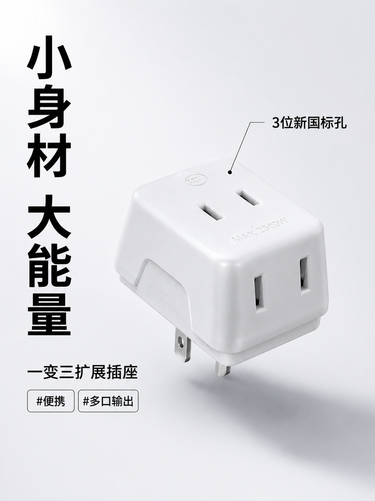
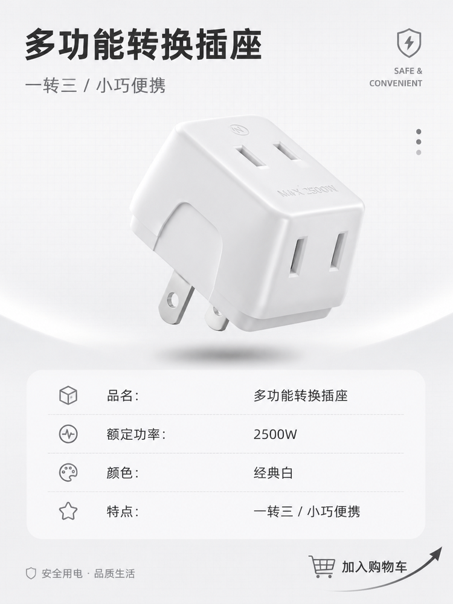
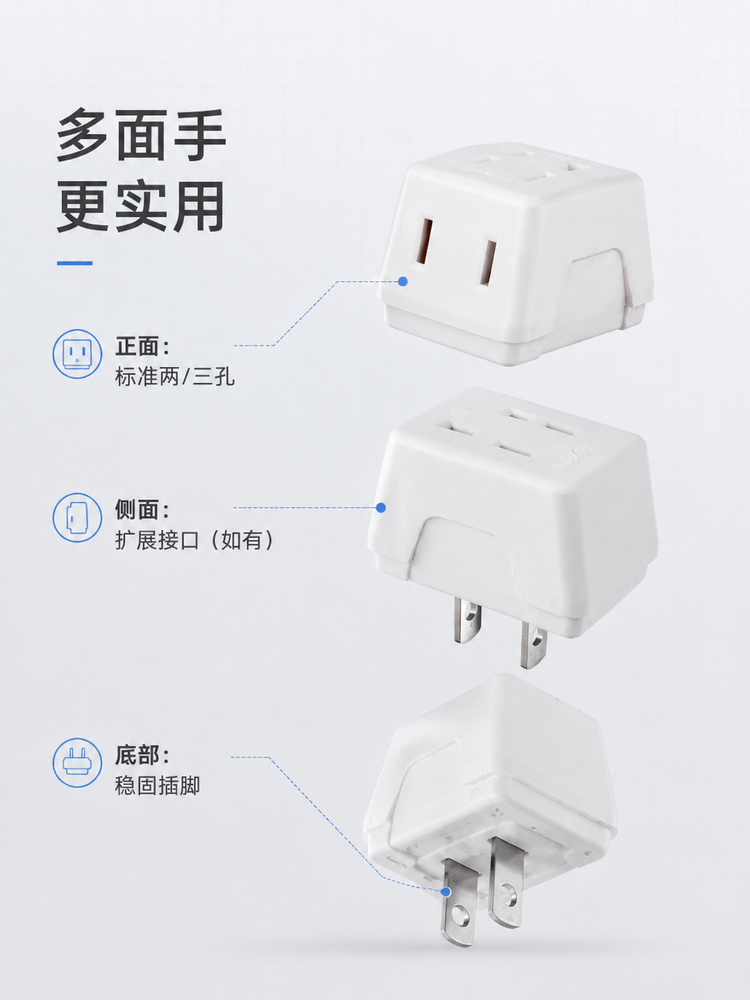
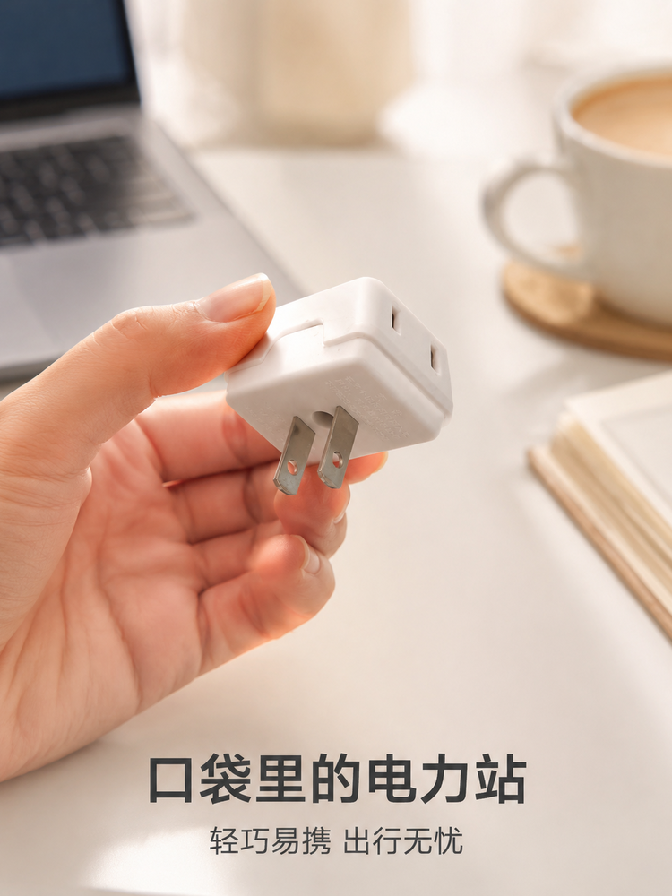
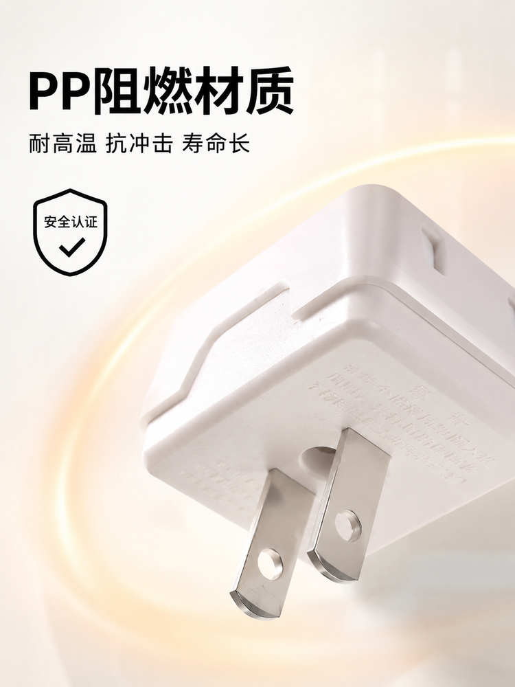
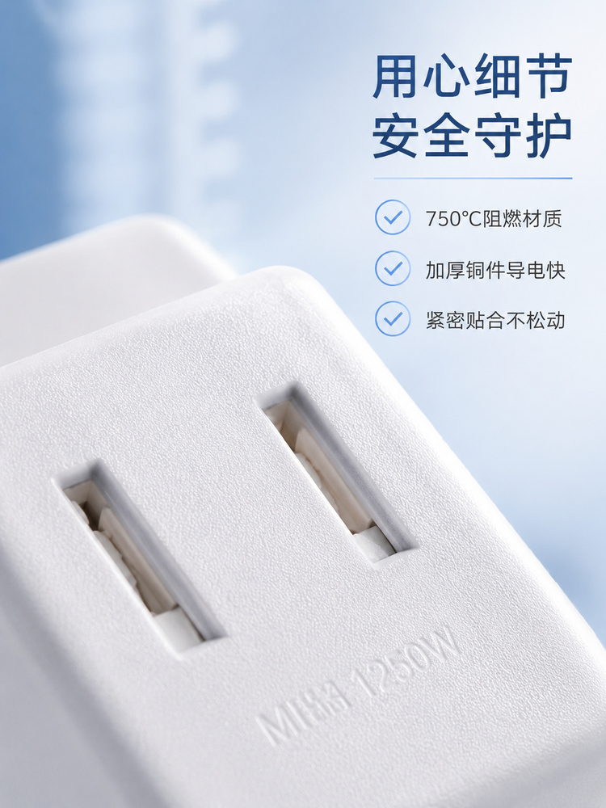
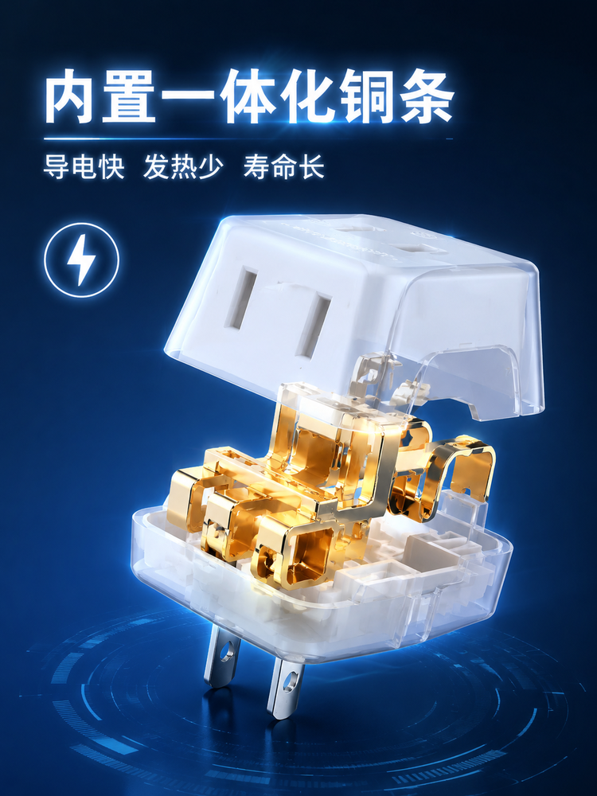
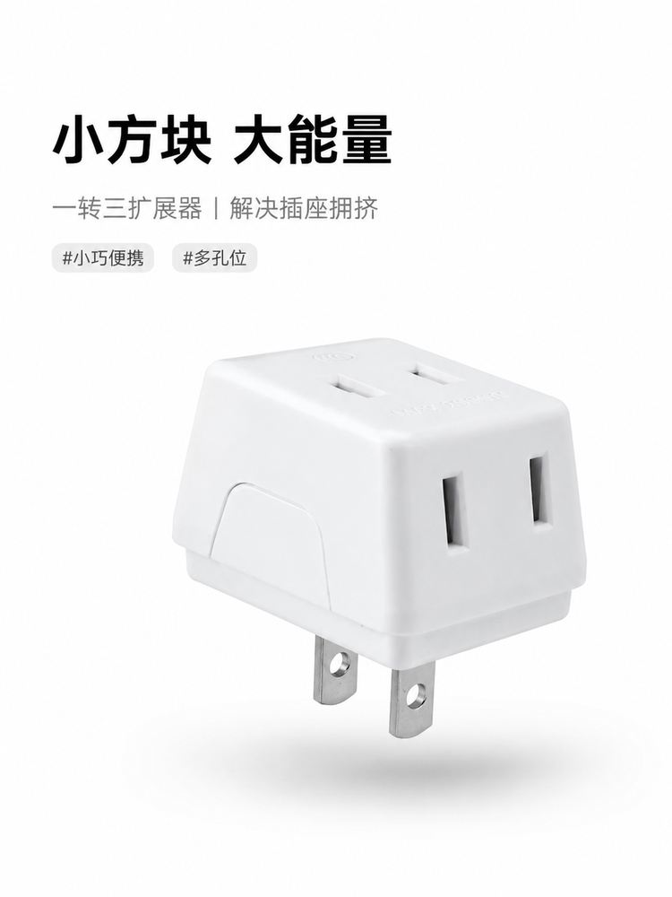

# 转换插头详情页提示词：居家科技风 · 一套 8 张成组图

## 适用场景

适合 3C / 家居电器类电商详情页，尤其是小件产品（转换插头、充电器、数据线、小家电配件）。这套提示词以「白色一转三转换插头」为例，一次性覆盖详情页需要的 8 个画面：主图卖点、场景痛点、细节工艺、便携展示、结构解析、兼容性、材质安全、规格总结。

整体风格统一走**明亮洁净的居家科技风**：纯白 / 浅灰基调，柔和自然光，极简、安全、有秩序感，现代无衬线字体，突出产品小巧精致。你把产品换成自己的品类，改几个关键词就能复用整套结构。

## 整体风格提示词（先定基调）

写详情页成组图时，先把统一的视觉基调固定下来，每张图都带上，成组出图才不会花：

```
明亮洁净的居家科技风，纯白或浅灰为基调，柔和自然光，极简安全、有秩序感，
微投影增加立体度，现代无衬线字体，突出产品实用、小巧、精致的质感。
```

## 8 张成组图提示词

下面每一张都给出「画面定位 + 文案 + 提示词」，直接复制提示词到生图工具即可。产品名 `白色一转三转换插头` 换成你的商品即可。

### 图 1 · 核心卖点：小体积大用途

**画面定位：** 展示产品整体形态及「一转三」核心功能，强调不占空间。

**文案：** 小身材 大能量 / 一变三扩展插座 / #便携 #多口输出

```
一张电商主图风格的特写照片。画面中心悬浮着一个白色的立方体转换插头，呈现约 45 度侧俯视角度，
清晰展示顶部的三个两孔插口和侧面的两个金属插脚。背景为纯净的浅灰白色渐变，光线从左上方打入，
在右下方形成柔和的阴影。左侧排列竖排黑色粗体文案"小身材 大能量"，右侧有细线指向插孔并标注
"3 位新国标孔"。整体画面干净、高亮，突出产品的洁白质感。
```



### 图 2 · 场景痛点：解决插座不足

**画面定位：** 模拟实际使用场景，展示如何解决墙插不够用的问题。

**文案：** 告别插座焦虑 / 一个顶三个 轻松扩容

```
场景化渲染图。背景是一面洁白的墙壁，墙上有一个标准的白色电源面板。白色的转换插头正插在面板上，
插脚完全插入。插头顶部插着三个不同颜色的电器插头（如白色、黑色、蓝色插头，仅露出插头尾部），
示意同时在使用。光线明亮温馨，模拟客厅自然光。左下角放置半透明白色色块，上书黑色文案
"告别插座焦虑"。构图强调插头与墙面的贴合度。
```



### 图 3 · 细节工艺：安全耐用

**画面定位：** 展示插孔内部结构和外壳材质，强调安全性。

**文案：** 用心细节 安全守护 / 750℃阻燃材质 · 加厚铜件导电快 · 紧密贴合不松动

```
产品微距特写图。镜头极近距离聚焦于转换插头的顶部插孔区域。画面极度清晰，展现白色塑料外壳的
细腻磨砂纹理，以及插孔内部保护门的结构。光线采用影棚布光，高光勾勒出插孔边缘的圆润倒角。
右侧垂直排列三个带勾选图标的卖点文案，字体纤细精致。背景虚化处理，呈淡蓝色调，凸显科技安全感。
```



### 图 4 · 便携特性：出差旅行必备

**画面定位：** 通过手持展示体现小巧易携带。

**文案：** 口袋里的电力站 / 轻巧易携 出行无忧

```
生活方式类图片。一只肤色自然的手轻轻捏住白色转换插头的两侧，将其展示在镜头前。背景是模糊处理的
现代办公桌或咖啡桌，有一台笔记本电脑的一角和一杯咖啡，营造差旅或办公氛围。焦点完全集中在手中的
插头和手指上。文案位于画面底部居中，使用深灰色无衬线字体"口袋里的电力站"。光线柔和，色调温暖。
```



### 图 5 · 结构设计：稳固防滑

**画面定位：** 展示侧面和底部结构，说明设计的合理性。

**文案：** 人体工学设计 / 凹槽指位 拔插省力 · 加宽间距 互不干扰

```
产品结构分析图。白色转换插头以侧躺或倾斜角度放置在纯白桌面上，重点展示侧面的凹槽设计和整体的
方正造型。使用细黑色的指示线和圆圈放大图，标注侧面的受力凹槽位置，说明"拔插省力"。光影层次丰富，
展现物体的体积感。文案采用工程制图风格的排版，位于画面留白处，显得专业严谨。
```



### 图 6 · 多设备兼容：广泛适用

**画面定位：** 强调标准孔型，适配各种家用电器插头。

**文案：** 标准孔距 兼容性强 / [手机充电器] [台灯] [风扇]

```
功能展示图。白色转换插头正面朝上平放，三个插孔清晰可见。在插孔上方，通过后期合成悬浮着三个常见的
电器插头（两脚扁插），分别对应三个孔位，暗示可以同时插入。背景为干净的浅米色。文案位于顶部，
配合简单的线性图标装饰。整体风格扁平化与实物结合，直观表达兼容性。
```



### 图 7 · 材质解析：防火阻燃

**画面定位：** 通过质感表现传达材料的安全性。

**文案：** PP 阻燃材质 / 耐高温 · 抗冲击 · 寿命长

```
质感特写图。画面主体为白色转换插头的局部特写，光线打在外壳上呈现出高级的哑光质感。背景使用淡淡的
暖橙色光晕烘托，暗示"防火/耐热"的心理联想，但不过分夸张。文案使用加粗的黑色字体置于画面一侧，
旁边配有一个盾牌形状的"安全认证"示意图标。画面传达出坚固、可靠的感觉。
```



### 图 8 · 全家福 / 规格总结

**画面定位：** 汇总产品参数，作为详情页的收尾或信息补充。

**文案：** 品名：多功能转换插座 / 额定功率：2500W / 颜色：经典白 / 特点：一转三 · 小巧便携

```
产品信息卡片图。白色转换插头以 45 度角悬浮在画面中央，周围环绕着简洁的参数表格或文字块。
背景为极淡的灰色网格底纹，增加理性感。文字排版整齐，使用黑灰双色区分标题和内容。画面右下角
有一个小的"立即购买"或"加入购物车"的引导性图形元素（非真实按钮，仅为视觉引导）。
整体风格像是一张精致的产品说明书封面。
```



---

## 使用说明

### 如何快速改成你的产品？

1. **替换产品名**：把所有「白色一转三转换插头」换成你的商品名，比如「便携式充电器」「Type-C 数据线」「智能插座」
2. **调整功能点**：根据你的产品卖点，修改文案中的「一转三」「750℃阻燃」等具体参数
3. **保留结构逻辑**：8 张图的顺序（卖点 → 场景 → 细节 → 便携 → 结构 → 兼容 → 材质 → 总结）通用于大多数 3C / 家电产品

### 关键参数解释

- **居家科技风**：区别于「高端奢华」或「活泼促销」，适合理性消费、强调安全 / 实用的家居小件
- **纯白 / 浅灰基调**：干净、通透、符合电商平台主流审美
- **柔和自然光**：避免硬光造成的阴影过重，营造舒适感
- **极简 + 有秩序感**：文案排版讲究对齐、留白，不花哨但有品质感

### 生图工具推荐

- **快速出图**：使用 [未来图 AI](https://www.weilaituai.cn/) 等一站式工具，上传产品图 + 输入提示词，即可一键生成 8 张成组详情页
- **高度定制**：使用 Midjourney / Stable Diffusion / DALL-E 3 等专业模型，配合 ControlNet 控制产品不变形

## 效果图预览

本套提示词实际生成效果见上方 8 张配图。生成工具：未来图 AI（模型组合：qwen3.7 + banana2）。

## 一键生成

如果你想直接一键生成这种风格的详情页，而不用自己调试提示词、抠图、排版，可以试试：

👉 [未来图 AI - 电商详情页一键生成](https://www.weilaituai.cn/) 

上传产品图，选择「居家科技风详情页」模板，自动生成 8 张成组图，支持批量导出。

---

**更新日期：** 2026-07-08  
**适用 AI 模型：** Midjourney / Stable Diffusion / DALL-E 3 / 通义万相 / 未来图 AI 等主流文生图模型  
**推荐搭配：** ControlNet（保持产品不变形）+ 局部重绘（只改背景和文案）


