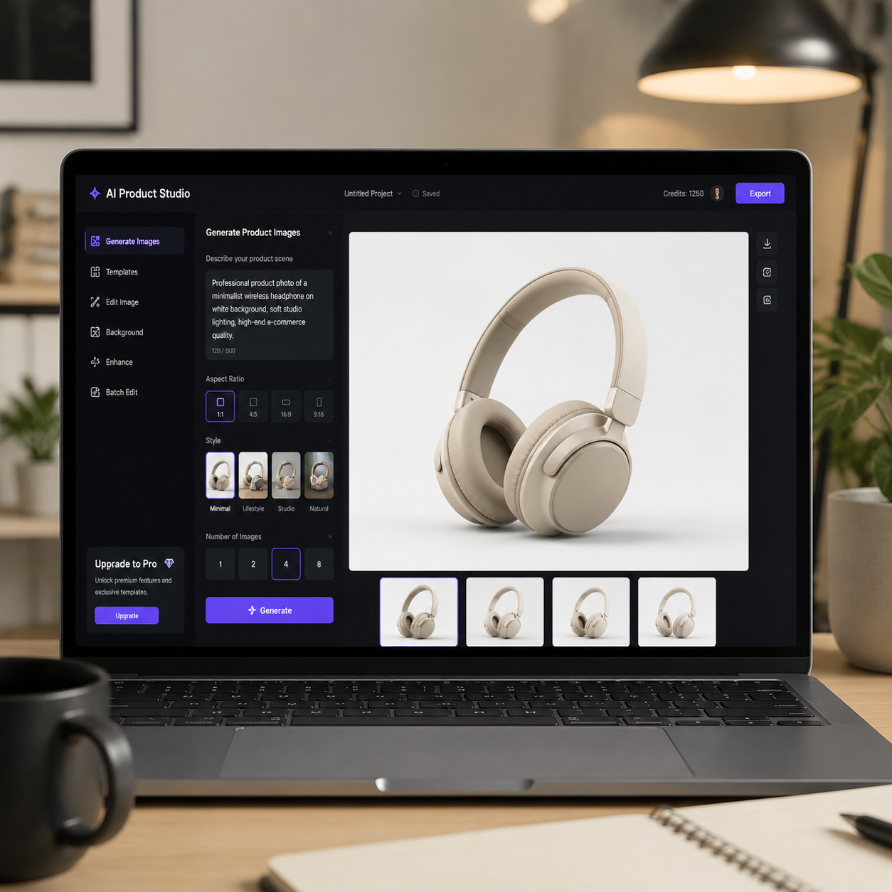

# bananapro官网怎么进？官网入口与使用教程

想用 bananapro 做电商图，却找不到官网入口？这篇教程给你整理好了。

## bananapro 是什么？

bananapro 是一款 AI 电商生图工具，支持商品图生成、背景替换、模特换装等功能。很多跨境卖家在用，但官网地址经常变动，入口难找。

## bananapro官网入口

bananapro 的官方访问地址会更新。如果你打不开，可以试试以下替代方案：

- 通过 nanobanana 官网找到跳转链接
- 使用 image2 在线版作为替代（功能类似，不用折腾找入口）
- 关注官方公告获取最新域名

## bananapro 的主要功能

1. **商品图生成**：上传产品图，AI 自动生成白底图、场景图
2. **模特换装**：一键替换模特和服装，适合服装类卖家
3. **背景替换**：智能抠图 + 背景融合，出片效率高
4. **批量处理**：支持批量生图，适合大量商品上架

## 找不到官网怎么办？

如果 bananapro 官网访问不了，或者入口变动，建议直接用更稳定的替代方案。AI 生图工具的核心是模型效果和出图效率，不一定非要盯着一个工具用。

如果你需要做电商商品图和详情页，可以用 aishop 在线生成，不需要找入口，打开即用。如果需要做促销海报，poster 工具也能一键搞定。

## 总结

bananapro 官网入口有时会变动，建议收藏多个备用地址。如果觉得找入口太麻烦，直接换用更稳定的 AI 生图工具会更高效。

需要生成电商商品图？试试 [aishop.anyachina.cn](https://aishop.anyachina.cn)  
需要制作促销海报？试试 [poster.anyachina.cn](https://poster.anyachina.cn)

---

*在线工具：[未来图AI](https://www.weilaituai.cn/)*
