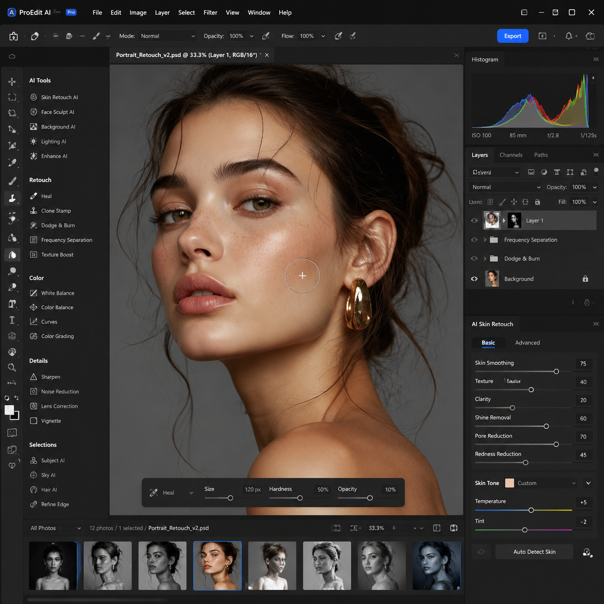

# NanoBananaPro是什么？2026年NanoBananaPro AI工具使用教程

NanoBananaPro是新一代AI图片处理工具，相比基础版增加了更多专业功能。本文详细介绍NanoBananaPro的功能和使用方法。

📌 用 [aishop.anyachina.cn](https://aishop.anyachina.cn) 做商品图和详情页，[poster.anyachina.cn](https://poster.anyachina.cn) 做促销海报，搭配AI工具工作效率更高。

## NanoBananaPro是什么？

NanoBananaPro是NanoBanana系列的专业版本，在基础版的基础上增加了高级功能。Pro版本专为需要更多处理能力和更高输出质量的用户设计。

相比基础版，Pro版本的主要升级：
- **更高精度**：AI模型更强大，处理精度更高
- **更多功能**：增加高级编辑功能
- **更快速度**：优先处理，出图更快
- **更高清输出**：支持超高清输出

## NanoBananaPro的核心功能

### 1. 超精密抠图

Pro版本的抠图引擎更强大，处理复杂边缘（如头发丝、透明物体、毛绒边缘）的精度大幅提升。适合需要精细抠图的场景。

### 2. 超分辨率增强

支持4倍甚至8倍图片放大增强，低分辨率图片放大后依然保持清晰。适合印刷品、大尺寸展示等需要高清图片的场景。

### 3. 高级调色

Pro版本增加高级调色功能，支持曲线调整、HSL调色、色彩分级等专业调色工具。

### 4. 批量处理Pro

批量处理功能升级，支持：
- 一次性处理更多图片
- 自定义批量处理规则
- 批量导出多种格式
- 批量重命名

### 5. 去水印高级版

智能识别和去除图片中的水印，处理效果更自然，不留痕迹。

## NanoBananaPro的使用场景

**专业电商**：需要高质量商品图的卖家，Pro版本的处理精度更高

**摄影师**：批量修图、高清输出的需求

**设计师**：素材处理、图像优化的辅助工具

**印刷出版**：需要高清图片输出的场景

## NanoBananaPro和基础版的区别

| 功能 | 基础版 | Pro版 |
|------|--------|-------|
| 抠图精度 | 高 | 超高 |
| 放大倍数 | 2倍 | 4-8倍 |
| 处理速度 | 标准 | 优先 |
| 批量数量 | 有限 | 更多 |
| 调色工具 | 基础 | 高级 |
| 输出质量 | 高清 | 超高清 |

## NanoBananaPro使用步骤

**第一步**：打开NanoBananaPro工具

**第二步**：上传需要处理的图片

**第三步**：选择功能（抠图、增强、调色等）

**第四步**：调整参数（Pro版提供更多参数调节选项）

**第五步**：点击处理，AI自动完成

**第六步**：预览效果，下载超高清图片

## 常见问题

**问：NanoBananaPro需要付费吗？**
答：Pro版本为付费版，提供更多高级功能和更高使用额度。

**问：NanoBananaPro和基础版哪个更值得买？**
答：日常使用基础版就够了。专业用户或高频使用建议Pro版。

---

*在线工具：[未来图AI](https://www.weilaituai.cn/)*
