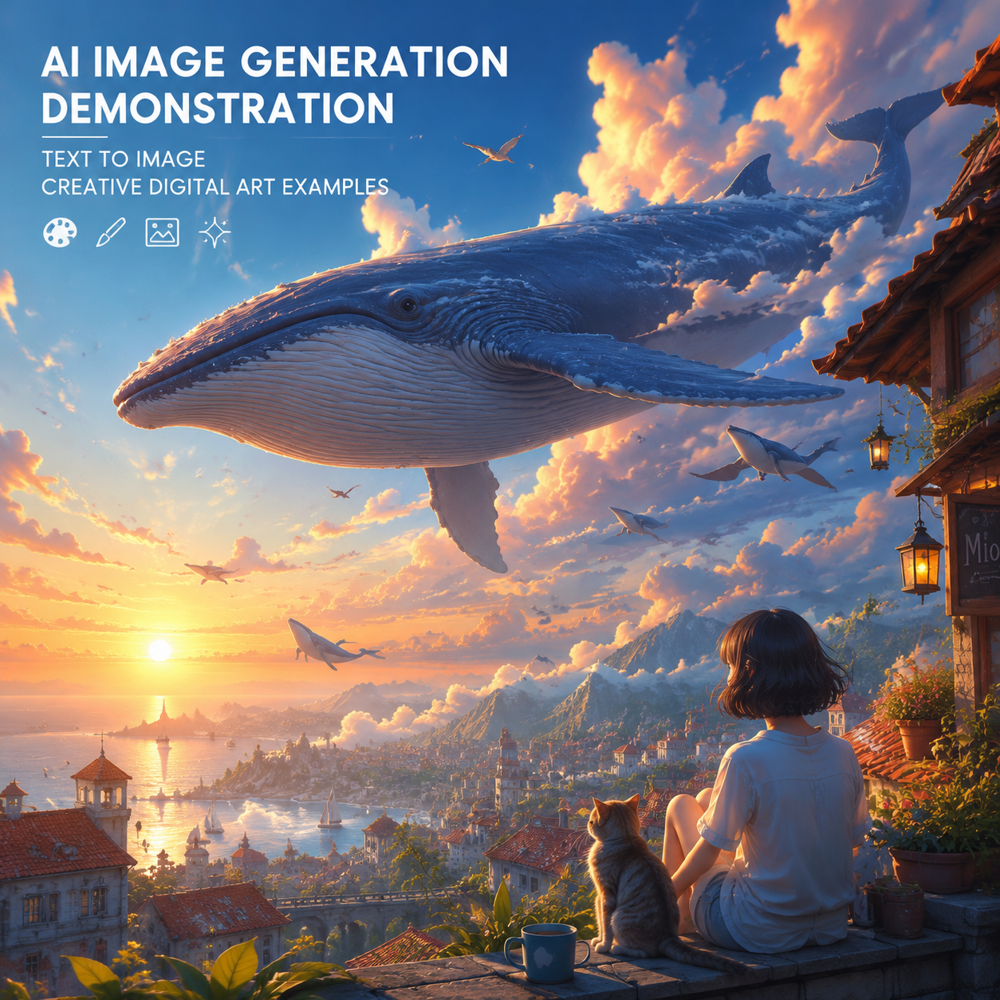

# AI生图工具推荐，2026年AI在线生图使用教程

AI生图技术已经非常成熟。输入文字描述，AI就能生成对应的图片。不管是商品图、海报还是创意插画，AI都能快速搞定。

✨ 推荐 [aishop.anyachina.cn](https://aishop.anyachina.cn) 做商品图，[poster.anyachina.cn](https://poster.anyachina.cn) 做促销海报，两款AI生图工具都支持中文提示词。

## AI生图是什么？

AI生图就是通过人工智能技术，根据文字描述自动生成图片。你告诉AI你想要什么，AI帮你画出来。

AI生图的应用：
- 商品图生成
- 海报设计
- 创意插画
- 场景图制作

## AI生图基本操作

**第一步**：写下提示词（文字描述）
**第二步**：选择图片比例和风格
**第三步**：点击生成
**第四步**：预览下载

## 提示词技巧

好的提示词 = 好的出图。记住这个公式：

**主体 + 环境 + 风格 + 细节**

示例：
"白色陶瓷杯，木桌，自然光，极简风格，商业摄影"

## AI生图工具分类

| 类型 | 优点 | 适合 |
|------|------|------|
| 电商专用 | 商品图效果好 | 电商卖家 |
| 通用型 | 风格多样 | 创意设计 |
| 海报型 | 排版专业 | 运营人员 |

---

*在线工具：[未来图AI](https://www.weilaituai.cn/)*
