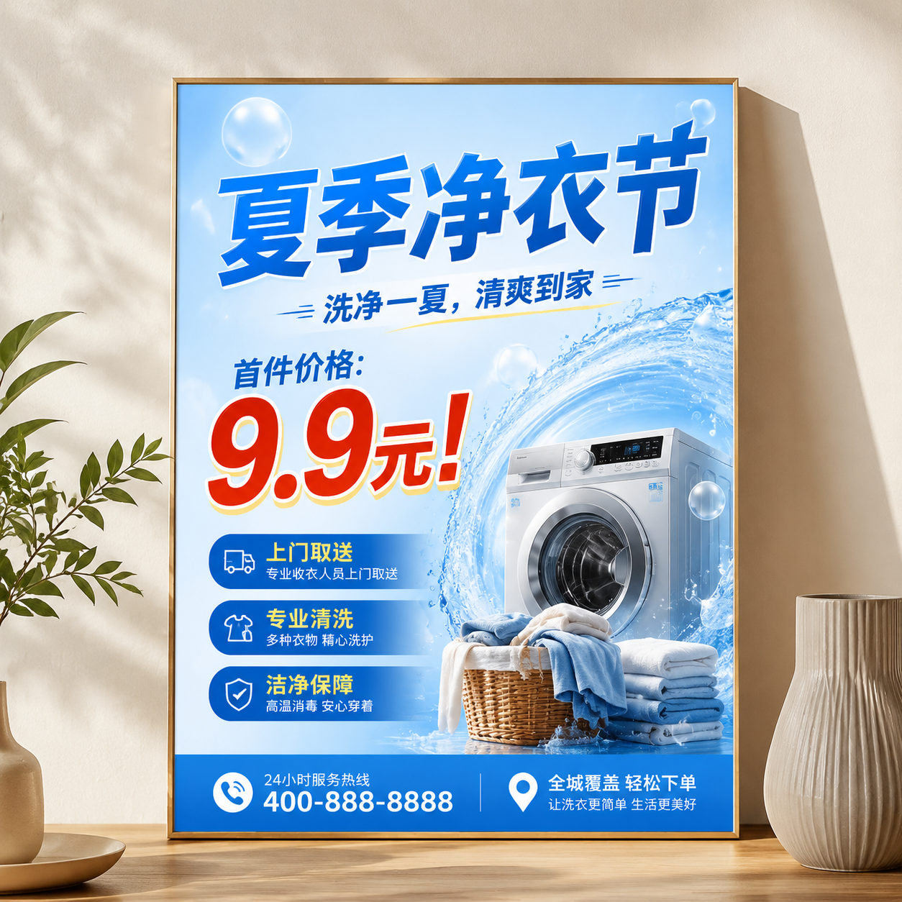

# AI做海报真的靠谱吗？2026年AI生成海报实测体验

AI做海报这两年很火，但很多人心里有个疑问：AI做出来的海报真的能用吗？

实测告诉你：能用，而且效果不输专业设计师。

## AI做的海报能达到什么水平？

我们实测了几组不同场景的AI海报生成效果：

**促销海报**：AI自动排版、配色、配图，成品可以直接上架使用。文字排版规范，色彩搭配协调。

**节日海报**：AI能自动匹配节日氛围，春节用红金配色，中秋用暖色调，圣诞用红绿搭配。不需要手动调风格。

**招聘海报**：信息类海报AI做得很好，标题突出、条理清晰、品牌色统一。

总的来说，AI海报在**排版规范、配色协调、出图速度**上已经超过了很多初级设计师。但在创意策划和品牌深度上，还需要人工把控。

## AI做海报的优势

1. **快**：30秒出一张，不满意随时重新生成
2. **便宜**：成本几乎为零，不用请设计师
3. **多版本**：同一内容可以生成多个风格版本，测试哪个效果好
4. **不用学**：不需要PS技能，打字就能做海报

⭐ 试试 [poster.anyachina.cn](https://poster.anyachina.cn) 直接用AI做海报，操作简单出图快。

## AI做海报的流程

1. 打开AI海报工具
2. 选择海报类型（促销/节日/招聘等）
3. 输入文案内容
4. 选择风格模板
5. 点击生成
6. 下载使用

全过程3分钟搞定。

## 总结

AI做海报已经足够靠谱了，日常商业场景完全够用。关键是要选对工具，把文案准备好，AI输出的质量会超出你的预期。

需要做电商商品图也可以试试 [aishop.anyachina.cn](https://aishop.anyachina.cn)，全套电商视觉都能搞定。

---

*在线工具：[未来图AI](https://www.weilaituai.cn/)*
