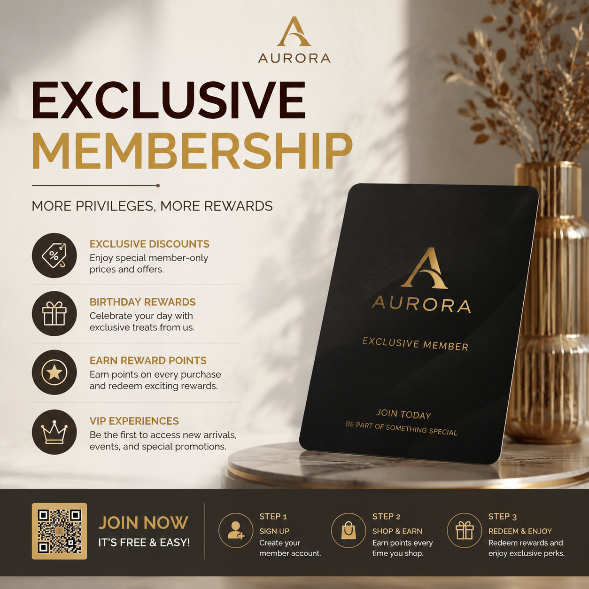

# AI做海报要多少钱？2026年AI海报生成成本解析

很多人想用AI做海报，但担心费用问题。AI做海报到底要花多少钱？比请设计师便宜多少？

## AI做海报的成本

目前市面上的AI海报工具，大部分是免费或低价模式：

- 免费版：每天可生成几张到几十张，基本够个人使用
- 付费版：每月几十元，不限生成次数，适合商家

对比请设计师的费用：一张普通海报设计费200-500元，AI工具一年会员费也就相当于1-2张海报的设计费。性价比非常高。

💡 推荐工具：[poster.anyachina.cn](https://poster.anyachina.cn) 免费即可生成海报，付费版不限量。

## 为什么AI做海报更划算

1. **不限制修改次数**：AI可以反复生成直到满意
2. **多版本测试**：同一内容生成多个版本，选效果最好的
3. **即时出图**：不用等设计师排期，随时需要随时做

## 总结

AI做海报的成本几乎可以忽略不计。对于中小商家来说，是最划算的选择。

---

*在线工具：[未来图AI](https://www.weilaituai.cn/)*
