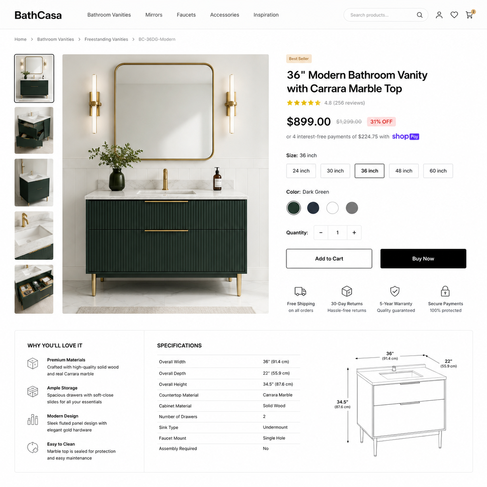

# AI做详情页怎么做？2026年电商详情页AI生成教程

电商详情页是决定转化率的关键。详情页做得好，客户看了就想下单。但请人设计一套详情页少说几百块，自己做又不知道从何下手。

现在用AI做详情页，上传产品图，输入卖点，AI自动生成整套详情页排版，30分钟搞定以前一天的工作量。

## 为什么详情页这么重要？

用户进到你的商品页面，决定买不买就在前10秒。详情页就是你的"线上导购"，它要回答三个问题：

- 这是什么产品？
- 能解决什么问题？
- 为什么值得买？

AI做详情页的功能正好针对这三点，自动生成卖点文案、场景图、规格说明，逻辑清晰。

## AI做详情页的流程

### 1. 上传产品图

把产品照片上传到AI工具，不需要专业拍摄，手机拍的就行。

### 2. 输入卖点信息

告诉AI你的产品核心卖点：材质、尺寸、适用场景、目标人群。信息越多，生成的详情页越精准。

### 3. AI自动生成

AI会根据产品图和卖点，自动生成详情页各模块：主图、卖点图、场景图、规格图、对比图等，一键排版。

🚀 推荐工具：[aishop.anyachina.cn](https://aishop.anyachina.cn) 支持AI一键生成电商详情页，模板丰富出图快。

## AI详情页和传统详情页的区别

| 维度 | 传统方式 | AI方式 |
|------|---------|-------|
| 时间 | 1-3天 | 30分钟 |
| 成本 | 几百上千元 | 几乎免费 |
| 修改 | 重新沟通设计 | 随时重新生成 |
| 多版本 | 成本高 | 一键生成多个版本 |

## 总结

AI做详情页正在成为电商卖家的标配。不需要会设计，不需要会排版，上传产品图就能生成一套专业详情页。

如果需要配合促销海报，[poster.anyachina.cn](https://poster.anyachina.cn) 也能一键搞定。

---

*在线工具：[未来图AI](https://www.weilaituai.cn/)*
