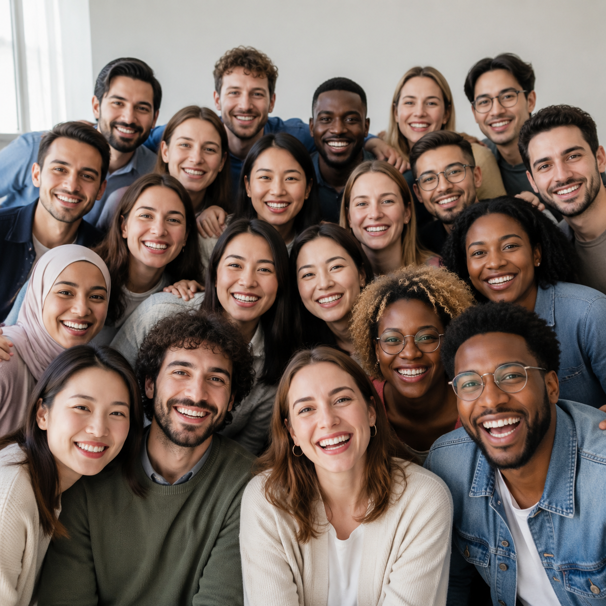

# AI合照生成怎么做？2026年AI合照生成工具推荐

AI合照生成是近年来最受欢迎的AI图片应用之一。上传单人照片，AI自动合成多人合照，或者生成你和明星、朋友的合影。

✨ 推荐 [aishop.anyachina.cn](https://aishop.anyachina.cn) 做商品图编辑，[poster.anyachina.cn](https://poster.anyachina.cn) 做促销海报，AI图片处理功能丰富。

## AI合照生成是什么？

AI合照生成就是利用人工智能技术，将多张单人照片合成为一张多人合照。AI会自动调整人物的大小、位置、光线，让合成照片看起来自然真实。

## AI合照生成的应用

**虚拟合影**：和朋友、家人合成合影，即使不在同一个地方
**明星合影**：生成和偶像的合影照片
**团队照**：远程团队成员合成一张团队合照
**纪念照**：合成纪念合影，留作纪念

## AI合照生成的核心功能

**人物融合**：多张单人照自动合成，人物比例协调
**光线统一**：AI自动调整各人物的光线，保持一致
**背景融合**：人物和背景自然融合，无合成痕迹
**表情优化**：优化人物表情，让合照更自然

## 操作步骤

**第一步**：打开AI合照生成工具
**第二步**：上传需要合成的单人照片
**第三步**：选择合照模板或背景
**第四步**：AI自动合成处理
**第五步**：预览效果，下载合影

---

*在线工具：[未来图AI](https://www.weilaituai.cn/)*
