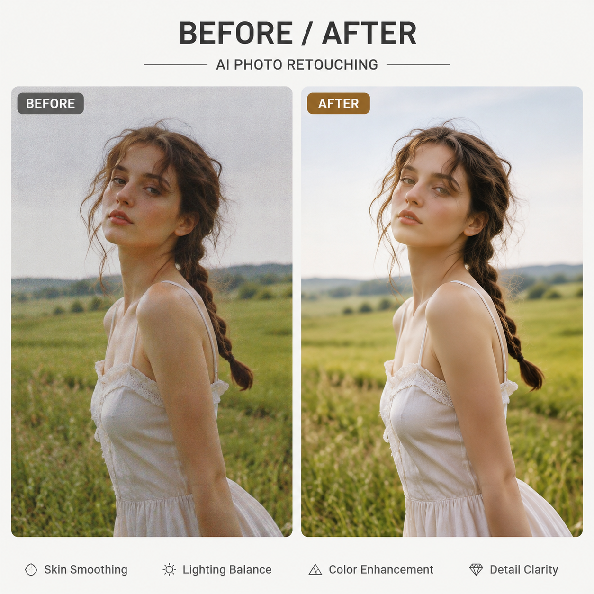

# AI图片修改怎么做？2026年AI图片修改工具在线教程

图片修改是电商运营和内容创作的日常需求。以前改图要用PS，现在AI图片修改工具上传图片就能自动修图，操作简单出图快。

✨ 试用 [aishop.anyachina.cn](https://aishop.anyachina.cn) 改商品图效果专业，[poster.anyachina.cn](https://poster.anyachina.cn) 改海报一键搞定，两款AI工具都支持在线修改图片。

## AI图片修改是什么？

AI图片修改就是利用人工智能技术自动编辑和优化图片。和传统手动修图不同，AI修改只需要上传图片，AI就能自动识别内容并完成修改。

常见的AI图片修改功能：

- **智能抠图换背景**：一键去除原背景换上新的
- **图片清晰化**：模糊图片变清晰，AI补充细节
- **去除杂物**：去掉图中不需要的人或物
- **调色美化**：AI自动调出专业色彩
- **图片扩展**：在原有图片基础上扩展画面

## AI图片修改的优势

### 操作极简

上传图片→选择功能→点击生成，三步搞定。不需要学PS的各种工具和快捷键。

### 速度快

传统修图一张十几分钟到几小时，AI只需几秒。批量处理几百张图也不在话下。

### 效果自然

AI处理结果自然无痕。不像老式P图那样有明显边界和处理痕迹。

### 成本低

AI修图几乎零成本，不用花钱请设计师或买专业软件。

## AI图片修改的使用场景

**电商卖家**：处理商品图、抠图换背景、批量优化

**自媒体人**：制作封面图、处理素材、优化截图

**普通用户**：修个人照片、去水印、简单编辑

## AI图片修改步骤

**第一步**：打开AI图片修改工具

**第二步**：上传需要修改的图片

**第三步**：选择功能（抠图、增强、调色等）

**第四步**：AI自动处理，几秒出结果

**第五步**：预览效果，下载高清图片

## 常见问题

**问：AI图片修改会损坏原图吗？**
答：不会。AI是在原图基础上处理，输出高清图片，原图不受影响。

**问：AI修改后的图片能商用吗？**
答：生成图片的版权归用户所有，可以商用。

---

*在线工具：[未来图AI](https://www.weilaituai.cn/)*
