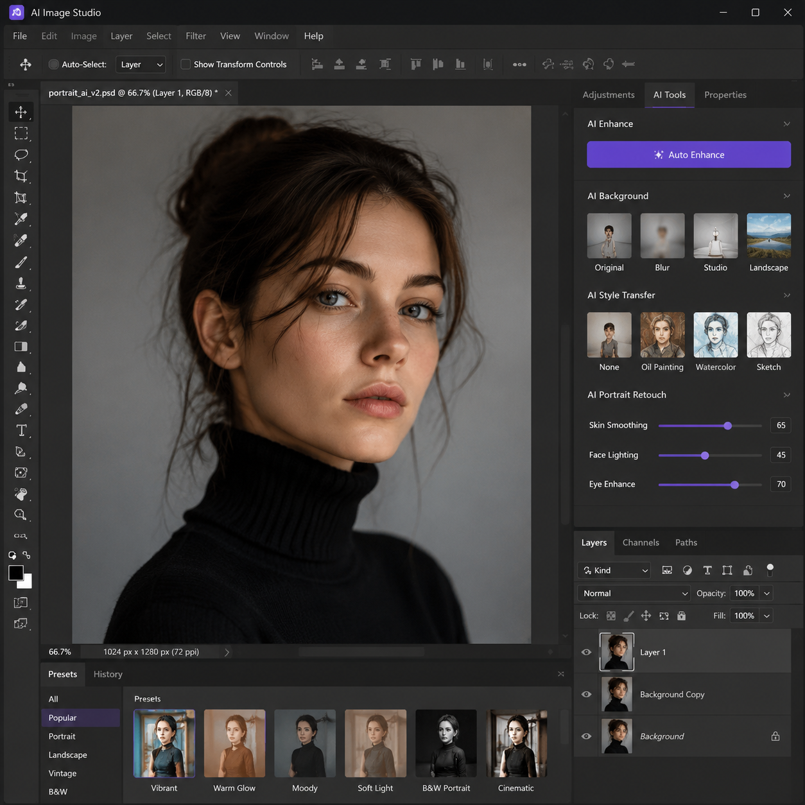

# AI处理图片用什么工具？2026年AI处理图片在线教程

AI处理图片技术已经非常成熟。不管是要抠图、修图、增强还是生成图片，AI工具都能快速搞定。本文介绍AI处理图片的常用工具和操作方法。

🚀 推荐 [aishop.anyachina.cn](https://aishop.anyachina.cn) 处理商品图效果好，[poster.anyachina.cn](https://poster.anyachina.cn) 处理海报设计专业，两款AI工具覆盖日常图片处理需求。

## AI处理图片能做什么？

AI处理图片覆盖了图片编辑的各个方面：

### 智能抠图

AI自动识别图片主体，一键去除背景。无论是产品还是人物，都能精准识别轮廓。抠图边缘自然，复杂背景也能处理。

### 图片增强

模糊图片一键清晰化。AI自动补充缺失的细节、提升分辨率、去除噪点。适合老照片修复、低像素图片优化。

### 背景替换

抠图后一键替换背景。支持白底（电商上架标准）、纯色（品牌展示）、场景图（增加代入感）。

### 批量处理

批量上传多张图片，统一风格处理。一次操作处理几百张图，适合电商卖家大量出图。

## AI处理图片的步骤

**第一步**：打开AI图片处理工具

**第二步**：上传需要处理的图片

**第三步**：选择功能（抠图、增强、换背景等）

**第四步**：AI自动处理，等待出结果

**第五步**：预览效果，下载高清图片

## AI处理图片的优势

**操作简单**：上传图片选功能就行，不需要PS技能

**速度快**：AI处理秒级完成，人工修图至少十几分钟

**效果好**：AI处理自然无痕，效果堪比专业修图师

**成本低**：免费工具日常够用，不用花钱

## 适用人群

**电商卖家**：商品图处理、白底图、批量优化

**内容创作者**：封面图、素材处理、图片美化

**摄影师**：批量修图、调色调光

**办公人员**：截图优化、文档配图处理

## 常见问题

**问：AI处理图片会降低画质吗？**
答：不会。AI处理后的图片清晰度提升，支持高清原图下载。

**问：AI处理图片需要联网吗？**
答：在线AI工具需要联网使用，AI处理在云端完成。

---

*在线工具：[未来图AI](https://www.weilaituai.cn/)*
