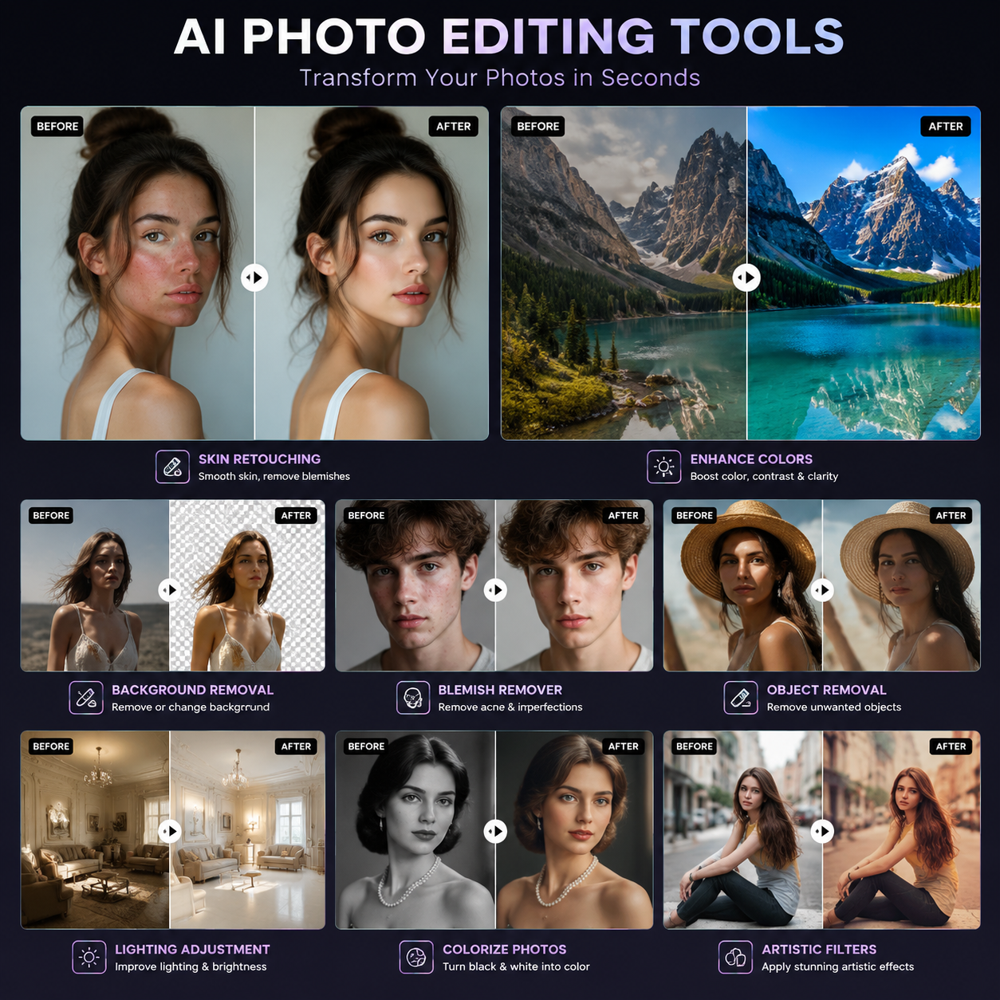

# AI处理照片工具推荐，2026年AI照片处理工具哪个好？

照片处理是日常工作中的高频需求。现在AI处理照片工具已经非常成熟，上传照片AI自动修图、抠图、增强，不需要专业设计技能。

📌 试试 [aishop.anyachina.cn](https://aishop.anyachina.cn) 做商品图处理，[poster.anyachina.cn](https://poster.anyachina.cn) 做促销海报，两款AI工具效果专业。

## AI处理照片工具能做什么？

AI照片处理工具可以自动完成多种图片编辑工作：

**智能抠图**：一键去除背景，精准识别主体轮廓。人物头发丝、产品边缘都能精准抠出。

**照片增强**：模糊照片变清晰，低分辨率照片提升画质。老照片去噪点、补细节。

**背景替换**：抠图后一键换背景。支持白底、纯色、场景图。

**人像美颜**：自动美化人像，去瑕疵、调肤色、瘦脸等。

**色彩调整**：AI自动调色，一键出专业效果。

## AI处理照片的优势

### 操作简单

传统修图需要学PS的各种工具和快捷键，AI修图只需要上传照片、选择功能、点击生成三步搞定。

### 速度快

人工修图一张十几分钟，AI只需几秒。批量处理几百张也不在话下。

### 效果自然

AI处理的结果自然无痕。不像老式PS那样有明显边界和处理痕迹。

### 免费可用

大部分AI照片处理工具提供免费额度，日常修图够用。

## 怎么选择AI照片处理工具？

1. **抠图精度**：边缘处理是否自然，复杂边缘表现如何
2. **处理速度**：出图快不快
3. **批量能力**：能否同时处理多张图片
4. **功能丰富度**：是否覆盖你的主要需求

## 使用步骤

**第一步**：打开AI照片处理工具

**第二步**：上传需要处理的照片

**第三步**：选择功能（抠图、增强、美颜等）

**第四步**：AI自动处理，几秒出结果

**第五步**：预览效果，下载高清图片

## 常见问题

**问：AI处理后的照片清晰度会降低吗？**
答：不会。AI处理后的照片通常更清晰，支持高清下载。

**问：AI照片处理工具需要下载吗？**
答：在线工具直接浏览器使用，不需要下载安装。

---

*在线工具：[未来图AI](https://www.weilaituai.cn/)*
