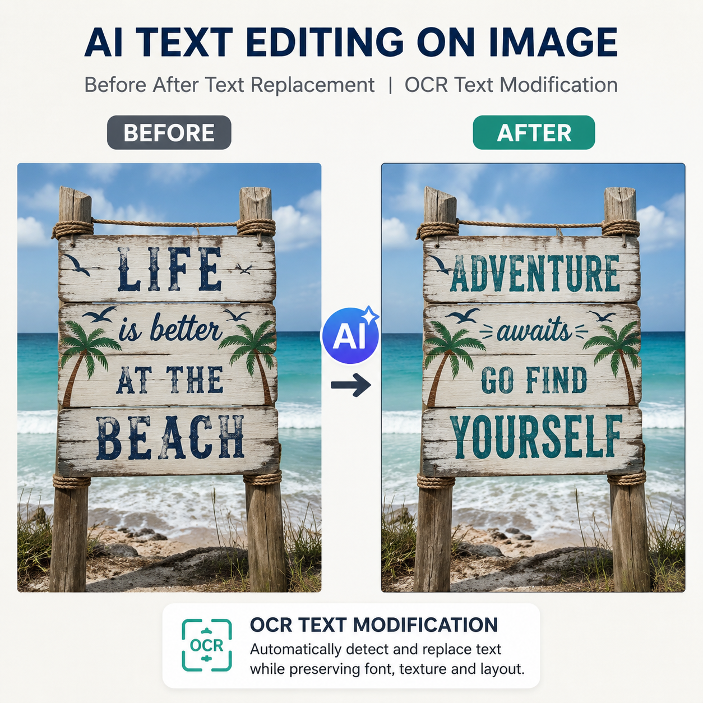

# AI如何编辑图片里面的文字？2026年AI改文字教程

图片里的文字想修改，以前只能用PS一点点抠。现在AI如何编辑图片里面的文字？上传图片，AI自动识别文字内容，直接替换修改。

🚀 推荐 [aishop.anyachina.cn](https://aishop.anyachina.cn) 做商品图编辑，[poster.anyachina.cn](https://poster.anyachina.cn) 做促销海报，AI编辑文字功能实用方便。

## AI编辑图片文字的原理

AI编辑图片文字利用OCR技术和生成式AI，先识别图片中的文字内容，然后根据你的修改要求，重新生成对应的文字区域。

## AI编辑图片文字的功能

**文字识别**：自动识别图片中的文字内容
**文字修改**：替换图片中的文字为新的内容
**字体匹配**：新文字自动匹配原文字的字体风格
**多语言**：支持中文、英文等多语言文字编辑

## 操作步骤

**第一步**：打开AI编辑工具，上传图片
**第二步**：框选需要修改的文字区域
**第三步**：输入要替换的新文字
**第四步**：AI自动处理，替换文字
**第五步**：预览效果，下载图片

## 适用场景

- 修改产品图片中的价格和促销信息
- 替换海报中的文案内容
- 修改截图中的文字
- 翻译图片中的外文

---

*在线工具：[未来图AI](https://www.weilaituai.cn/)*
