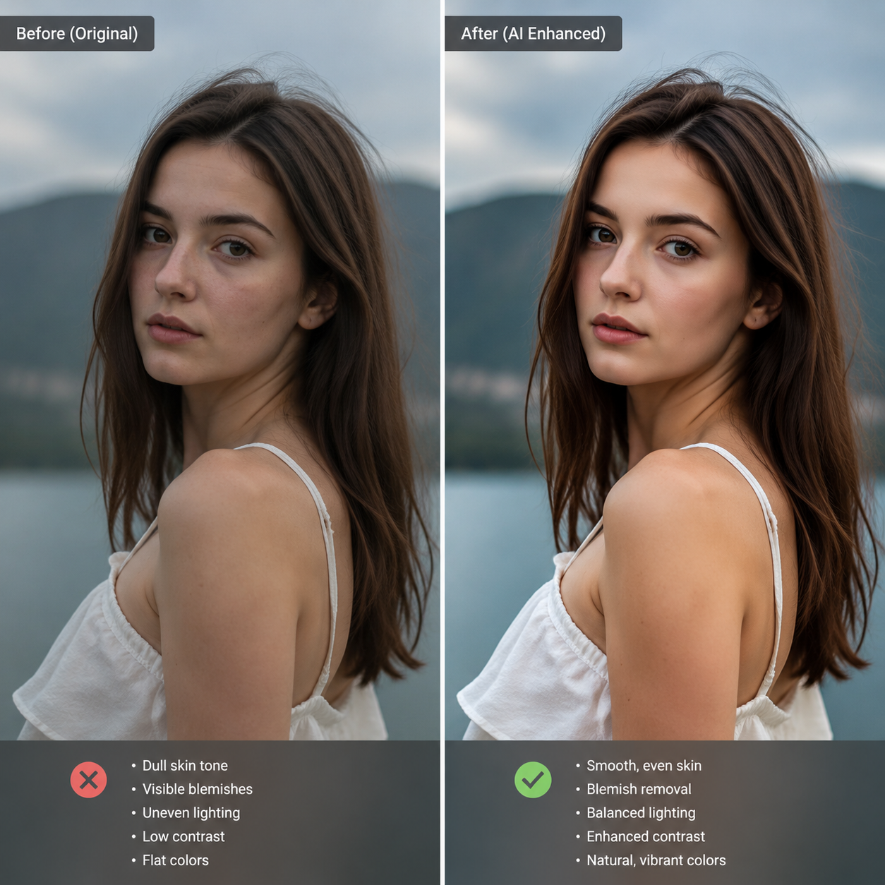

# AI改图怎么弄？2026年AI改图工具在线使用教程

改图这件事，以前想到的就是PS。但PS门槛高、操作复杂，大多数人学了半天只会基础操作。现在用AI改图，上传图片输入需求，AI自动完成抠图、换背景、修图等操作。

🚀 试试 [aishop.anyachina.cn](https://aishop.anyachina.cn) 改商品图，效果一键到位。海报改图用 [poster.anyachina.cn](https://poster.anyachina.cn)，30秒出设计稿。

## AI改图是什么？

AI改图就是通过人工智能技术自动编辑和修改图片。和传统手动P图不同，AI改图只需要你告诉它"要改什么"，AI就自动完成修改。

常见的AI改图操作包括：

- **抠图换背景**：自动识别主体，换成新背景
- **去除物体**：去掉图中不需要的人或物
- **修改内容**：改变图片中的颜色、文字、元素
- **图片扩展**：在原图基础上扩展开来，自动生成周围场景
- **风格转换**：把照片转成插画、油画等风格

## AI改图的核心功能

### 1. AI智能抠图

这是AI改图最基础也是最常用的功能。上传图片后，AI自动识别主体和背景，不需要手动描边。处理毛绒玩具、头发丝等复杂边缘效果也很好。

### 2. AI图片扩展（Outpainting）

图片构图不好、主体太靠边？AI可以在原图四周自动扩展，生成与原有风格一致的画面内容。就像把照片"放大"了一样，边缘无缝衔接。

### 3. AI内容修改

选中图片中想修改的区域，输入要改的内容描述。比如把红色衣服改成蓝色、把产品包装上的文字换掉。AI只改动选中区域，其他部分保持不变。

### 4. AI去除物体

照片背景中有路人、杂物？用AI去除功能圈选不需要的元素，AI自动识别并移除，同时补全被遮挡的背景。

## AI改图的操作步骤

### 第一步：上传图片

进入AI改图工具，上传需要修改的图片。支持的格式包括JPG、PNG、WebP等。

### 第二步：选择改图方式

根据需求选择功能：
- 抠背景 → 选"智能抠图"
- 加东西 → 选"内容填充"
- 去东西 → 选"物体去除"
- 扩画面 → 选"图片扩展"

### 第三步：标记修改区域

部分功能需要标记修改区域：
- 抠图：自动识别，一般不需要标记
- 去除物体：在物体上涂抹标记
- 修改内容：圈选要改的区域

### 第四步：AI生成

点击处理，AI开始分析并生成结果。处理时间一般在几秒到半分钟。

### 第五步：下载保存

预览效果满意后，直接下载高清图片。

## AI改图的应用场景

**电商卖家**：给商品图换背景、去水印、调整尺寸，批量处理大量商品图

**自媒体运营**：制作封面图、修人物照片、添加文字效果

**设计师**：快速出初稿方案、扩展素材图片、生成多种风格变体

**普通用户**：修个人照片、做社交图片、修改截图

## AI改图常见问题

**问：AI改图能保留原图质量吗？**
答：可以。AI改图通常输出高清原图，部分工具还支持放大增强。

**问：AI改图需要联网吗？**
答：AI改图是在云端服务器处理，需要联网使用。

**问：修改后的图会不会有痕迹？**
答：好的AI改图工具处理结果自然无痕，不会像老式PS那样有明显边界。

## 总结

AI改图让图片编辑变得前所未有的简单。不管你是电商卖家、自媒体人还是普通用户，都可以用AI改图快速完成图片修改，不需要学习复杂的专业软件。

---

*在线工具：[未来图AI](https://www.weilaituai.cn/)*
