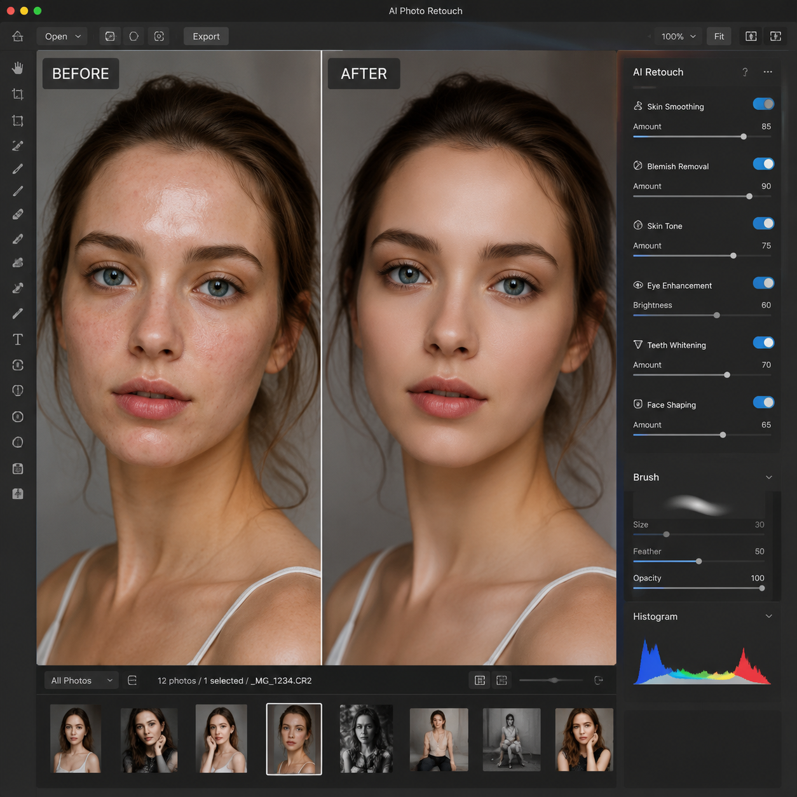

# AI改图软件哪个好用？2026年AI改图工具推荐

改图不再需要学Photoshop了。现在用AI改图软件，上传图片、输入需求，AI自动帮你完成抠图、换背景、调色等操作，几分钟就能出专业效果。

👉 推荐工具：[aishop.anyachina.cn](https://aishop.anyachina.cn) 专注电商商品图改图，效果自然。海报设计用 [poster.anyachina.cn](https://poster.anyachina.cn) 一键生成。

## AI改图软件是什么？

AI改图软件是利用人工智能技术来编辑和优化图片的工具。传统的改图需要手动操作PS的各种工具和图层，而AI改图只需要上传图片，AI就能智能识别图片内容并自动完成修改。

目前的AI改图软件已经可以实现：

- **智能抠图换背景**：一键去除原背景，换成白底、场景图或自定义背景
- **图片修复增强**：模糊图片变清晰，老照片修复上色
- **智能修图美颜**：人像美化、皮肤处理、体型调整
- **文字修改**：图片中的文字可以用AI修改替换

## 主流AI改图软件功能介绍

### 1. 一键抠图换背景

这是最常用的功能。上传商品图或人像照，AI自动识别主体轮廓，复杂边缘如头发丝也能精准抠出。抠好之后可以：

- 换成纯白背景（电商上架必备）
- 换成场景背景（增加产品代入感）
- 换成透明背景（方便后续设计使用）

### 2. 图片清晰化

AI改图的超分辨率功能，可以把低分辨率图片放大并补充细节。特别适合：

- 老照片修复翻新
- 截图素材放大
- 低像素商品图优化

### 3. 智能调色

AI自动分析图片色调，一键调出专业色彩效果。也可以根据参考图调整风格，保持整套图片风格一致。

## AI改图软件的三大优势

**速度快**：传统改图一张图少则十几分钟，多则几小时。AI改图只需几秒到几十秒。

**零门槛**：不需要学习复杂的软件操作，上传图片选功能就能用。

**成本低**：相比请设计师，AI改图几乎零成本，而且可以无限次修改。

## 如何选择AI改图软件？

选择AI改图软件时要注意以下几点：

1. **处理精度**：抠图边缘是否自然、增强效果是否真实
2. **处理速度**：出图速度直接影响工作效率
3. **批量能力**：能否批量处理大量图片
4. **价格**：免费额度是否够用，付费是否合理

## 实战：用AI改图软件处理商品图

以电商商品图为例，AI改图的典型流程：

1. 上传手机拍摄的产品原图
2. 选择"智能抠图"，AI自动去除背景
3. 选择"换背景"，选择白底或场景模板
4. AI自动合成，下载成品

整个过程不超过1分钟，效果堪比专业摄影棚拍摄。

## AI改图和传统PS的对比

| 对比项 | AI改图软件 | 传统PS |
|--------|-----------|--------|
| 学习曲线 | 零基础可用 | 需要专业培训 |
| 处理时间 | 秒级 | 分钟到小时 |
| 抠图精度 | AI自动识别 | 靠手动操作 |
| 批量处理 | 轻松批量 | 繁琐 |
| 精细化调整 | 有限 | 完全可控 |

## 总结

AI改图软件正在改变图片处理的方式。不需要专业设计技能，也不需要昂贵的软件订阅，上传图片就能获得专业级的改图效果。对于电商卖家、自媒体运营者和普通用户来说，AI改图是目前最高效的图片处理方案。

---

*在线工具：[未来图AI](https://www.weilaituai.cn/)*
