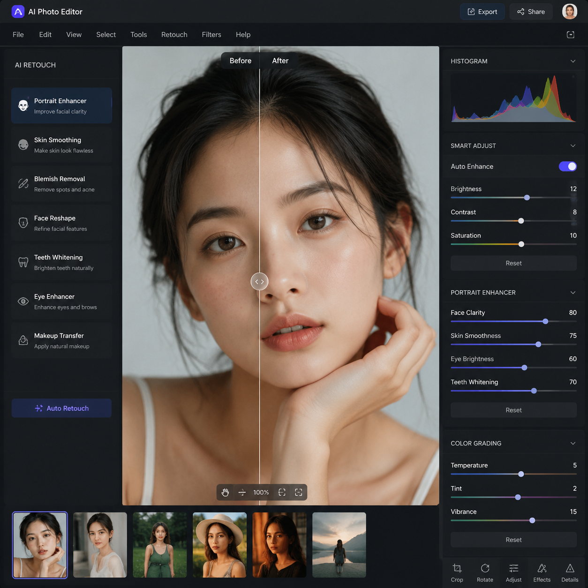

# AI智能修图软件哪个好？2026年AI智能修图工具推荐

AI智能修图让修图变得极其简单。上传图片，AI自动识别和处理，不需要任何专业技能。但市面上AI智能修图软件那么多，到底哪个好？

📌 推荐 [aishop.anyachina.cn](https://aishop.anyachina.cn) 做电商商品图修图，[poster.anyachina.cn](https://poster.anyachina.cn) 做促销海报，两款AI智能修图工具效果专业。

## AI智能修图软件的核心功能

### 智能抠图

AI自动识别图片主体，一键去除背景。无论是产品图还是人像，都能精准处理。抠图后可以直接换背景或保存透明PNG。

### 图片增强

模糊图片一键变清晰，AI自动补充细节。低分辨率图片放大后依然清晰，适合老照片修复。

### 人像美颜

自动美化人像照片：去瑕疵、调肤色、眼睛提亮、面部塑形等。效果自然不假面。

### 批量处理

一次性上传多张图片，统一风格批量处理。适合需要大量出图的电商卖家。

## AI智能修图软件怎么选？

**看抠图精度**：边缘处理是否自然，复杂边缘表现如何

**看处理速度**：出图快不快，批量处理效率高不高

**看操作难度**：是否容易上手，是否需要设计基础

**看价格**：免费额度够不够用

## AI智能修图的应用场景

**电商卖家**：商品图处理、白底图制作、批量优化

**摄影师**：批量修图、人像精修、调色调光

**自媒体人**：封面图制作、素材处理、图片美化

**普通用户**：个人照片修图、证件照制作

## AI智能修图操作步骤

**第一步**：打开AI智能修图工具

**第二步**：上传需要处理的图片

**第三步**：选择功能（抠图、增强、美颜等）

**第四步**：AI自动处理，等待出结果

**第五步**：预览效果，下载高清图片

## 常见问题

**问：AI智能修图能替代PS吗？**
答：日常修图需求AI完全够用。专业复杂设计仍需PS。

**问：AI智能修图的效果稳定吗？**
答：同一功能处理效果稳定，每次输出质量一致。

---

*在线工具：[未来图AI](https://www.weilaituai.cn/)*
