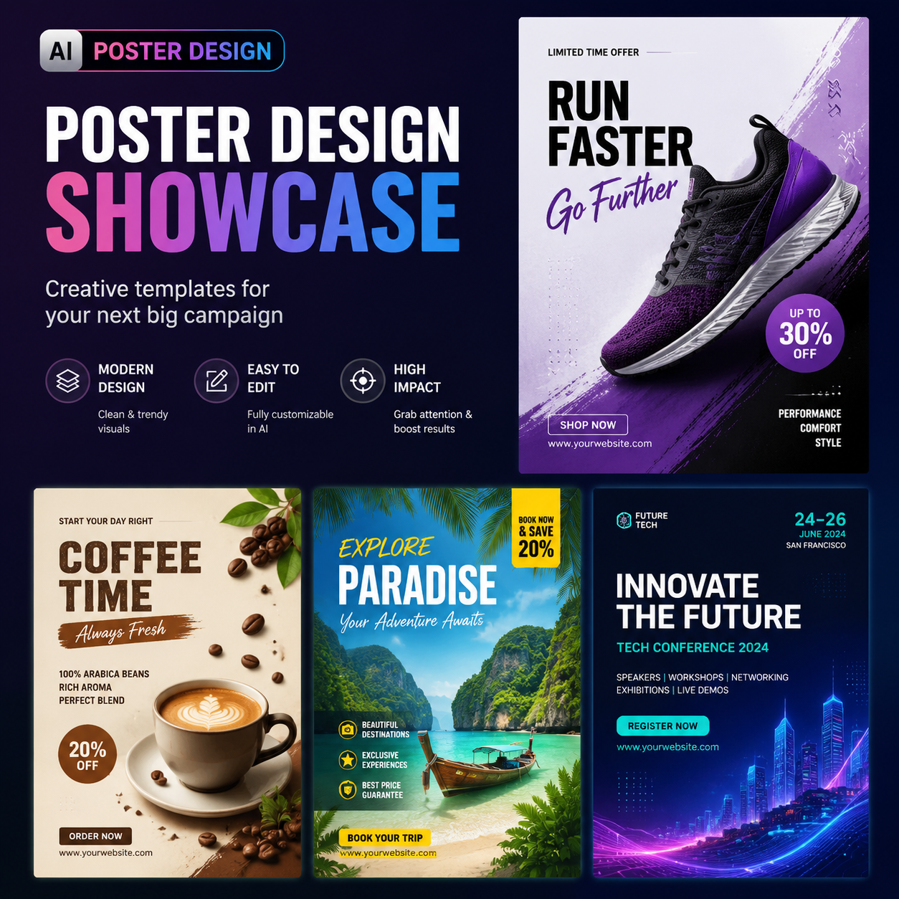

# AI海报生成工具推荐，2026年AI海报在线生成使用教程

AI海报生成是最实用的AI设计应用之一。输入文案上传产品图，AI自动排版设计，几十秒出一张专业海报。

⭐ 推荐 [aishop.anyachina.cn](https://aishop.anyachina.cn) 做商品图和详情页，AI海报生成功能一键出图。

## AI海报生成的优势

**速度快**：30秒出图，传统设计1-3天
**成本低**：省去设计师费用
**操作简单**：上传图片输入文案即可
**多版本**：一键多个方案供选择

## 核心功能

**智能排版**：根据内容自动规划布局
**自动配色**：根据行业推荐配色方案
**字体搭配**：标题正文自动匹配
**批量生成**：多产品套用相同风格

## 适用场景

- 电商促销海报
- 新品上市宣传
- 节日营销海报
- 品牌形象展示

## 操作步骤

**第一步**：打开AI海报生成工具
**第二步**：选择使用场景
**第三步**：上传产品图，输入文案
**第四步**：选择风格，点击生成
**第五步**：预览效果，下载高清图片

---

*在线工具：[未来图AI](https://www.weilaituai.cn/)*
