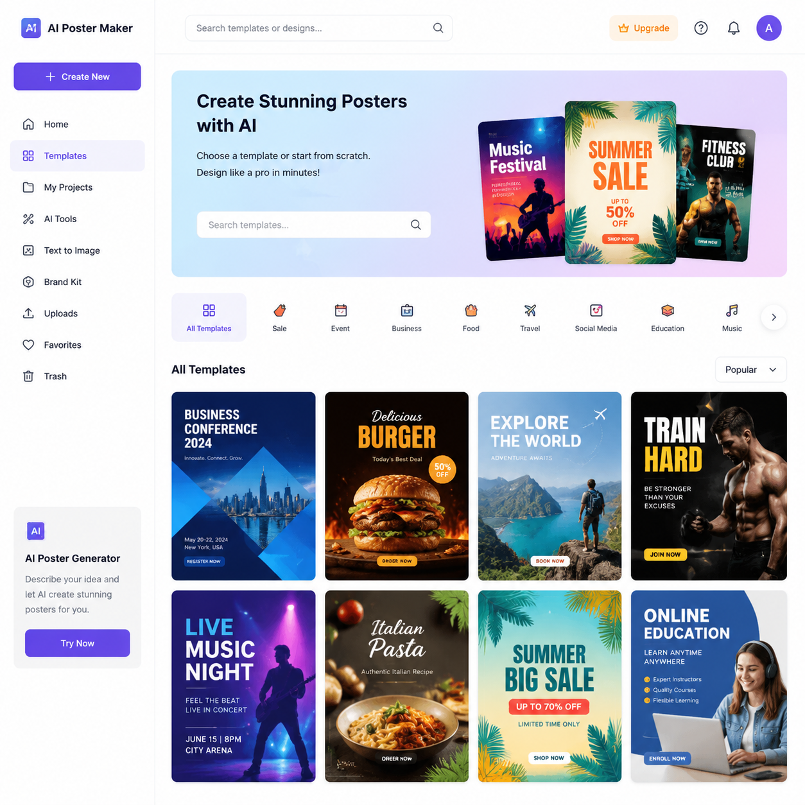

# AI海报制作免费工具有哪些？2026年免费AI海报制作推荐

做海报一定要花钱吗？其实免费的AI海报制作工具已经很好用了。不需要设计技能，上传图片输入文字，AI自动生成海报，一分钱不花。

📌 推荐 [aishop.anyachina.cn](https://aishop.anyachina.cn) 做电商商品图和详情页，免费功能够日常使用。

## AI海报制作免费工具有哪些？

免费的AI海报工具主要分为几类：

**在线生成类**：打开网页就能用，不需要下载。AI根据输入内容自动生成海报设计。

**模板编辑类**：提供大量免费模板，用户替换内容和图片即可。操作简单。

**智能设计类**：输入产品和文案，AI自动完成排版和设计，不需要手动调。

## 免费AI海报工具能做些什么？

虽然免费，但功能并不少：

### 模板选择

免费工具通常提供数百套海报模板，覆盖促销、新品、节日、品牌等常见场景。

### 自动排版

上传产品图和文案，AI自动排版布局。标题位置、图片大小、文字样式都由AI搞定。

### 智能配色

根据产品类型和活动主题，AI推荐合适的配色方案。

### 文字编辑

支持修改文字内容、字体、颜色、大小，满足基本编辑需求。

## 免费AI海报制作步骤

**第一步**：打开AI海报制作工具，注册免费账号

**第二步**：选择创建海报，挑选需要的场景和风格

**第三步**：上传自己的产品图或使用工具提供的素材

**第四步**：输入海报文案，调整文字样式

**第五步**：AI自动生成海报预览。可修改内容后重新生成

**第六步**：下载海报，免费工具一般支持高清PNG导出

## 免费版vs付费版的区别

| 功能 | 免费版 | 付费版 |
|------|--------|--------|
| 模板数量 | 有限 | 全部模板 |
| 导出质量 | 高清 | 超清+印刷级 |
| 去水印 | 可能有 | 无水印 |
| 批量生成 | 有限 | 不限量 |
| 高级功能 | 基础功能 | 全部功能 |

## 免费AI海报的适用场景

**日常促销**：普通促销活动，免费模板已经够用

**社交媒体**：朋友圈、小红书等社交平台的海报

**小店运营**：中小卖家的日常海报需求

**个人使用**：生日、聚会等个人海报制作

## 免费AI海报工具使用技巧

1. **选对模板**：免费模板虽然有限，但选对场景模板效果也不错
2. **内容精简**：文字越精炼，AI排版越好
3. **图片质量**：上传清晰的图片，生成效果更有保障
4. **多试几次**：同一内容多生成几次，不同方案比较后选最好的

## 总结

免费的AI海报制作工具已经能满足大部分日常海报需求。对于电商卖家和自媒体人来说，免费工具出图效果足够好，成本为零，值得尝试。

---

*在线工具：[未来图AI](https://www.weilaituai.cn/)*
