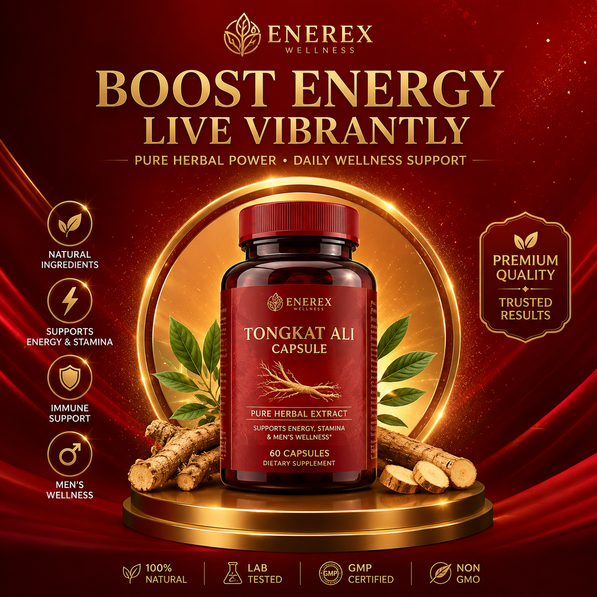

# AI海报设计怎么做？2026年AI一键生成海报教程

海报设计是每个商家都会遇到的刚需。新品上市要海报、节日促销要海报、开业活动也要海报。请设计师一张几百块，自己做又做不好看。

现在AI海报设计工具已经成熟了，输入文案就能自动出图，30秒一张，完全不用学设计软件。

## 传统海报设计 vs AI海报设计

传统方式：找设计师 → 沟通需求 → 等1-3天出初稿 → 修改 → 定稿，一张海报几百到上千元。

AI方式：打开工具 → 输入文案 → 选择模板 → 30秒生成 → 微调 → 下载，成本几乎为零。

两者的效果差距正在缩小，AI海报在排版、配色、字体搭配上已经能达到专业水平。

## 怎么做一张AI海报？

### 第一步：确定海报类型

先想好你要做什么类型的海报：
- 促销海报：突出折扣和卖点
- 节日海报：烘托节日氛围
- 开业海报：传递开业信息
- 招聘海报：吸引求职者

### 第二步：准备文案

把标题、副标题、卖点、联系方式准备好。文案越清晰，AI生成的海报越精准。

### 第三步：用AI生成

把文案输入AI海报工具，选择风格，点击生成。不满意就换一个，直到满意为止。

⭐ 推荐工具：[poster.anyachina.cn](https://poster.anyachina.cn) 一键生成各类商业海报，模板丰富出图快。

## 海报设计的几个要点

1. **标题要大**：用户第一眼看到的是标题，占画面30%以上
2. **色彩不要超过3种**：颜色太多显得杂乱
3. **留白要够**：不要把画面塞满，呼吸感很重要
4. **行动引导明确**：告诉用户下一步做什么

## 总结

AI海报设计让每个商家都能自己做出专业级海报。不需要设计基础，不需要买软件，打开浏览器就能做。试试用AI做一张，你会发现比想象的简单很多。

---

*在线工具：[未来图AI](https://www.weilaituai.cn/)*
