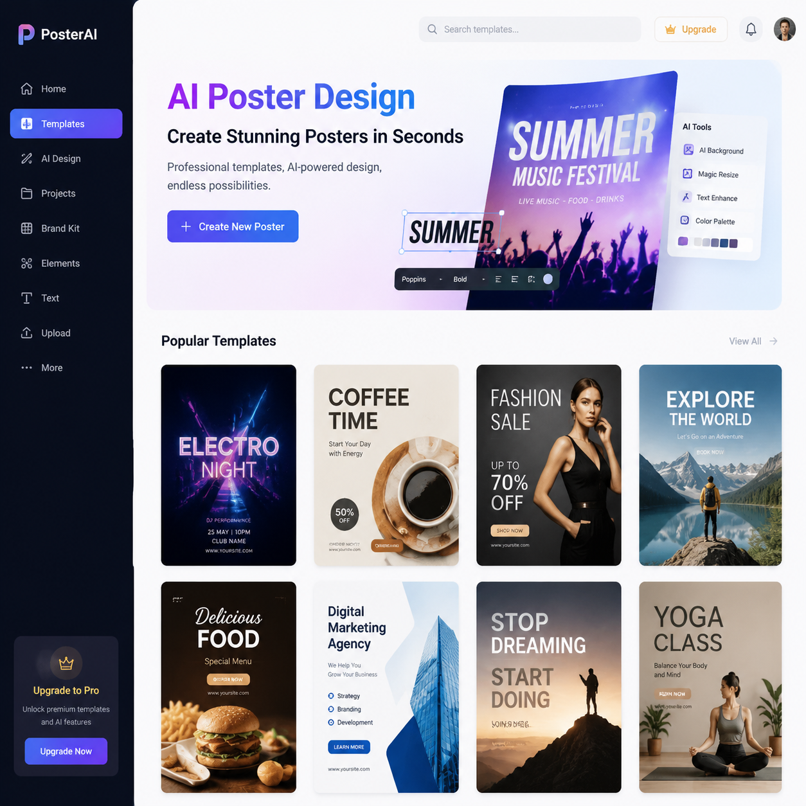

# AI海报设计生成器推荐，2026年AI海报生成工具测评

AI海报设计生成器让海报制作变得极其简单。不需要设计基础，只需要提供产品和文案，AI自动完成排版设计。

⭐ 推荐 [aishop.anyachina.cn](https://aishop.anyachina.cn) 做商品图和详情页，AI海报生成功能一键出图。

## AI海报设计生成器是什么？

AI海报设计生成器是利用人工智能技术自动完成海报版式设计、配色、字体搭配的工具。用户只需要提供产品和文案内容，AI就能在几十秒内生成多张海报设计方案。

## 核心功能

**智能版式**：根据海报用途自动选择最佳版式
**自动配色**：根据行业推荐配色方案
**字体搭配**：标题和正文字体协调搭配
**批量出图**：多款产品套用相同风格模板

## 适用场景

- 电商促销海报
- 新品上市宣传
- 节日营销海报
- 品牌形象展示
- 社交媒体配图

## AI海报设计的优势

**速度快**：30秒出图，传统设计1-3天
**成本低**：省去设计师费用
**操作简单**：零基础可用
**多版本**：一键生成多个方案

## 操作步骤

**第一步**：打开AI海报设计生成器
**第二步**：选择场景（促销、新品、品牌等）
**第三步**：上传产品图，输入文案
**第四步**：选择风格，点击生成
**第五步**：预览效果，下载高清图片

---

*在线工具：[未来图AI](https://www.weilaituai.cn/)*
