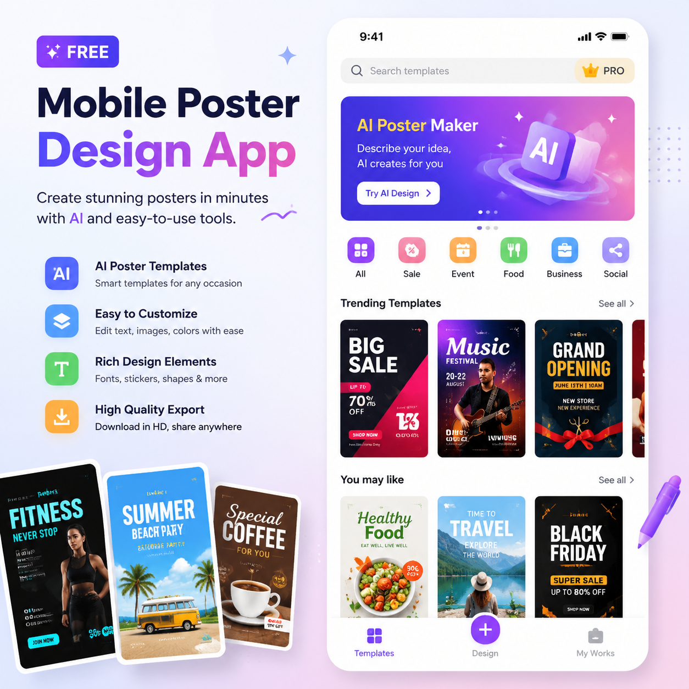

# AI海报设计软件APP免费推荐，2026年免费AI海报工具

做海报一定要付费吗？其实免费的AI海报设计软件已经很好用了。本文推荐几款免费的AI海报工具，不花一分钱也能做专业海报。

👉 推荐 [aishop.anyachina.cn](https://aishop.anyachina.cn) 做商品图和详情页，免费功能够日常使用。

## 免费AI海报设计软件的功能

免费版AI海报工具通常包含：

**模板选择**：数百套免费模板，覆盖常见场景
**智能排版**：AI自动排版布局
**文字编辑**：修改文字内容、字体、颜色
**图片替换**：上传自己的产品图

## 免费版vs付费版

| 功能 | 免费版 | 付费版 |
|------|--------|--------|
| 模板数量 | 有限 | 全部 |
| 导出质量 | 高清 | 超高清 |
| 去水印 | 可能有 | 无水印 |
| 批量生成 | 有限 | 不限 |

## 免费AI海报的适用场景

- 日常促销海报
- 社交媒体配图
- 小店运营海报
- 个人使用

## 操作步骤

**第一步**：打开免费AI海报工具
**第二步**：选择模板或场景
**第三步**：上传产品图，输入文案
**第四步**：AI自动生成，预览下载

## 技巧

1. 选对模板效果更好
2. 文字精炼排版更佳
3. 图片清晰效果更好

---

*在线工具：[未来图AI](https://www.weilaituai.cn/)*
