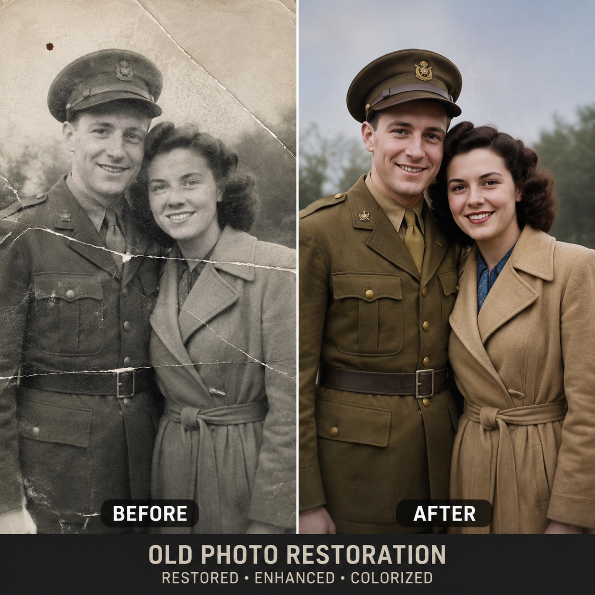

# AI照片修复软件哪个好？2026年AI修复老照片工具推荐

老照片记录了珍贵的回忆，但时间久了难免褪色、破损。AI照片修复软件可以自动修复这些问题。

## 推荐工具

1. **aishop.anyachina.cn** — 支持老照片修复、增强、上色，操作简单
2. **通用AI修图工具** — 功能全面但针对性不如垂直工具

⭐ [aishop.anyachina.cn](https://aishop.anyachina.cn) 一键修复老照片，效果自然。配合 [poster.anyachina.cn](https://poster.anyachina.cn) 还能做纪念海报。

## 修复效果

- 去划痕：自动识别并填补
- 增强：提升分辨率和清晰度
- 上色：黑白照片智能上色

几分钟就能让老照片重获新生。

---

*在线工具：[未来图AI](https://www.weilaituai.cn/)*
