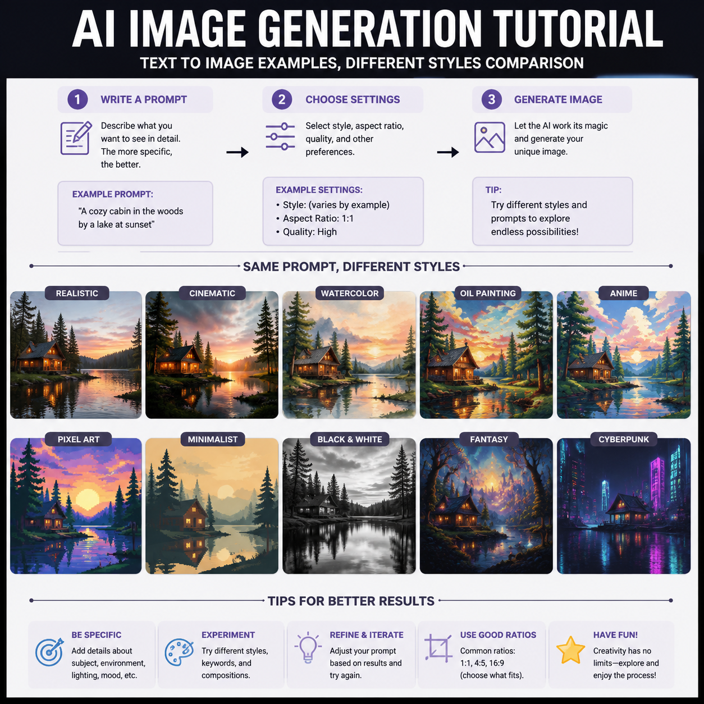

# AI生图怎么用？2026年AI生图在线工具使用教程

AI生图是当前最热门的AI应用之一。输入文字描述，AI就能生成对应的图片。本文介绍AI生图的基本用法和实用技巧。

📌 试试 [aishop.anyachina.cn](https://aishop.anyachina.cn) 生成商品图，[poster.anyachina.cn](https://poster.anyachina.cn) 做促销海报，两款AI生图工具都支持中文提示词。



## AI生图是什么？

AI生图就是通过人工智能技术，根据文字描述自动生成图片。你告诉AI你想要什么样的图片，AI就能帮你画出来。

AI生图的应用场景非常广泛：
- **商品图生成**：上传产品照片，AI生成不同风格的展示图
- **海报设计**：输入文案，AI生成完整的海报设计
- **创意插画**：输入描述，AI生成艺术插画
- **场景图**：把产品放到各种场景中，生成场景图

## AI生图的基本操作

### 第一步：写提示词

提示词就是你对AI的"画图指令"。好的提示词包含四个要素：

- **主体**：画面中主要是什么
- **环境**：背景和氛围
- **风格**：视觉风格（写实、插画、极简等）
- **细节**：颜色、光线、构图等

### 第二步：选择参数

设置图片比例（1:1、16:9、4:3等），选择风格模板。

### 第三步：点击生成

AI处理需要几秒到几十秒，等待出图。

### 第四步：下载使用

预览效果，满意后下载高清图片。不满意可以修改提示词重新生成。

## AI生图实用技巧

### 提示词要具体

```
❌ 不好：一张漂亮的图
✅ 好：白色陶瓷咖啡杯，木桌，自然光，极简风格，商业摄影
```

描述越具体，AI越能理解你要的效果。

### 善用风格词

在提示词中加入风格参考词汇：
- "商业摄影风格" → 适合商品图
- "极简主义" → 适合海报
- "写实风格" → 适合产品展示

### 多版本生成

同一提示词生成多个版本，AI每次生成略有不同，选择最满意的一个。

## AI生图工具推荐

| 工具类型 | 优点 | 适合人群 |
|---------|------|---------|
| 电商专用 | 商品图效果好 | 电商卖家 |
| 通用型 | 风格多样 | 创意设计 |
| 海报型 | 排版专业 | 运营人员 |

## 常见问题

**问：AI生图需要付费吗？**
答：大部分AI生图工具提供免费额度，日常使用够了。

**问：AI生图的结果可以商用吗？**
答：生成图片的版权归用户所有，可以商用。

---

*在线工具：[未来图AI](https://www.weilaituai.cn/)*
