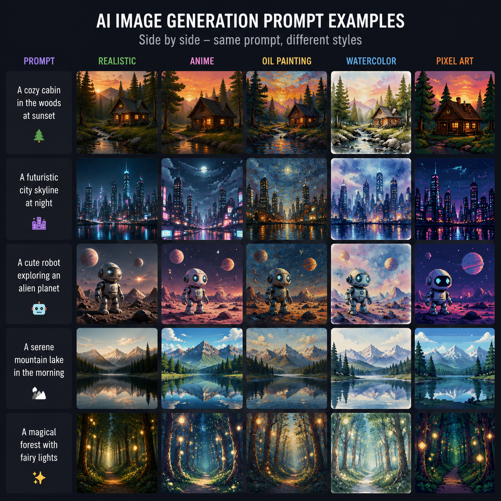

# AI生图提示词怎么写？2026年AI生图提示词技巧大全

用AI生图工具，提示词写得好不好，直接决定出图质量。很多人觉得AI生图就是随便写几句描述，其实好的提示词能让出图效果翻倍。

🚀 推荐 [aishop.anyachina.cn](https://aishop.anyachina.cn) 生成商品图，[poster.anyachina.cn](https://poster.anyachina.cn) 做海报，两款工具都支持中文提示词，上手简单出图快。



## 什么是AI生图提示词？

AI生图提示词（Prompt）就是你对AI描述"想要什么样的图片"的文字。和搜索关键词不同，提示词需要更具体、更有结构。

好的提示词 = 好的出图效果。用大白话说就是：你描述得越清楚，AI越能画出你想要的。

## 提示词的基本结构

一个完整的AI生图提示词包含四个要素：

**主体**：画面中主要是什么（产品、人物、场景）
**环境**：背景和氛围（室内、户外、灯光）
**风格**：视觉风格（写实、插画、极简、复古）
**细节**：具体特征（颜色、材质、构图）

举个例子：
```
❌ 差：一件衣服
✅ 好：一件白色女士连衣裙，纯色背景，柔和自然光，高清细节
```

## 不同场景的提示词模板

### 电商商品图

```
[产品名]，白底/场景图，[材质描述]，[光线条件]，高清，商业摄影风格
```

示例：*"白色陶瓷咖啡杯，极简白底，柔光照射，商业摄影级，4K高清"*

### 海报设计

```
[主题]促销海报，[风格]，[色彩]，[排版描述]，专业设计感
```

示例：*"夏日清凉饮品促销海报，蓝白配色，极简时尚排版，高端质感"*

### 产品场景图

```
[产品名]在[场景]中，[光线条件]，真实感，生活化
```

示例：*"皮质手提包在咖啡厅桌上，暖光，真实生活场景，自然氛围"*

### 人像修图

```
[人物描述]，[风格]，[光线]，[肤色/细节]，自然美颜
```

## AI生图提示词进阶技巧

### 技巧一：用权重词

在提示词中强调某些元素，可以用括号或者权重标记（不同工具格式不同）：
- 主体优先：把最重要的词放在前面
- 重复强调：重复关键词可以增加权重
- 程度词：使用"非常""极其""高细节"等程度副词

### 技巧二：加入否定提示

告诉AI不要什么，比告诉它要什么同样重要：
- 避免模糊、低质量
- 避免多余的元素
- 避免奇怪的比例

### 技巧三：参考风格

如果想让图片有特定的艺术风格，可以加入风格参考词：
- "商业摄影风格""杂志封面感""ins风"
- "赛博朋克""极简主义""北欧风"
- "电影质感""素描风格""油画感"

## 常见问题

**问：中文提示词和英文提示词哪个效果好？**
答：大部分AI生图工具对英文支持更好，但好的中文工具（如aishop、poster）对中文提示词的识别也很准确。

**问：提示词越长越好吗？**
答：不是。提示词要精准，不是越长越好。30-80个词是比较合适的长度，重点信息前置。

---

*在线工具：[未来图AI](https://www.weilaituai.cn/)*
