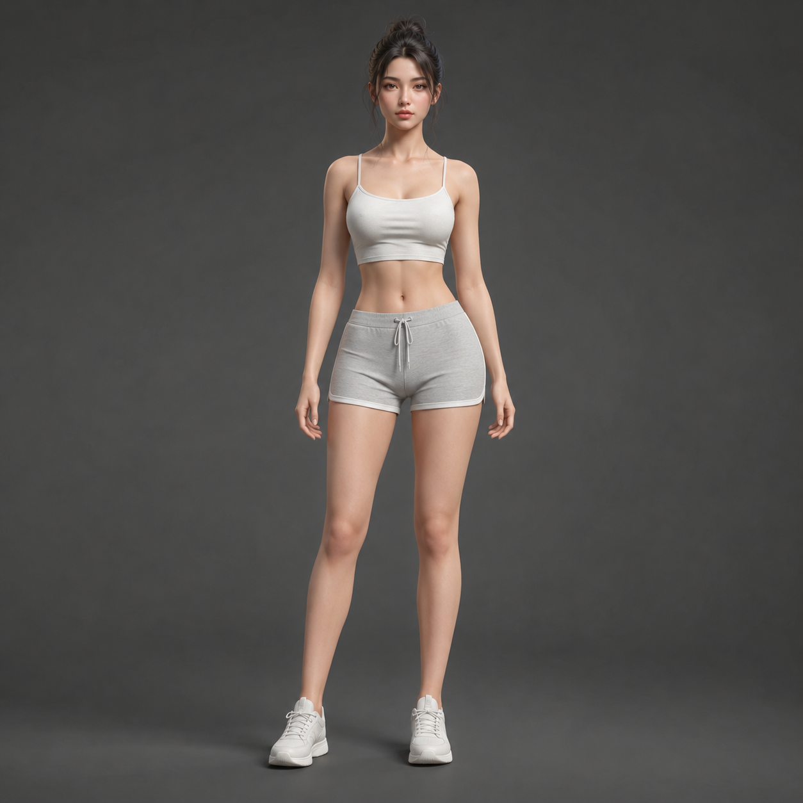

# AI生成3D人物怎么做？2026年AI生成3D人物在线教程

3D人物制作以前需要专业建模软件和技能。现在AI生成3D人物工具让这件事变得简单，上传照片或输入描述，AI自动生成3D人物模型。

🚀 推荐 [aishop.anyachina.cn](https://aishop.anyachina.cn) 做商品图，[poster.anyachina.cn](https://poster.anyachina.cn) 做促销海报，AI工具搭配使用效率更高。

## AI生成3D人物是什么？

AI生成3D人物就是利用人工智能技术，自动创建3D人物模型。不需要3D建模软件，不需要专业技能，AI就能生成逼真的3D人物。

AI生成3D人物的主要应用：

- **电商模特**：生成虚拟模特展示服装，不用请真人模特
- **游戏角色**：快速生成游戏角色概念图
- **虚拟形象**：创建个人虚拟形象用于社交或直播
- **设计素材**：3D人物素材用于海报和广告设计

## AI生成3D人物的方式

### 方式一：照片转3D

上传真人照片，AI自动转换成3D人物模型。模型保留人物特征，适合电商模特展示。

### 方式二：文字描述生成

输入人物描述（性别、年龄、服装、姿态等），AI直接生成3D人物。适合虚拟形象和游戏角色。

### 方式三：模板调整

在现有3D人物模板基础上，调整外观、服装、姿态等参数。操作最简单。

## AI生成3D人物的应用场景

**电商服装展示**：生成虚拟模特试穿衣服，节省拍摄成本

**游戏开发**：快速生成游戏角色概念图

**广告设计**：3D人物素材用于海报和广告

**虚拟偶像**：创建虚拟形象用于直播和短视频

## AI生成3D人物的优势

**省钱**：不请模特、不租影棚，AI直接生成

**省时**：传统3D建模几天到几周，AI只需几分钟

**灵活**：随时修改人物外观、服装、姿态

**版权清晰**：AI生成的人物版权归用户所有

## 操作步骤

**第一步**：打开AI生成3D人物工具
**第二步**：选择生成方式（照片转3D、文字描述、模板）
**第三步**：上传照片或输入描述
**第四步**：选择风格和参数
**第五步**：点击生成，等待处理
**第六步**：预览下载3D人物

---

*在线工具：[未来图AI](https://www.weilaituai.cn/)*
