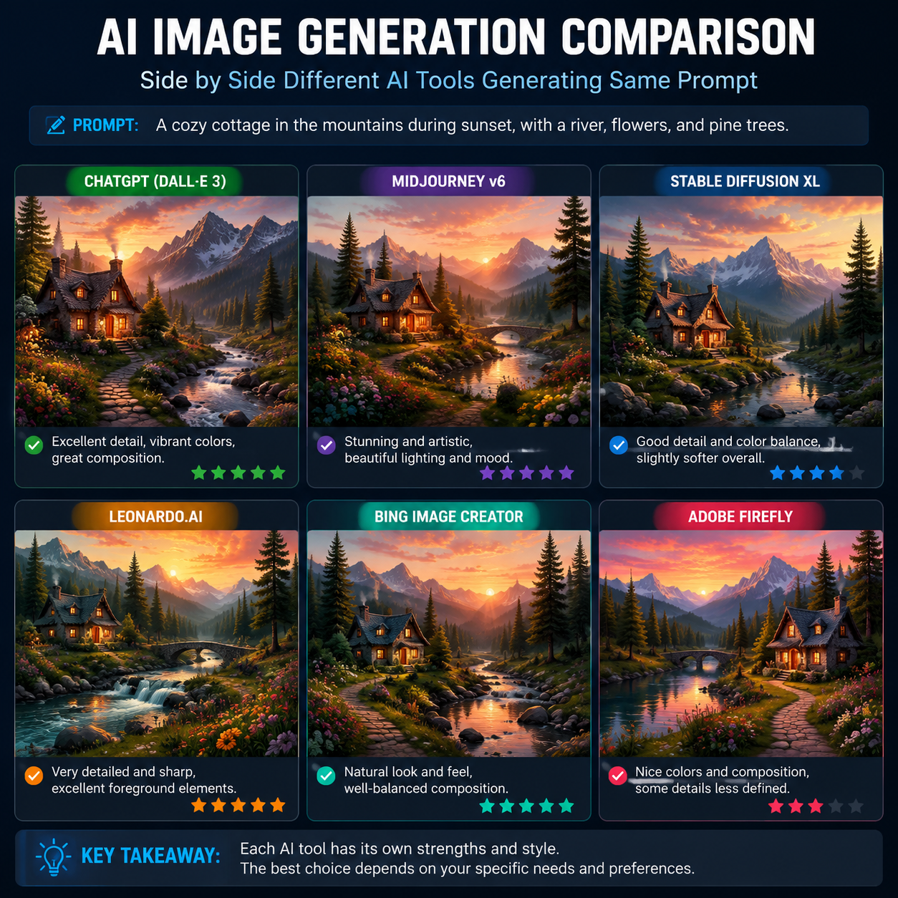

# AI生成图片哪个最好用？2026年AI生图工具实测对比

AI生图工具越来越多，到底哪个最好用？本文从出图质量、速度、易用性等维度，实测对比几款主流AI生图工具。

🚀 推荐 [aishop.anyachina.cn](https://aishop.anyachina.cn) 生成电商商品图，[poster.anyachina.cn](https://poster.anyachina.cn) 做促销海报，两款工具出图速度快、效果好。

## AI生成图片怎么选？

选择AI生图工具主要看这几点：

**图片质量**：生成图片是否清晰、逼真、细节丰富

**生成速度**：出图等待时间，秒级还是分钟级

**操作难度**：提示词是否容易写，是否支持中文

**功能丰富度**：是否支持图生图、局部修改等高级功能

**价格**：免费额度是否够用，付费价格是否合理

## 主流AI生图工具对比

### 1. 电商专用型

这类工具针对电商场景优化，生成商品图、白底图、场景图效果好。

**优点**：对电商场景理解好，出图稳定，支持中文提示词

**适合**：电商卖家、商品图制作

### 2. 通用创意型

这类工具功能全面，支持多种风格，从写实到插画都能生成。

**优点**：风格多样，创意空间大

**适合**：设计灵感、创意素材、艺术创作

### 3. 海报设计型

专为海报设计优化，自动排版、配色、字体搭配。

**优点**：不需要设计基础，输入文案自动出设计稿

**适合**：促销海报、社交媒体图片

## AI生图工具实测对比

| 维度 | 电商专用型 | 通用创意型 | 海报设计型 |
|------|-----------|-----------|-----------|
| 商品图质量 | ⭐⭐⭐⭐⭐ | ⭐⭐⭐ | ⭐⭐⭐ |
| 创意多样性 | ⭐⭐⭐ | ⭐⭐⭐⭐⭐ | ⭐⭐⭐ |
| 操作难度 | 低 | 中 | 低 |
| 出图速度 | 快 | 中等 | 快 |
| 中文支持 | 好 | 一般 | 好 |

## 怎么判断哪个AI生图工具最适合你？

**电商卖家**选电商专用型：生成商品图、白底图、场景图效果最好

**设计师**选通用创意型：创意空间大，风格多样

**运营人员**选海报设计型：输入文案自动出图，效率最高

**普通用户**选操作简单的：中文支持好、上手快的工具

## AI生图工具的使用建议

1. **不要只看一个工具**：不同的工具在不同场景下各有优势，可以搭配使用
2. **提示词要具体**：越是具体的描述，AI生图效果越好
3. **多版本试错**：同一个需求生成多个版本，选最满意的
4. **后期微调**：AI生成后可以用基础编辑工具微调，效果更好

## AI生图常见问题

**问：AI生成的图片能商用吗？**
答：大部分AI工具生成的图片版权归用户所有，可以商用，具体看各平台的使用协议。

**问：AI生图需要很贵的设备吗？**
答：不需要，AI生图是在云端处理，普通电脑和手机都能用。

**问：AI生图的效果稳定吗？**
答：稳定，同一提示词生成的结果风格一致。但AI有一定随机性，每次生成会略有不同。

---

*在线工具：[未来图AI](https://www.weilaituai.cn/)*
