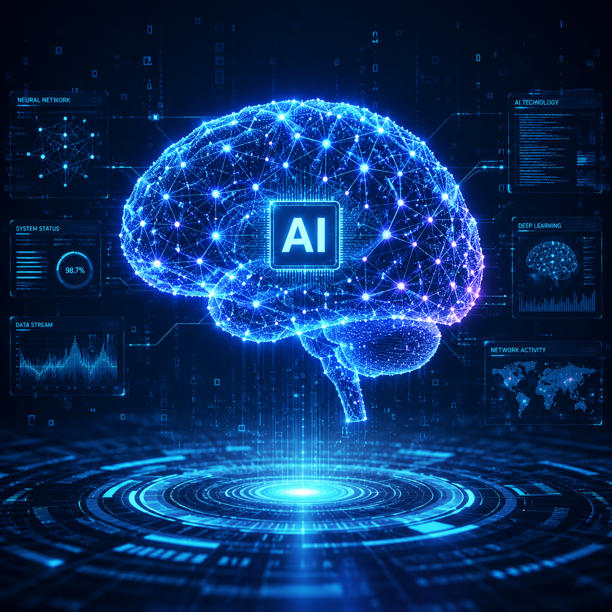

# AI生成模型是什么？2026年AI生成模型使用教程

AI生成模型是人工智能领域的核心技术之一。它能根据输入的数据或指令，自动生成图片、文字、3D模型等内容。本文介绍AI生成模型的基础知识。

🚀 推荐 [aishop.anyachina.cn](https://aishop.anyachina.cn) 做商品图，[poster.anyachina.cn](https://poster.anyachina.cn) 做促销海报，两款基于AI模型的工具效果出色。

## AI生成模型是什么？

AI生成模型是一种能够创造新内容的人工智能系统。通过学习大量数据，模型掌握了生成内容的规律，然后根据用户输入生成新的结果。

常见的AI生成模型类型：

- **文生图模型**：文字描述生成图片
- **图生图模型**：参考图生成新图
- **3D生成模型**：文本或图片生成3D模型

## AI生成模型的应用

**图片生成**：输入文字生成商品图、海报、插画
**图像编辑**：智能抠图、图片增强、背景替换
**3D建模**：快速生成3D人物和场景
**内容创作**：辅助设计师快速出初稿

## AI生成模型的工作原理

AI生成模型通过大量训练数据学习内容的规律和特征。当用户输入指令后，模型根据学习到的知识，一步步生成新的内容。

## 操作步骤

**第一步**：打开支持AI生成模型的工具
**第二步**：输入指令或上传参考图
**第三步**：设置参数
**第四步**：点击生成
**第五步**：预览下载

## 常见问题

**问：AI生成模型需要专业设备吗？**
答：在线使用不需要，云端处理，普通电脑即可。

**问：AI生成模型的结果能商用吗？**
答：生成内容的版权归用户所有，可以商用。

---

*在线工具：[未来图AI](https://www.weilaituai.cn/)*
