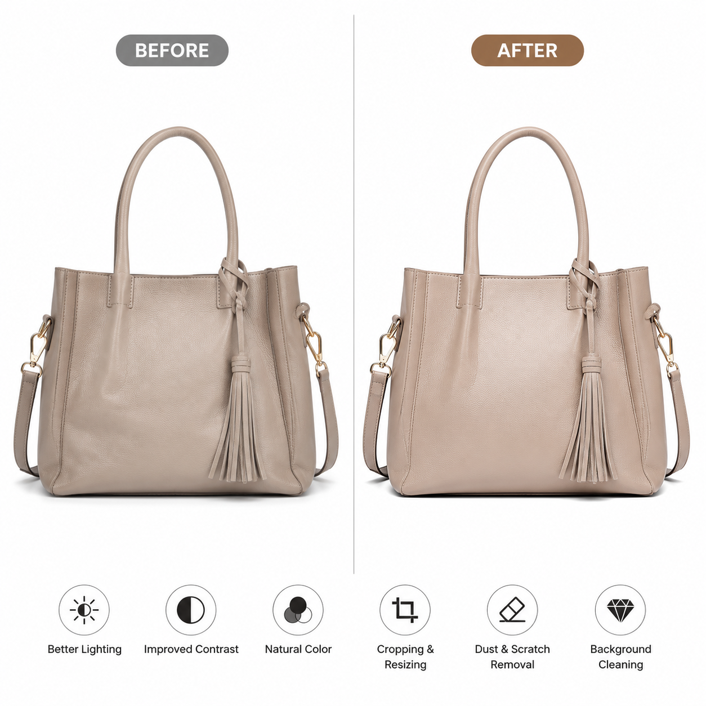

# AI电商图片怎么生成？2026年电商AI图片生成完整教程

电商卖家的图片需求量巨大：主图、详情图、场景图、白底图……以前只能靠摄影师和设计师，现在用AI电商图片工具，自己就能搞定大部分图片需求。

📌 试试 [aishop.anyachina.cn](https://aishop.anyachina.cn) 一键生成商品图和详情页，[poster.anyachina.cn](https://poster.anyachina.cn) 做促销海报，全套电商视觉工具。

## AI电商图片是什么？

AI电商图片就是利用人工智能技术生成和优化电商图片。从商品主图到详情页，从白底图到场景图，AI都能快速搞定。

传统电商图片制作的痛点：
- 拍照贵：请摄影师一次几百上千
- 修图慢：P一张图大半天
- 改图麻烦：重拍或重新修图成本高

AI电商图片正好解决这些问题。

## AI电商图片的核心功能

### 1. 商品主图生成

上传产品照片，AI自动抠图、换背景、调光。生成白底主图或场景主图，适配各电商平台规格。

### 2. 详情页制作

把产品图和卖点信息给AI，自动生成包含主图、卖点图、场景图、参数图、对比图的完整详情页。

### 3. 白底图

电商上架的标准配置。AI自动抠图换白底，阴影自然、边缘干净。

### 4. 批量处理

批量上传产品图，统一风格一键处理。适合店铺中商品图片风格统一。

## AI电商图片的制作步骤

**第一步**：拍摄产品照片。手机拍摄即可，注意光线均匀、产品主体突出。

**第二步**：上传到AI工具，选择需要的功能（抠图、换背景、生成主图等）。

**第三步**：填写产品卖点信息（材质、尺寸、功能等），信息越多AI生成越精准。

**第四步**：选择风格模板，点击生成。

**第五步**：预览效果，满意下载。不满意重新生成，直到满意为止。

## 电商AI图片的应用场景

**商品上架**：生成白底主图，符合各平台标准
**促销活动**：制作促销氛围图，突出折扣信息
**详情页优化**：整套详情页一键生成，提升转化率
**社交媒体**：制作小红书、朋友圈等渠道的宣传图

## AI电商图片实战技巧

1. **产品图要清晰**：AI是在原图基础上创作，原图越清晰效果越好
2. **卖点提炼好**：把产品最核心的卖点提炼出来，AI生成的图片更有说服力
3. **风格统一**：同一批产品用相同的风格模板，店铺看起来更专业
4. **多版测试**：用AI生成多个版本，分别测试转化率

## AI电商图片与传统方式的对比

| 对比项 | AI方式 | 传统方式 |
|--------|--------|---------|
| 制图时间 | 几分钟 | 半天以上 |
| 制作成本 | 极低 | 几百元/次 |
| 技能要求 | 无需设计基础 | 需要PS技能 |
| 批量生产 | 轻松搞定 | 费时费力 |
| 修改调整 | 随时重新生成 | 繁琐复杂 |

---

*在线工具：[未来图AI](https://www.weilaituai.cn/)*
