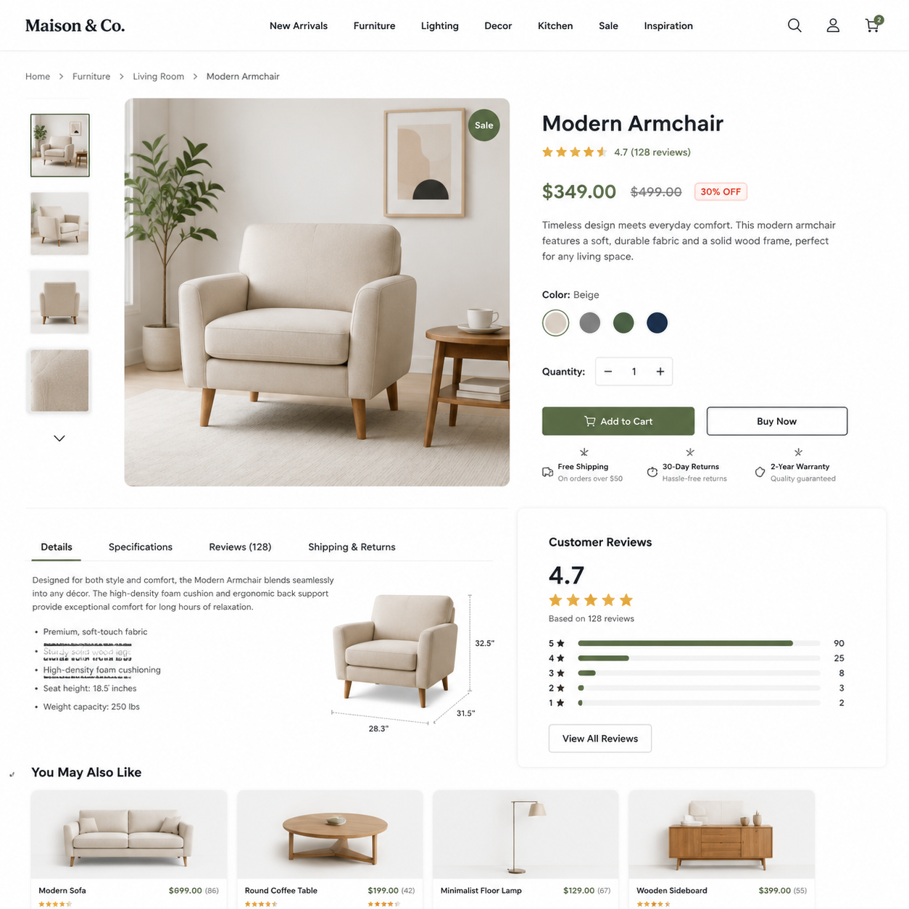

# AI电商详情页怎么做？2026年AI自动生成详情页完整教程

电商详情页是线上店铺的"门面"。详情页做得好，转化率翻倍；做得差，流量再多也白费。但很多中小卖家请不起专业设计师，自己做又不懂排版。

现在用AI电商详情页工具，上传产品图、输入卖点，AI自动生成整张详情页，连文案都帮你写好。

👉 推荐工具：[aishop.anyachina.cn](https://aishop.anyachina.cn) 一键生成电商详情页和商品主图，[poster.anyachina.cn](https://poster.anyachina.cn) 还可以做促销海报，一套工具搞定全部。

## 什么是AI电商详情页？

AI电商详情页就是用人工智能技术，自动生成电商产品的详情介绍页面。它不只是拼图，而是根据产品的图片和卖点信息，智能生成包含主图、卖点图、场景图、参数图等模块的完整详情页。

传统的详情页制作流程：拍照→修图→排版→写文案→反复修改，一套下来至少半天到一天。AI电商详情页把整个流程压缩到30分钟以内。

## AI电商详情页的五大核心功能

### 1. 主图生成

上传产品原图，AI自动抠图换背景，生成白底图或场景主图。可以根据不同电商平台的要求调整尺寸。

### 2. 卖点图

把你产品的核心卖点（如材质、功能、适用人群）输入给AI，自动生成对应的卖点展示图，图文排版美观。

### 3. 场景图

AI能把产品放置到真实使用场景中。比如卖厨房用品，自动生成厨房场景图，让买家看到产品在实际环境中的效果。

### 4. 对比图

自动生成"改善前vs改善后"的对比图，突出产品的价值。这是提升转化率非常有效的手段。

### 5. 参数规格图

根据你输入的产品参数，自动排版成清晰的规格说明图，统一风格。

## AI电商详情页制作的详细步骤

### 第一步：准备素材

你需要准备两样东西：
- 产品照片（手机拍摄即可，注意光线和角度）
- 产品卖点信息（材质、尺寸、功能特色、使用场景等）

### 第二步：登录AI工具

打开AI电商详情页工具，注册账号即可使用。

### 第三步：上传并设置

上传产品图片，填写卖点信息，选择想要的风格模板。AI工具一般提供多种行业模板可选：食品、服装、家电、美妆等。

### 第四步：AI生成并微调

点击生成后，AI会在几十秒内输出详情页预览。你可以对不满意的模块进行调整，或者直接重新生成。

### 第五步：下载使用

确认效果满意后，下载导出即可。通常AI工具提供高清无水印的原图。

## AI电商详情页和传统方式对比

| 对比项 | 传统设计 | AI详情页 |
|--------|---------|---------|
| 制作时间 | 半天以上 | 20-30分钟 |
| 设计成本 | 几百元/次 | 极低成本 |
| 专业技能 | 需要会PS/排版 | 零基础可用 |
| 修改难度 | 麻烦，涉及返工 | 随时重新生成 |
| 批量出图 | 成本随数量翻倍 | 边际成本极低 |

## 实战技巧：让你的AI详情页更出彩

1. **原图质量决定上限**：AI是在原图上创作的，原图越清晰、产品主体越突出，生成的详情页效果越好。
2. **卖点写具体**：不要只写"质量好"，写"加厚不锈钢，双层防烫设计"，AI才能生成有说服力的画面。
3. **参考同行业模板**：先看看做得好的同行详情页是怎么布局的，再决定自己的风格方向。
4. **A/B测试**：用AI可以低成本生成多个版本的详情页，不同版本分别测试转化率。

## 常见问题

**问：AI电商详情页适合哪些品类？**
答：几乎全品类通用，尤其是服装、食品、家居、美妆、电子产品等标准化程度较高的品类效果最好。

**问：生成的图片版权归谁？**
答：大部分AI工具的生成图片著作权归用户所有，具体看各平台的使用协议。

**如果还需要生成促销海报**，可以试试 [poster.anyachina.cn](https://poster.anyachina.cn)，和详情页搭配使用效果更好。

---

*在线工具：[未来图AI](https://www.weilaituai.cn/)*
