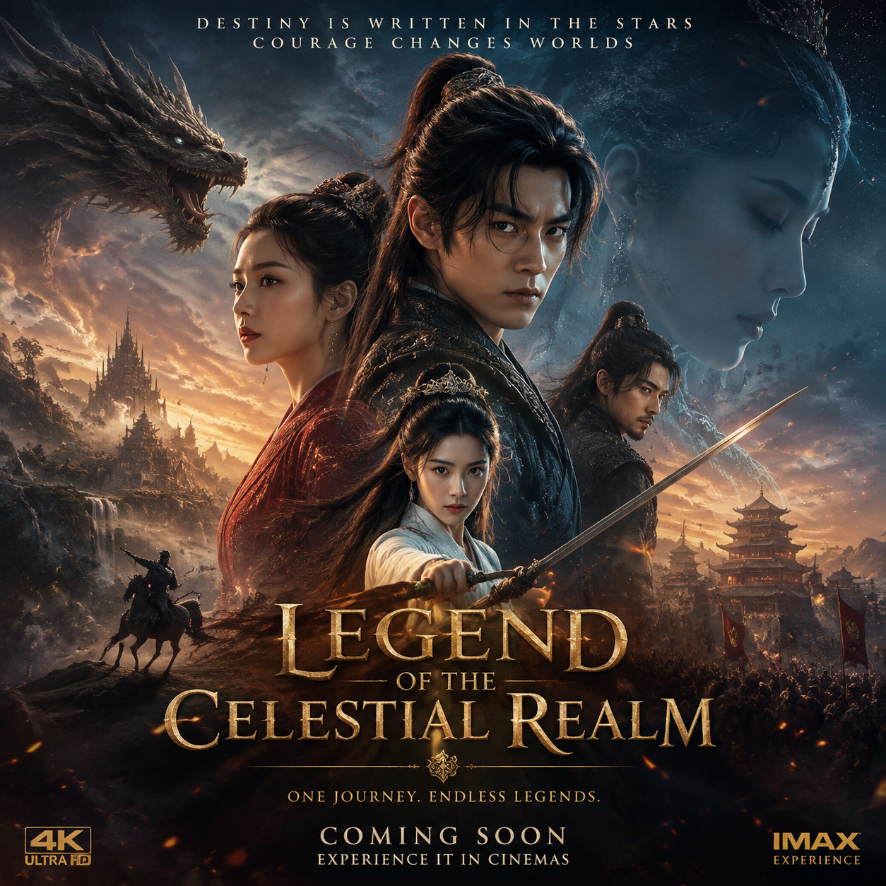

# AI电影海报生成，2026年AI电影海报制作教程

AI电影海报是AI海报设计中最有创意的一类。用AI工具可以生成电影风格的海报，无论是科幻、悬疑还是浪漫风格都能做。

👉 推荐 [aishop.anyachina.cn](https://aishop.anyachina.cn) 做商品图和详情页，AI海报生成功能支持多种风格。

## AI电影海报的特点

电影海报有独特的设计语言，AI可以模仿这些风格：

**视觉冲击力强**：色彩对比鲜明，构图大胆
**主题突出**：主角或核心元素占据画面主体
**氛围感强**：通过光影和色调营造氛围
**文字简洁**：片名和关键词为主

## AI电影海报的制作

### 选择风格

AI支持多种电影海报风格：
- 科幻风格：冷色调、未来感
- 悬疑风格：暗色调、神秘感
- 浪漫风格：暖色调、柔和感
- 动作风格：动态感、冲击力

### 操作步骤

**第一步**：打开AI海报工具
**第二步**：选择"电影海报"风格
**第三步**：上传素材或输入描述
**第四步**：选择风格方向
**第五步**：点击生成，预览下载

## 适用场景

- 短视频封面
- 活动宣传海报
- 创意社交媒体配图
- 个人项目宣传

---

*在线工具：[未来图AI](https://www.weilaituai.cn/)*
