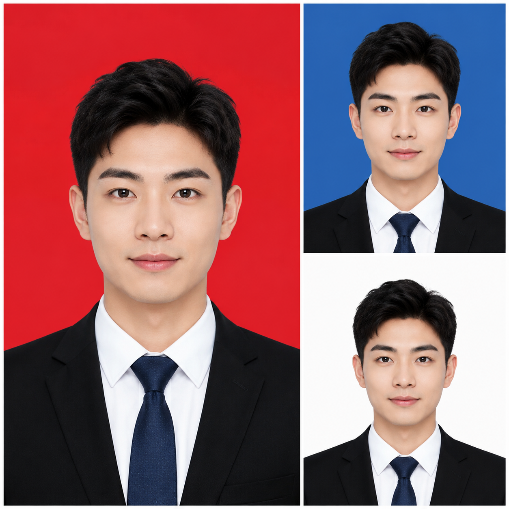

# AI证件照怎么生成？2026年AI证件照生成在线教程

证件照是日常高频需求，但去照相馆拍一次几十块，自己P又麻烦。现在用AI证件照生成工具，上传自拍就能自动生成合规证件照，换底色、换服装一键搞定。

🚀 推荐 [aishop.anyachina.cn](https://aishop.anyachina.cn) 编辑商品图和详情页，[poster.anyachina.cn](https://poster.anyachina.cn) 做促销海报，日常编辑工具搭配使用更高效。

## AI证件照生成是什么？

AI证件照生成是利用人工智能技术，把普通照片自动处理成符合规范的证件照。不需要去照相馆，手机拍一张就能用。

AI证件照的核心功能：

- **自动抠图**：AI精准识别人物轮廓，去除原背景
- **换底色**：一键切换红底、蓝底、白底等证件照标准底色
- **换服装**：AI自动给人物换上正装
- **面部优化**：轻微美颜、去瑕疵、调整表情
- **规格适配**：支持一寸、二寸、签证照等常用规格

## AI证件照生成的优势

### 省时省力

不用专门跑照相馆，不用排队，手机拍好上传，30秒出片。

### 省钱

一次拍照十几块到几十块，AI生成几乎免费，想换底色换服装随时生成。

### 自由

想换底色就换底色，想换服装就换服装，想调整就重新生成，没有额外成本。

## AI证件照生成步骤

**第一步**：找一面白墙，用手机拍一张正面照。光线均匀，不要戴帽子和墨镜。

**第二步**：打开AI证件照生成工具，上传照片

**第三步**：选择需要的证件照规格（一寸、二寸、签证等）

**第四步**：选择背景颜色（红底、蓝底、白底等）

**第五步**：点击生成，AI自动处理。预览效果满意后下载

## AI证件照的常见规格

| 规格 | 尺寸 | 常用场景 |
|------|------|---------|
| 一寸 | 25×35mm | 简历、学生证 |
| 二寸 | 35×49mm | 护照、签证 |
| 小一寸 | 22×32mm | 驾驶证 |
| 大一寸 | 33×48mm | 中国护照 |
| 美国签证 | 51×51mm | 美国签证 |

## AI证件照实用技巧

1. **拍照技巧**：正面面对镜头，双肩放平，表情自然，光线要均匀
2. **服装建议**：穿深色有领衣服，避免白色（和白底合影）
3. **不要化浓妆**：AI虽然可以美颜，但过度美化可能导致照片不合规
4. **头发处理**：露出额头和耳朵，符合大多数证件照要求

## 常见问题

**问：AI证件照能用签证吗？**
答：大部分旅游签证可以使用，具体以各国使馆要求为准。建议重要签证前先确认。

**问：AI生成的证件照和照相馆拍的有什么区别？**
答：质量上差别不大，主要区别是AI生成更方便快捷、成本更低。

---

*在线工具：[未来图AI](https://www.weilaituai.cn/)*
