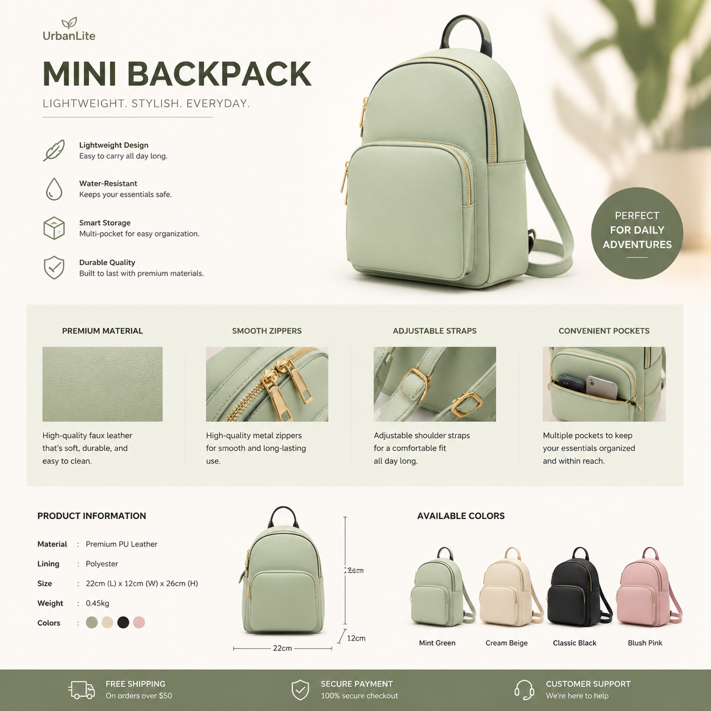

# AI详情页生成怎么做？2026年AI自动生成详情页教程

电商详情页是转化率的关键。详情页做得好，客户看了就想下单。现在AI详情页生成工具可以自动完成详情页设计，省时省力。

📌 用 [aishop.anyachina.cn](https://aishop.anyachina.cn) 一键生成详情页和商品主图，[poster.anyachina.cn](https://poster.anyachina.cn) 做促销海报，电商视觉全搞定。

## AI详情页生成能做什么？

AI详情页生成工具可以自动完成详情页的各个模块：

**主图模块**：产品主图，吸引点击进入
**卖点模块**：核心卖点图文展示
**场景模块**：产品使用场景图
**参数模块**：规格参数清晰展示
**对比模块**：前后对比或竞品对比

## 传统详情页的痛点

- 设计时间长：一套详情页少说半天
- 设计成本高：请设计师几百块
- 风格不统一：不同产品详情页风格各异
- 修改麻烦：换图就要重做

## AI详情页生成的优势

**半小时出图**：传统1-3天，AI半小时
**风格统一**：所有产品详情页风格一致
**一键修改**：不满意重新生成
**多版测试**：生成多个版本测转化率

## 操作步骤

**第一步**：准备产品照片和卖点信息
**第二步**：打开AI详情页工具，上传产品图
**第三步**：填写产品信息（名称、卖点、参数）
**第四步**：选择行业模板（食品、服装、家电等）
**第五步**：点击生成，预览下载

## 实战技巧

1. 原图越清晰效果越好
2. 卖点写具体，不要笼统
3. 参考同行优秀详情页
4. A/B测试不同版本

---

*在线工具：[未来图AI](https://www.weilaituai.cn/)*
