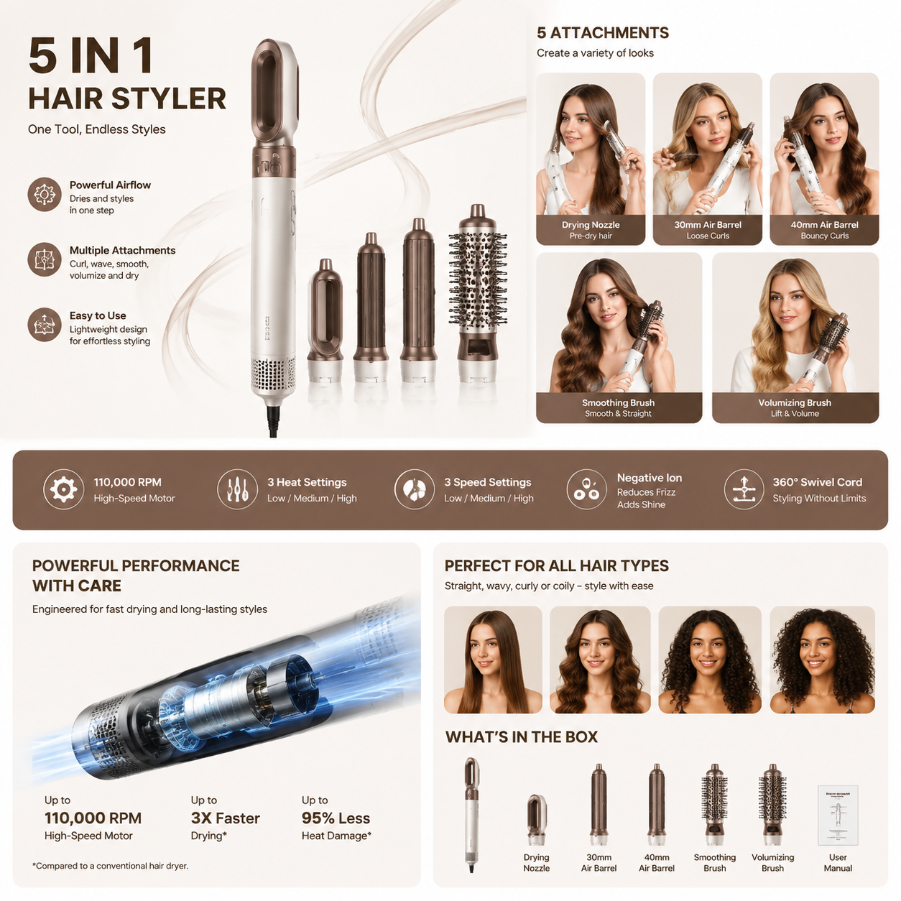

# AI详情页制作工具推荐，2026年AI自动生成详情页教程

电商详情页是决定转化率的关键因素。详情页做得好，客户看了就想下单。现在AI详情页制作工具可以自动生成专业详情页，省时省力。

📌 用 [aishop.anyachina.cn](https://aishop.anyachina.cn) 一键生成详情页和商品主图，[poster.anyachina.cn](https://poster.anyachina.cn) 做促销海报，电商视觉全搞定。

## 什么是AI详情页制作？

AI详情页制作就是利用人工智能技术，自动生成电商产品的详情介绍页面。你只需要上传产品图和卖点信息，AI就能自动完成排版、文案、配图等工作。

传统详情页制作需要：拍照→修图→排版→写文案→反复修改，一套下来至少半天。AI详情页制作把整个流程压缩到30分钟以内。

## AI详情页制作的核心功能

### 1. 主图生成

上传产品原图，AI自动抠图换背景，生成白底图或场景主图。适配不同电商平台的尺寸要求。

### 2. 卖点图

输入产品的核心卖点（材质、功能、适用场景），AI自动生成对应的卖点展示图，图文排版美观。

### 3. 场景图

AI能把产品放置到真实使用场景中，让买家看到产品在实际环境中的效果，增加购买欲望。

### 4. 参数图

根据产品参数自动排版成清晰的规格说明图，风格统一。

### 5. 对比图

自动生成"改善前vs改善后"的对比图，突出产品价值。

## AI详情页的制作步骤

**第一步**：准备产品照片和卖点信息。照片用手机拍就行，注意光线和角度。

**第二步**：打开AI详情页工具，上传产品图片。

**第三步**：填写产品信息（名称、卖点、规格参数等）。

**第四步**：选择行业模板（食品、服装、家电、美妆等），点击生成。

**第五步**：预览详情页效果，不满意可重新生成或微调。

**第六步**：确认效果后下载导出。

## AI详情页的优势

**节省时间**：从半天到半小时，效率提升数倍

**降低成本**：不用请设计师，自己做免费

**多版本测试**：生成多个版本测试转化率

**风格统一**：所有产品详情页风格一致，店铺更专业

## 实战技巧

1. **原图质量决定上限**：AI是在原图基础上创作，原图越清晰效果越好
2. **卖点写具体**：不要只写"质量好"，写"加厚不锈钢，双层防烫设计"
3. **参考同行**：先看看做得好的同行详情页，再决定风格方向
4. **A/B测试**：用AI生成多个版本，分别测试转化率

---

*在线工具：[未来图AI](https://www.weilaituai.cn/)*
