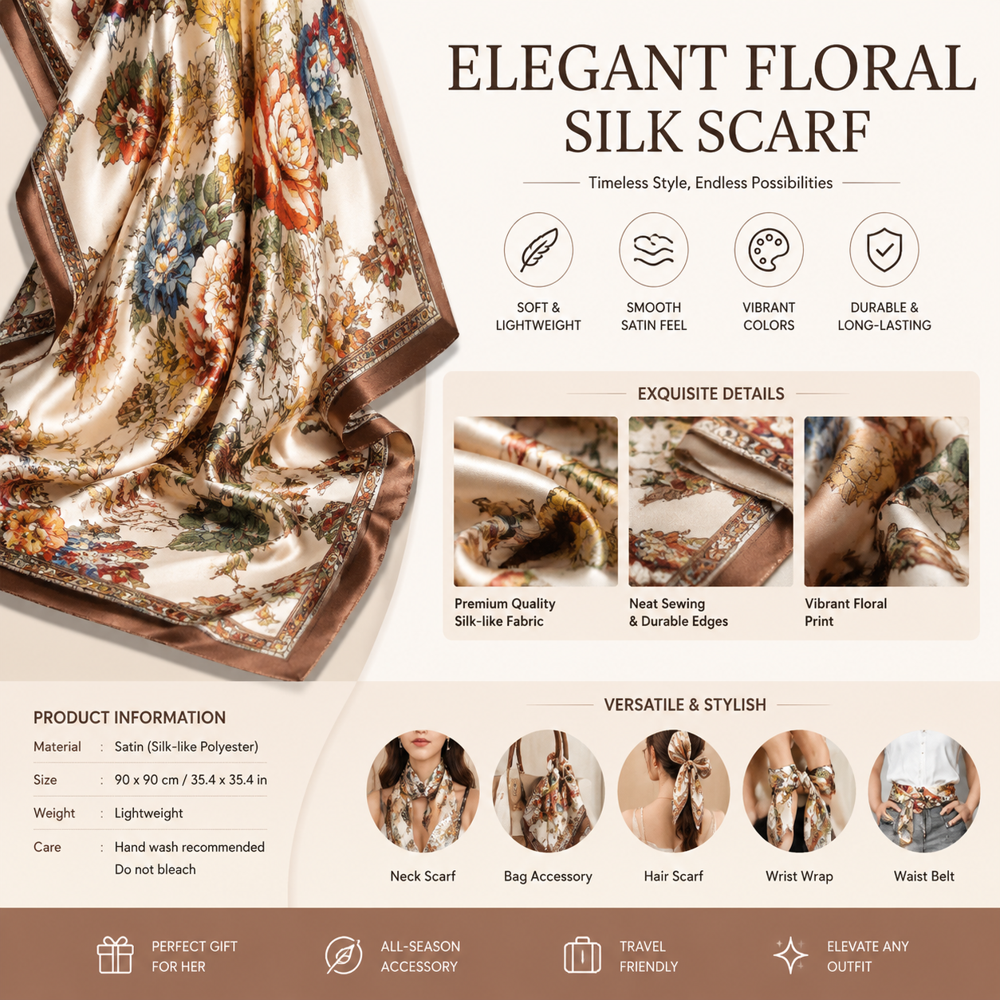

# AI详情页设计怎么做？2026年AI详情页设计完整教程

电商详情页是产品转化的关键页面。详情页设计得好，客户停留时间长、下单率高。现在AI详情页设计工具可以帮你自动生成专业详情页，不需要请设计师。

🚀 用 [aishop.anyachina.cn](https://aishop.anyachina.cn) 一键生成商品详情页，[poster.anyachina.cn](https://poster.anyachina.cn) 做促销海报，电商视觉全套搞定。

## AI详情页设计是什么？

AI详情页设计就是利用人工智能技术，自动生成电商产品详情页的排版和内容。你只需要上传产品照片和卖点信息，AI就能自动完成页面布局、文案撰写和配图设计。

传统的详情页设计流程：拍照→修图→排版→写文案→反复修改，一套流程下来至少半天到一天。AI详情页设计把时间缩短到30分钟以内。

## AI详情页设计的核心功能

### 1. 自动布局

AI根据产品类型和卖点信息，自动选择最优的页面布局方案。主图放哪里、卖点怎么排、参数放什么位置，AI都自动规划好。

### 2. 卖点提炼

你输入产品的基础信息后，AI会自动提炼核心卖点，生成有说服力的卖点文案。不懂怎么写文案也没关系，AI帮你写。

### 3. 智能配图

AI根据卖点内容自动配图。比如卖点是"大容量"，AI会配上展示容量的场景图。图文搭配更生动。

### 4. 风格统一

同一店铺的所有详情页风格自动统一，提升品牌形象。不需要每个产品单独设计。

## AI详情页设计的优势

**省时间**：从一天缩短到半小时，效率提升十几倍

**降成本**：省去设计师费用，自己做完全免费

**提转化**：AI根据大数据优化排版，转化率更有保障

**易操作**：上传产品图填信息，AI全自动完成

## AI详情页设计步骤

**第一步**：准备产品照片。手机拍摄即可，注意光线均匀。

**第二步**：整理产品卖点。材质、尺寸、功能、适用场景等信息越详细越好。

**第三步**：打开AI详情页工具，上传图片、填写信息。

**第四步**：选择行业模板（食品、服装、美妆、家电等）。

**第五步**：点击生成，AI自动输出详情页预览。不满意可重新生成。

**第六步**：确认满意后下载高清图片。

## 设计技巧

1. **首图要抓眼球**：详情页第一屏决定用户是否继续看下去
2. **卖点可视化**：文字卖点配图说明，比纯文字更有说服力
3. **信任元素**：加入质检报告、用户评价等信任元素
4. **行动引导**：页面底部加入购买引导按钮

## AI设计vs传统设计

| 对比 | AI设计 | 传统设计 |
|------|--------|---------|
| 用时 | 30分钟 | 1-3天 |
| 成本 | 免费 | 几百元 |
| 技能要求 | 零基础 | 需设计经验 |
| 修改 | 一键重来 | 反复沟通 |

---

*在线工具：[未来图AI](https://www.weilaituai.cn/)*
