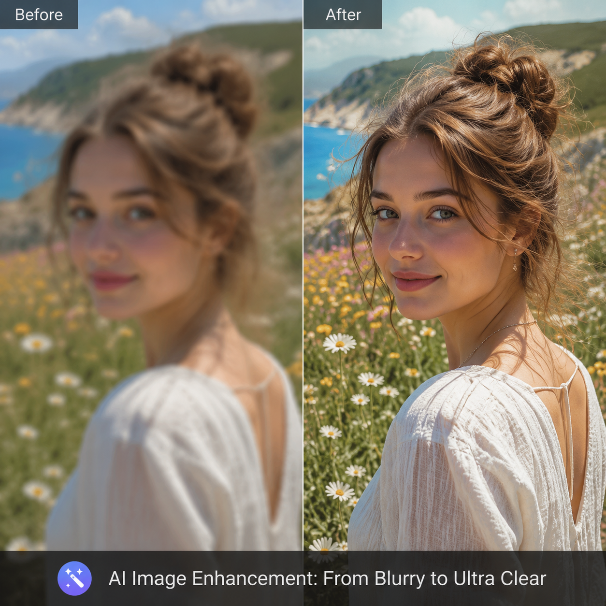

# AI超清修图有用吗？2026年AI图片清晰化实测

图片不清晰怎么办？用AI超清修图，模糊变清晰，细节自动补全。

## 效果如何

发微信被压缩的图、老旧照片、截图的模糊部分，AI都能提升清晰度。人像五官更清晰，文字更锐利，产品细节更丰富。

🚀 推荐 [aishop.anyachina.cn](https://aishop.anyachina.cn) 做电商图增强，[poster.anyachina.cn](https://poster.anyachina.cn) 做促销海报。

## 适用场景

- 电商商品图清晰化
- 老照片修复增强
- 社交媒体图片优化

上传图片，一键增强，几秒出结果。

---

*在线工具：[未来图AI](https://www.weilaituai.cn/)*
