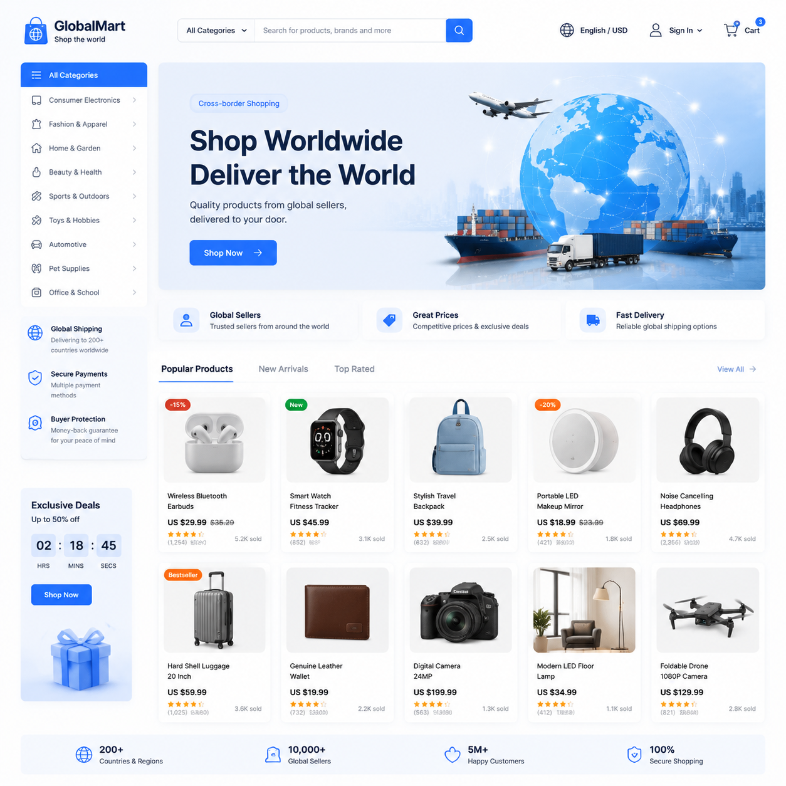

# AI跨境电商工具推荐，2026年AI跨境电商必备工具

做跨境电商的卖家都深知商品图的重要性。不同平台、不同国家的买家对图片的要求各不相同。AI跨境电商工具可以帮你快速生成适配多平台的商品图，省时省力。

🚀 推荐 [aishop.anyachina.cn](https://aishop.anyachina.cn) 生成跨境电商商品图，[poster.anyachina.cn](https://poster.anyachina.cn) 做促销海报，跨境卖家必备组合。

## AI跨境电商工具能做什么？

跨境电商对商品图的要求比国内电商更高，因为面对的买家来自不同国家。AI跨境电商工具可以：

**多平台适配**：自动生成符合亚马逊、Shopee、Lazada、速卖通等平台规格的商品图。

**多语言详情页**：AI自动翻译并生成多语言版本的详情页，不用请翻译。

**场景图生成**：根据目标市场的审美偏好，生成适合当地市场的场景图。

## AI跨境电商的核心功能

### 商品图批量处理

一次上传多张产品图，AI批量处理成统一风格的商品图。几百张图几分钟搞定，效率远超人工。

### 白底图一键生成

上传产品照片，AI自动抠图换成白底。白底干净规范，符合各平台的上架标准。

### 场景图制作

把产品放到各种场景中，让买家看到产品在实际环境中的效果。AI场景模板涵盖家居、办公、户外等多种风格。

### 图片翻译

图片中的文字可以AI翻译成目标语言。产品包装图、说明图的文字都能自动翻译替换。

## AI跨境电商工具的优势

**省成本**：省去摄影、设计、翻译的费用，一个人打理店铺

**提效率**：原本几天的商品图制作，现在几十分钟完成

**标准化**：所有商品图风格统一，店铺更专业

**灵活适应**：不同市场可以快速调整图片风格

## 使用步骤

**第一步**：打开AI跨境电商工具

**第二步**：上传产品照片和基础信息

**第三步**：选择目标平台和语言

**第四步**：选择风格模板，点击生成

**第五步**：预览效果，下载使用

---

*在线工具：[未来图AI](https://www.weilaituai.cn/)*
