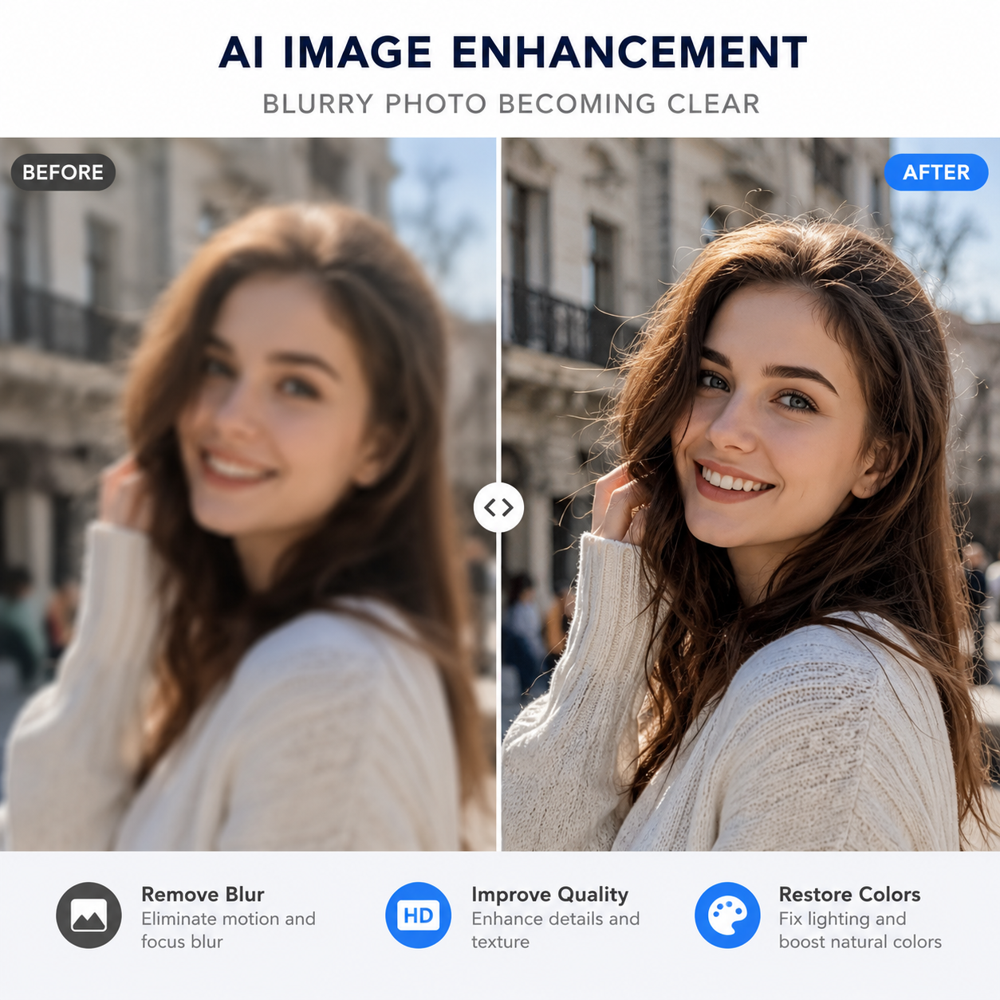

# AI高清图片修复怎么做？模糊图变高清的完整教程

图片模糊、像素低、老照片有划痕——这些以前只能找专业人士修复的问题，现在用AI高清图片修复工具就能自己搞定。上传图片，AI自动补全细节，把模糊变清晰。

📌 用 [aishop.anyachina.cn](https://aishop.anyachina.cn) 修复商品图清晰度，搭配 [poster.anyachina.cn](https://poster.anyachina.cn) 做促销海报，电商视觉一站式搞定。

## AI高清图片修复是什么原理？

AI高清图片修复利用深度学习模型，分析图片中的像素信息，智能补全缺失的细节。简单说，就是AI"猜"出模糊部分应该长什么样，然后补上去。

这项技术主要依赖两种模型：

- **超分辨率模型（Super Resolution）**：把低分辨率图片放大并补充细节，让图片在放大的同时保持清晰
- **去噪修复模型（Denoising）**：去除图片中的噪点、划痕、模糊等瑕疵

## AI高清图片修复能做什么？

### 1. 老照片修复翻新

家里的老照片发黄、有折痕、模糊不清？AI高清修复可以：
- 去除折痕和污渍
- 修复残缺部分
- 自动上色（黑白照片变彩色）
- 提升分辨率让面部更清晰

### 2. 电商商品图优化

商品图模糊直接影响转化率。AI修复让商品图更清晰：
- 产品细节更锐利
- 纹理质感更真实
- 颜色更鲜艳自然
- 放大后不失真

### 3. 截图和文档增强

截图不清晰、扫描件模糊，AI修复后文字更锐利，适合打印或再次编辑。

### 4. 人像照片优化

自拍或合影模糊，AI修复让人物面部更清晰，肤色更自然。

## AI高清图片修复的操作步骤

### 第一步：准备图片

把需要修复的模糊图片准备好，保存在电脑或手机上。图片格式不限，JPG、PNG、WebP都可以。

### 第二步：上传到AI工具

打开AI高清图片修复工具，点击上传或拖拽图片到上传区域。

### 第三步：选择修复模式

根据图片类型选择合适的修复模式：
- **通用增强**：适合大多数模糊图片
- **人像修复**：专注面部细节优化
- **老照片修复**：去划痕+上色+增强
- **文字增强**：截图和文档专用

### 第四步：AI自动处理

点击开始，AI自动处理。处理时间根据图片大小和修复程度，一般在几秒到一分钟左右。

### 第五步：下载高清图

预览修复效果，对比前后差异。满意后下载高清版本。

## AI修复前后的效果对比

| 维度 | 修复前 | 修复后 |
|------|--------|--------|
| 分辨率 | 低（模糊） | 高（清晰） |
| 细节 | 丢失 | 恢复补全 |
| 颜色 | 偏暗或发黄 | 鲜艳自然 |
| 瑕疵 | 有划痕噪点 | 去除干净 |
| 可用性 | 无法商用 | 适合打印上架 |

## 实用技巧

1. **不要期望过度**：AI修复是基于现有信息的"合理猜测"，严重损坏的图片可能无法完全恢复
2. **原图越大越好**：即使是模糊的原图，分辨率越高修复效果越好
3. **多次修复**：如果一次效果不理想，可以分步骤修复（先去噪再增强）
4. **结合人工调整**：AI修复后再用基础工具微调，效果更完美

## 常见问题

**问：AI高清图片修复免费吗？**
答：大部分AI修复工具提供免费额度，高频使用需要付费。

**问：修复后的图片能商用吗？**
答：生成图片的版权归用户所有，可以商用。

---

*在线工具：[未来图AI](https://www.weilaituai.cn/)*
