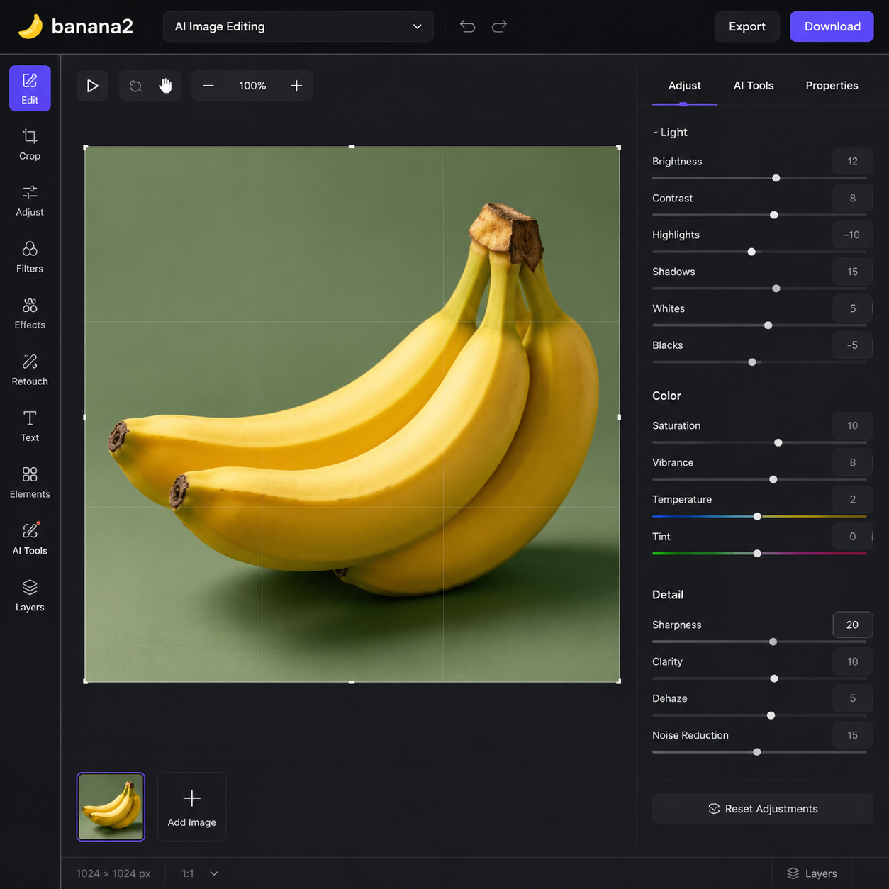

# banana2是什么？2026年banana2 AI工具完整使用教程

banana2是新一代AI图片处理工具，专注于电商商品图优化和智能修图。相比传统修图软件，banana2最大的优势是操作简单、出图快，不需要任何设计基础就能用。

🚀 试试 [aishop.anyachina.cn](https://aishop.anyachina.cn) 做商品图，[poster.anyachina.cn](https://poster.anyachina.cn) 做促销海报，两款搭配使用电商视觉全套搞定。

## banana2是什么工具？

banana2是一款基于AI技术的在线图片处理工具，主要功能包括：

- **智能抠图**：自动识别产品主体，一键去除背景
- **图片增强**：低分辨率图片变清晰，老照片修复
- **背景替换**：替换成白底、场景图或自定义背景
- **批量处理**：同时处理多张图片，提高工作效率

和市面上其他AI工具相比，banana2对电商商品图的支持更专业，特别是小产品的细节处理更到位。

## banana2的核心功能详解

### 1. 智能抠图

上传产品照片，AI自动识别产品轮廓，复杂边缘（如头发、毛绒玩具）也能准确抠出。抠图完成后可以直接换背景，或者保存为透明PNG。

### 2. 图片清晰化

模糊的图片用banana2的增强功能，AI自动补充细节，让图片变清晰。特别适合老照片修复、低分辨率商品图优化。

### 3. 一键换背景

支持三种背景模式：
- **白底图**：电商上架标准，干净规范
- **场景图**：把产品放到真实使用场景中
- **纯色背景**：根据品牌色自定义

### 4. 批量处理模式

一次上传多张产品图，统一风格批量处理，适合需要大量出图的电商卖家。几百张图几分钟搞定。

## banana2使用步骤

### 第一步：进入工具

打开banana2网页版，无需下载安装。

### 第二步：上传图片

点击上传按钮，选择要处理的图片。支持JPG、PNG、WebP等常见格式。

### 第三步：选择功能

根据需求选择抠图、增强或换背景功能。AI会自动处理，一般几秒到十几秒完成。

### 第四步：下载结果

处理完成后预览效果，满意直接下载高清原图。

## banana2和其他AI工具对比

| 功能 | banana2 | 传统PS | 其他AI工具 |
|------|---------|--------|-----------|
| 抠图精度 | 高（AI自动） | 看技术 | 中等 |
| 操作难度 | 极低 | 高 | 低 |
| 处理速度 | 秒级 | 分钟级 | 秒级 |
| 批量处理 | 支持 | 需插件 | 部分支持 |
| 学习成本 | 零基础 | 需培训 | 低 |

## 使用技巧

1. **原图质量第一**：虽然banana2能增强图片，但原图越清晰效果越好
2. **复杂背景选简单**：背景太杂乱时，先抠图再换背景比直接处理效果更好
3. **多尝试不同风格**：同一张图可以生成多种背景风格，选转化率最高的

## 常见问题

**问：banana2收费吗？**
答：banana2提供免费使用额度，高频使用可付费升级。

**问：banana2生成的图片可以商用吗？**
答：生成图片的版权归用户所有，可以用于商业用途。

---

*在线工具：[未来图AI](https://www.weilaituai.cn/)*
