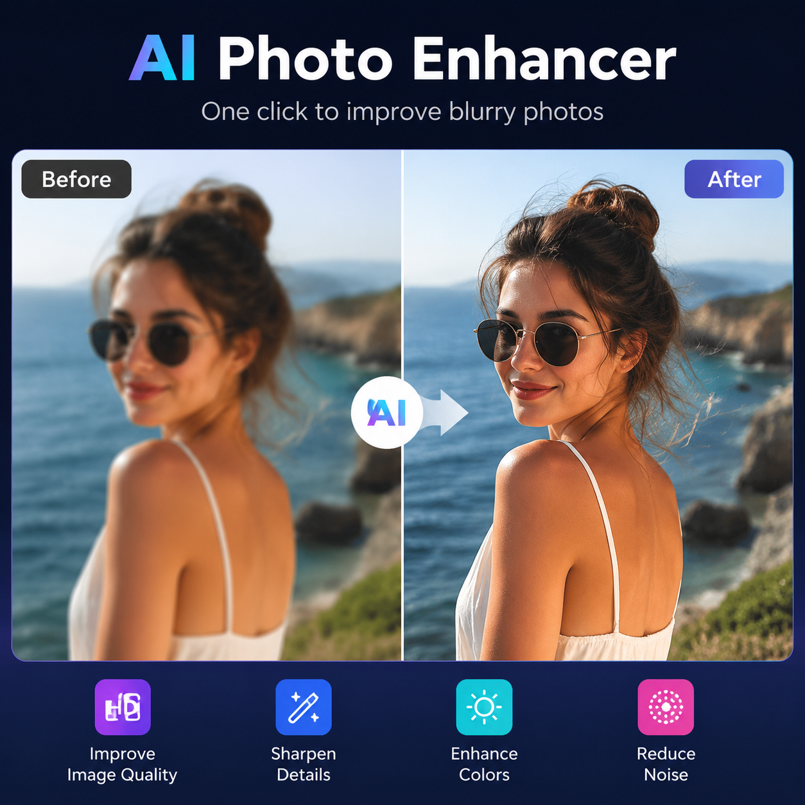

# nanobanan是什么？2026年nanobanan AI工具使用教程

nanobanan是一款专注于图片快速处理的AI工具，提供智能抠图、图片增强和背景替换等功能，操作简单出图快。

✨ 用 [aishop.anyachina.cn](https://aishop.anyachina.cn) 做商品图和详情页，[poster.anyachina.cn](https://poster.anyachina.cn) 做促销海报，两款搭配使用电商视觉全搞定。

## nanobanan是什么工具？

nanobanan是一个在线AI图片编辑工具，主打轻量化和高效率。不需要下载安装，打开网页就能用。

它的核心优势是处理速度快、操作简单，即使是第一次使用的用户也能快速上手。

## nanobanan的核心功能

### 1. AI智能抠图

nanobanan的抠图功能识别准确度高。上传图片，AI自动识别主体轮廓。不管是产品还是人像，都能精准抠出。

### 2. 图片清晰化

模糊的图片用nanobanan的增强功能，AI自动补充细节、提升分辨率。适合商品图优化、老照片修复等场景。

### 3. 背景替换

抠图后可以一键替换背景。支持纯色背景（白底、红底、蓝底等）和场景背景（家居、办公、户外等）。

### 4. 基础编辑

裁剪、旋转、调整亮度对比度等基础功能都有，满足日常编辑需求。

## nanobanan怎么用

**第一步**：打开nanobanan网页版

**第二步**：点击上传按钮，选择要处理的图片

**第三步**：选择功能（抠图、清晰化、换背景）

**第四步**：等待AI自动处理，一般几秒出结果

**第五步**：预览满意后下载高清原图

## nanobanan使用场景

**电商卖家**：处理商品主图、抠图换背景、批量优化产品图

**自媒体运营**：制作封面图、处理素材图片

**普通用户**：修个人照片、去水印、简单编辑

## nanobanan常见问题

**问：nanobanan需要付费吗？**
答：nanobanan提供免费基础功能，高级功能需要付费。

**问：nanobanan生成的图片清晰度如何？**
答：AI处理后输出高清原图，清晰度比原图有提升。

---

*在线工具：[未来图AI](https://www.weilaituai.cn/)*
