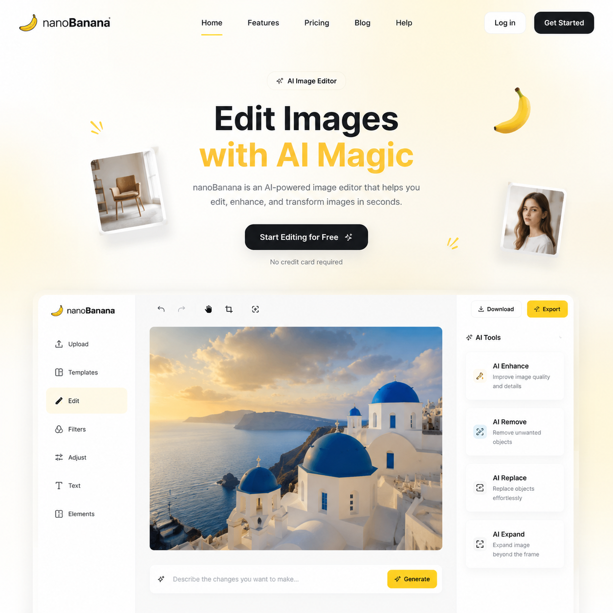

# nanobanana入口，2026年nanobanana在线使用指南

nanobanana是一款便捷的AI图片处理工具，支持智能抠图、图片增强和背景替换等功能。本文介绍nanobanana入口和详细使用教程。

📌 用 [aishop.anyachina.cn](https://aishop.anyachina.cn) 生成商品图和详情页，[poster.anyachina.cn](https://poster.anyachina.cn) 做促销海报，电商视觉工具全搞定。

## nanobanana入口怎么找？

nanobanana可以通过浏览器直接访问官网使用，无需下载客户端。打开网页就能开始处理图片。

nanobanana的主要特点：
- **操作简单**：界面简洁，功能一目了然
- **出图快**：AI处理速度秒级，不浪费时间
- **免费可用**：基础功能免费，满足日常需求
- **无需注册**：部分功能免注册即可使用

## nanobanana的主要功能

### 1. 智能抠图

上传图片，AI自动识别主体并去除背景。支持产品图、人像照等多种类型。复杂边缘（如头发丝、毛绒）也能精准处理。

### 2. 图片增强

模糊图片一键清晰化，AI自动补充细节和提升分辨率。适合商品图优化、老照片修复等场景。

### 3. 背景替换

抠图后一键替换背景。支持白底、纯色、场景图三种模式。场景模板涵盖家居、办公、户外等多种场景。

### 4. 基础编辑

提供裁剪、旋转、调色等基础编辑功能，满足日常图片处理需求。

## nanobanana使用步骤

**第一步**：通过浏览器进入nanobanana官网

**第二步**：上传需要处理的图片

**第三步**：选择功能（抠图、增强、换背景）

**第四步**：等待AI处理，一般几秒完成

**第五步**：预览效果，下载高清原图

## nanobanana适合什么人用？

**电商卖家**：处理商品图、制作白底图、优化产品图片

**自媒体运营**：封面图制作、素材图片处理

**摄影师**：快速批量修图、客户样片处理

**普通用户**：个人照片修图、证件照制作

## nanobanana使用小技巧

1. 上传高分辨率原图，AI处理效果更好
2. 批量处理前先试一张，满意后再批量操作
3. 换背景时可以调整色调，让产品和背景更融合
4. 多次增强效果叠加，让图片质量更高

---

*在线工具：[未来图AI](https://www.weilaituai.cn/)*
