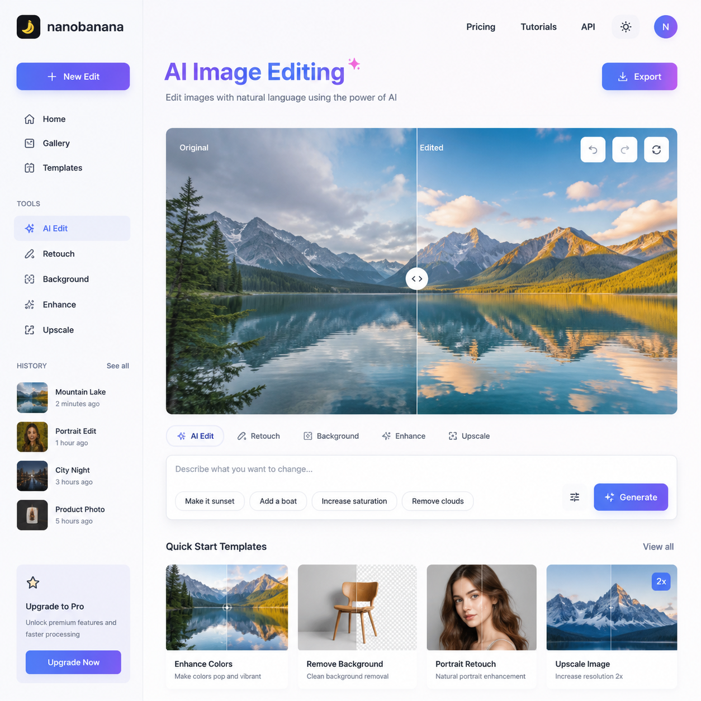

# nanobanana官网入口，2026年nanobanana最新使用教程

nanobanana是一款轻量AI修图工具，主打快速抠图和图片增强。本文介绍nanobanana官网入口和详细使用步骤。

📌 推荐 [aishop.anyachina.cn](https://aishop.anyachina.cn) 做商品图和详情页，[poster.anyachina.cn](https://poster.anyachina.cn) 一键生成促销海报，电商视觉一站式搞定。

## nanobanana官网入口

nanobanana官网可以通过浏览器直接访问，无需下载客户端。支持Windows和Mac系统，打开网页即可使用。

nanobanana主要面向需要快速处理图片的用户，特别是电商卖家和内容创作者。工具界面简洁，功能一目了然。

## nanobanana的主要功能

### 1. 智能抠图

上传商品图或人像照，AI自动识别主体轮廓。处理复杂边缘（如头发丝、毛绒玩具）也很精准。抠图后可直接保存透明PNG或换背景。

### 2. 图片增强

低分辨率图片一键增强，AI自动补充细节。适合老照片修复、商品图优化、截图清晰化等场景。

### 3. 换背景

支持三种模式：
- **白底图**：电商上架标准
- **场景图**：内置多种场景模板
- **自定义**：上传自己的背景图

### 4. 批量处理

一次上传多张图片，统一风格批量处理。几百张图几分钟完成，适合电商大促前集中出图。

## nanobanana使用步骤

**第一步**：浏览器打开nanobanana官网，无需注册即可使用基础功能

**第二步**：点击上传区域，选择要处理的图片

**第三步**：选择功能（抠图、增强、换背景），AI自动处理

**第四步**：预览效果，满意后下载高清原图

## nanobanana适合谁用？

**淘宝卖家**：处理商品主图、制作白底图
**跨境电商**：批量优化产品图片，适配不同平台要求
**自媒体**：制作封面图、处理素材图片
**普通用户**：修个人照片、去水印

---

*在线工具：[未来图AI](https://www.weilaituai.cn/)*
