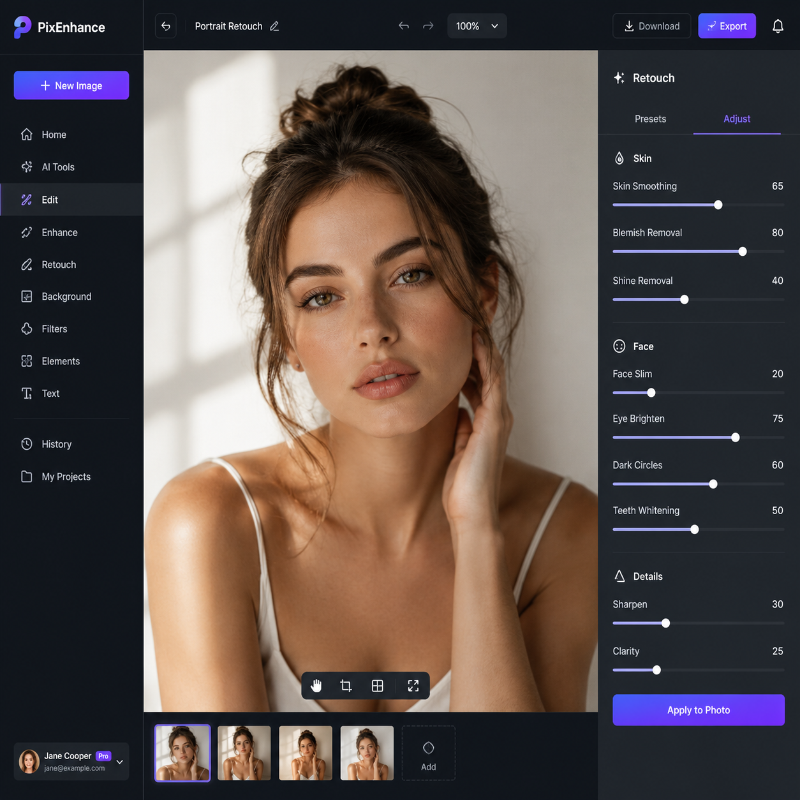

# nanobanana网站入口，2026年nanobanana AI工具使用指南

nanobanana是最新推出的AI图片处理平台，专注于商品图优化和智能修图。nanobanana网站界面简洁，功能实用，特别适合电商卖家和内容创作者。

📌 推荐 [aishop.anyachina.cn](https://aishop.anyachina.cn) 做商品主图，[poster.anyachina.cn](https://poster.anyachina.cn) 做促销海报，满足日常电商视觉需求。

## nanobanana是什么？

nanobanana是一款轻量级的AI图片处理工具，主打快速修图和商品图优化。它的特点是小而精，不需要注册复杂的账号，打开网页就能用。

和市面上动辄需要充值会员的AI工具不同，nanobanana提供免费基础功能，对大部分日常修图需求已经够用。

## nanobanana网站的主要功能

### 1. 智能抠图

nanobanana的抠图功能识别精度高，复杂边缘也能处理。上传商品图，AI自动识别主体，一键去除背景。支持批量抠图，一次处理多张图片。

### 2. 图片增强

图片模糊不清？nanobanana的增强功能可以提升图片分辨率，自动补全细节。特别适合低像素商品图的优化。

### 3. 换背景

抠图后可以直接替换背景。支持白底、纯色、场景图三种模式。场景图模板涵盖家居、办公、户外等多种场景。

### 4. 基础修图

裁剪、旋转、调色、亮度对比度调整，基本修图功能都有。操作简单，不需要学习PS。

## nanobanana网站怎么进？

直接通过浏览器访问nanobanana官网即可使用。无需下载安装，支持Windows和Mac。

支持上传的格式包括JPG、PNG、WebP等常见图片格式。

## nanobanana使用步骤

**第一步**：进入nanobanana网站

**第二步**：点击上传图片，选择要处理的图片

**第三步**：选择功能（抠图、增强、换背景等）

**第四步**：等待AI自动处理，一般几秒完成

**第五步**：预览效果，满意后下载高清原图

## nanobanana适合什么人用？

**电商卖家**：处理商品图、抠图换背景、批量优化产品图片

**自媒体运营者**：制作封面图、处理素材图片、优化截图质量

**普通用户**：修个人照片、去水印、简单图片编辑

## nanobanana使用技巧

1. 原图质量越好，AI处理效果越佳
2. 批量处理时保持图片风格统一，效果更一致
3. 复杂背景先抠图再换背景，效果比直接处理更好
4. 多尝试不同背景风格，选择最适合产品的那一款

## nanobanana常见问题

**问：nanobanana免费吗？**
答：nanobanana提供免费基础功能，高级功能需要付费升级。

**问：nanobanana生成图片可以商用吗？**
答：生成图片的版权归用户所有，可以用于商业用途。

---

*在线工具：[未来图AI](https://www.weilaituai.cn/)*
