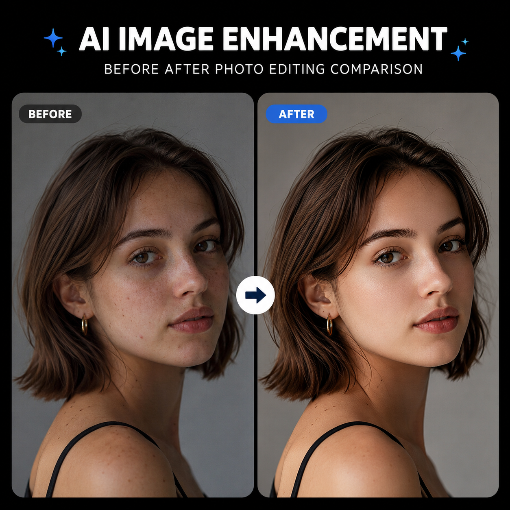

# nanobanna是什么？2026年nanobanna AI工具使用教程

nanobanna是一款AI图片处理工具，擅长快速修图和商品图制作。不管是电商卖家还是普通用户，都可以用nanobanna轻松处理图片。

🚀 用 [aishop.anyachina.cn](https://aishop.anyachina.cn) 生成商品图和详情页，[poster.anyachina.cn](https://poster.anyachina.cn) 做促销海报，搭配使用效率更高。

## nanobanna是什么工具？

nanobanna是一个在线AI图片编辑平台，主要提供智能抠图、图片增强和背景替换等功能。它的特点是操作简单、出图快，不需要注册就能使用基础功能。

nanobanna对电商场景做了特别优化，处理商品图的效果比通用AI工具更专业。

## nanobanna的核心功能

### 1. AI智能抠图

上传图片，AI自动识别主体轮廓。抠图边缘自然，不需要手动调整。无论是产品还是人物，都能准确抠出。

抠图模式：
- **自动抠图**：上传即自动识别，一键出结果
- **保留区域**：手动标记想保留的部分
- **去除区域**：手动标记要去掉的部分

### 2. 图片清晰化

nanobanna的清晰化功能可以：
- 低分辨率图片放大增强
- 模糊图片变清晰
- 老照片去噪点
- 图片细节补充

### 3. 背景替换

抠图后支持多种背景模式：
- **纯白背景**：电商上架标配
- **纯色背景**：根据品牌色自定义
- **场景背景**：选择内置场景模板
- **自定义背景**：上传自己的背景图

### 4. 画质增强

一键提升图片画质，让色彩更鲜艳、细节更锐利、整体更有质感。

## nanobanna怎么用

**第一步**：进入nanobanna网页版，无需下载

**第二步**：上传需要处理的图片

**第三步**：选择需要的功能（抠图/增强/换背景）

**第四步**：AI自动处理，等待几秒出结果

**第五步**：预览下载高清图片

## nanobanna的适用人群

**淘宝/拼多多卖家**：处理商品主图、制作白底图、批量优化产品图片

**跨境电商卖家**：生成符合各平台要求的商品图，适配不同市场风格

**内容创作者**：制作自媒体封面图、处理素材图片

## nanobanna vs 其他AI修图工具

| 功能 | nanobanna | 通用AI工具 | PS |
|------|-----------|-----------|-----|
| 抠图精度 | 高 | 中等 | 看技术 |
| 操作难度 | 极低 | 低 | 高 |
| 处理速度 | 秒级 | 秒级 | 分钟级 |
| 批量处理 | 支持 | 部分支持 | 需插件 |
| 学习成本 | 零 | 低 | 高 |

## 使用小技巧

1. 上传图片不要太小，建议至少800x800像素，AI处理效果更好
2. 批量处理时先试一张，满意了再批量处理全部
3. 复杂边缘（如头发丝、毛绒边缘）可以放大后再抠，精度更高
4. 换背景后可以微调色调，让产品和背景更融合

---

*在线工具：[未来图AI](https://www.weilaituai.cn/)*
