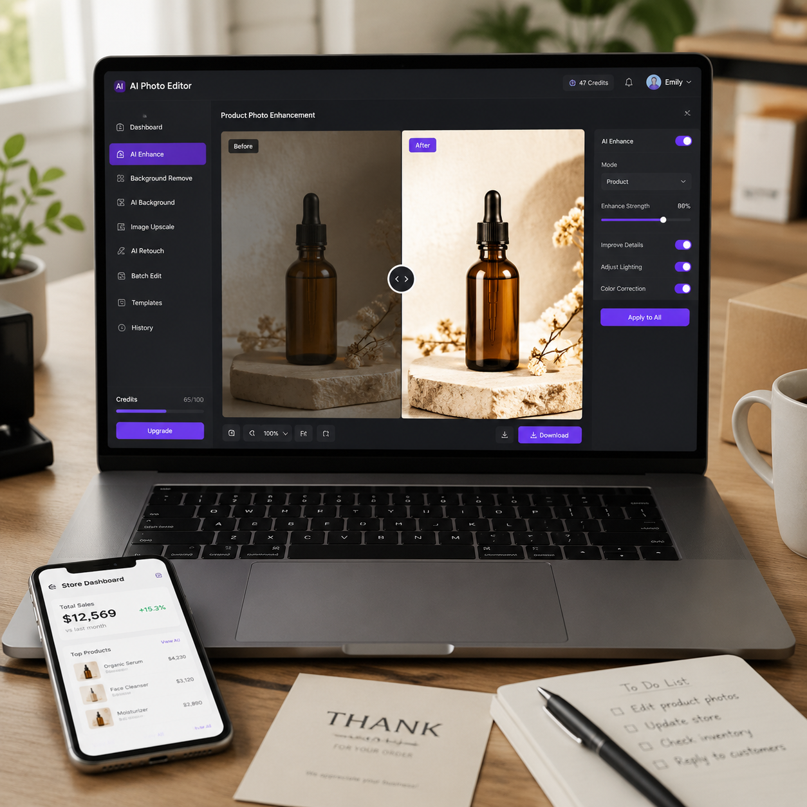

# AI修图怎么用？2026年最新AI修图工具在线使用教程

你是不是也遇到过这样的烦恼？拍了一堆商品照片，背景杂乱、光线不均、细节不够清晰。找设计师修图一张就要几十块，自己学PS又太花时间。

现在有了AI修图工具，这些问题迎刃而解。无论你是电商卖家、自媒体博主还是普通用户，只需上传图片，AI就能自动帮你完成抠图、调色、修复、美化等操作，30秒出图，完全不需要任何设计基础。

## 什么是AI修图？

AI修图是利用人工智能技术，通过深度学习模型自动识别图片内容并进行智能处理的技术。与传统的手动修图不同，AI修图只需要你上传图片，选择想要的效果，剩下的全部交给AI完成。

目前主流的AI修图功能包括：
- 智能抠图换背景
- 图片修复与增强
- 自动调色与美化
- 人像美颜与修肤
- 老照片修复上色
- 批量处理与排版

## AI修图工具怎么用？三步搞定

### 第一步：上传图片

打开AI修图工具的在线工作台，点击「上传图片」按钮，选择你需要处理的图片。支持常见的JPG、PNG、WEBP格式，单张图片最大支持20MB。

上传后，工具会自动识别图片中的主体内容，并显示在原图预览区。

### 第二步：选择功能

根据你的需求选择对应的修图功能：

- **想要白底图**：选择「抠图换背景」，AI会自动抠出主体，你可以把背景换成纯白、纯色或任何场景图
- **图片不清晰**：选择「图片增强」或「超清修复」，AI会自动提升画质和清晰度
- **需要调色**：选择「智能调色」，AI会根据图片内容自动匹配合适的色调风格
- **人像美化**：选择「人像修图」，AI会自动美肤、美颜、瘦脸

### 第三步：一键生成

点击「生成」按钮，等待几秒钟，AI修图工具就会输出处理后的图片。你可以对比原图和效果图，如果不满意可以调整参数重新生成，或者直接下载使用。

整个过程只需要30秒到1分钟，比传统修图效率提升了10倍以上。

## AI修图的几大实用场景

### 电商商品图处理

对于电商卖家来说，商品图的质量直接影响转化率。AI修图可以帮助你：
- 一键生成商品白底图，符合各大电商平台规范
- 智能替换背景，让商品呈现不同场景效果
- 批量处理多张图片，大幅提升工作效率
- 自动优化光影和色彩，让商品看起来更高级

### 社交媒体配图

自媒体博主和运营人员可以用AI修图快速制作社交媒体配图，包括抠图换背景、添加文字排版、调整滤镜风格等，轻松产出高质量的视觉内容。

### 老照片修复

AI修图还可以修复老照片，去除划痕和噪点，提升分辨率，甚至给黑白照片上色，让珍贵记忆重新清晰起来。

## AI修图 vs 传统修图

| 对比项 | AI修图 | 传统PS修图 |
|--------|--------|-----------|
| 操作难度 | 零基础，上传即用 | 需要专业技能 |
| 处理速度 | 30秒-1分钟 | 10分钟-数小时 |
| 成本 | 免费或低价 | 几十到几百元/张 |
| 批量处理 | 支持批量 | 需要重复操作 |
| 效果稳定性 | AI自动优化 | 依赖设计师水平 |

## 总结

AI修图正在改变我们处理图片的方式。无论你是电商卖家需要批量处理商品图，还是普通用户想要快速美化照片，AI修图工具都能帮你省时省力。

如果你还需要生成电商商品图和详情页，可以试试我们的AI电商图工具 → [aishop.anyachina.cn](https://aishop.anyachina.cn)
需要制作促销海报？试试AI海报工具 → [poster.anyachina.cn](https://poster.anyachina.cn)

---

*在线工具：[未来图AI](https://www.weilaituai.cn/)*
