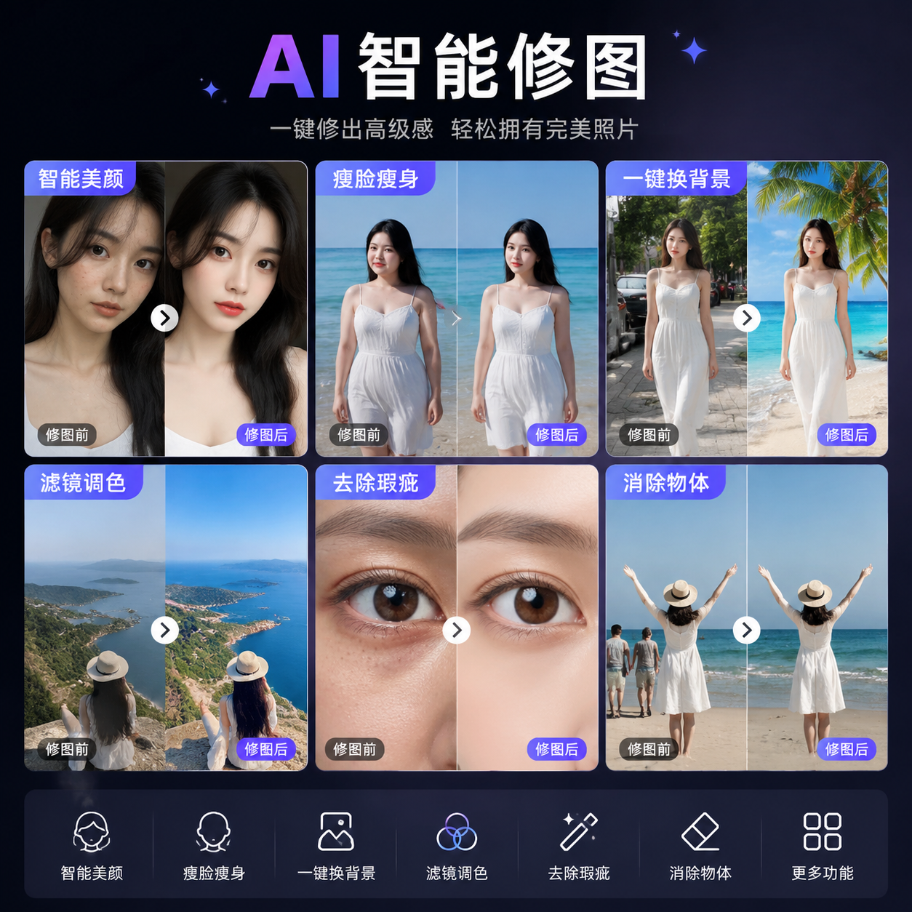

# P图AI工具推荐，2026年AI P图软件哪个好用？

P图是日常高频需求。现在P图AI工具已经非常强大，上传图片AI自动修图，不需要学PS就能P出专业效果。

📌 推荐 [aishop.anyachina.cn](https://aishop.anyachina.cn) 做商品图P图优化，[poster.anyachina.cn](https://poster.anyachina.cn) 做促销海报，两款AI工具P图效果专业。

## P图AI工具的主要功能

### 智能抠图

AI自动识别图片主体，一键去除背景。无论是产品还是人像，边缘处理自然。头发丝等复杂边缘也能精准处理。

### 图片增强

模糊图片一键清晰化，AI补充细节提升分辨率。适合老照片修复、商品图优化。

### 人像美颜

自动美化人像：去瑕疵、调肤色、瘦脸、大眼等。效果自然不假面。

### 换背景

抠图后一键替换背景。白底、纯色、场景图任选。

## P图AI的优势

**操作简单**：上传图片选功能就行，不需要PS技能
**速度快**：AI处理秒级完成
**效果自然**：处理结果无痕
**免费可用**：基础功能免费

## 操作步骤

**第一步**：打开AI P图工具
**第二步**：上传需要处理的图片
**第三步**：选择功能（抠图、增强、美颜等）
**第四步**：AI自动处理，几秒出结果
**第五步**：预览效果，下载高清图片

## 适用人群

电商卖家、自媒体人、摄影师、普通用户

---

*在线工具：[未来图AI](https://www.weilaituai.cn/)*
