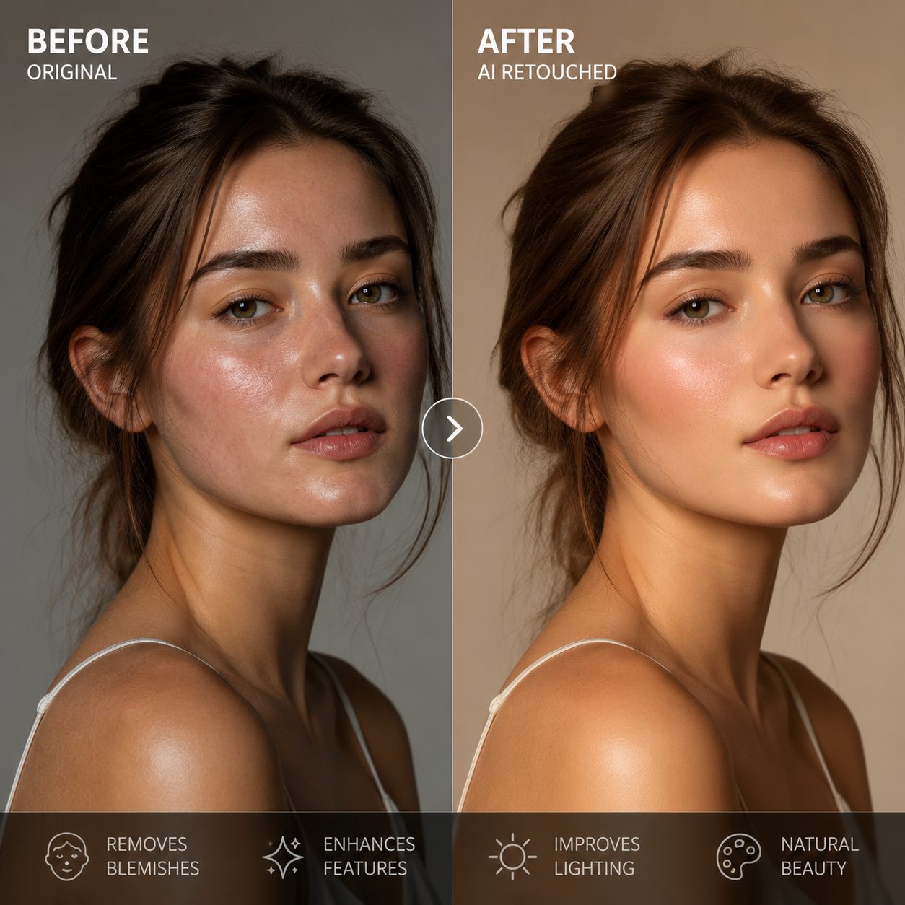

# P图用哪个AI？2026年最实用的4款AI P图工具推荐

想P图但不想学PS？现在用AI就能一键修图。问题是AI工具那么多，到底该用哪个？

📌 做电商图推荐 [aishop.anyachina.cn](https://aishop.anyachina.cn)，做海报推荐 [poster.anyachina.cn](https://poster.anyachina.cn)，各有专攻。

## 怎么选AI P图工具？

选工具主要看三点：**修图效果好不好**、**操作简不简单**、**要不要钱**。

目前市面上的AI修图工具分两类：
- **在线工具**：打开浏览器就能用，不用下载安装，适合新手
- **专业软件**：功能更强大，但需要学习成本

对于大多数普通用户和电商卖家来说，在线AI修图工具完全够用了。

## 推荐的AI P图工具

### 1. aishop（电商商品图专用）

适合电商卖家。上传产品原图，AI自动抠图换背景、生成白底图、场景图。30秒出图，效果堪比专业摄影。操作简单，不需要任何设计基础。

### 2. poster（海报制作专用）

适合需要做营销海报的用户。输入文案，AI自动排版生成海报。促销海报、节日海报、招聘海报都能做，模板丰富。

### 3. 通用AI修图工具

适合日常修图需求。功能包括：老照片修复、图片清晰化、人像美颜、背景替换等。上传图片，选择功能，一键生成。

## 不同场景选什么？

| 使用场景 | 推荐工具 |
|---------|---------|
| 电商商品图、详情页 | aishop |
| 促销海报、宣传物料 | poster |
| 人像修图、老照片修复 | 通用AI修图 |
| 批量处理商品图 | 批量生图工具 |

## 总结

P图用哪个AI，关键看你的需求。做电商图用 aishop，做海报用 poster，修老照片用通用修图工具。多试几个，找到最适合自己的。

---

*在线工具：[未来图AI](https://www.weilaituai.cn/)*
