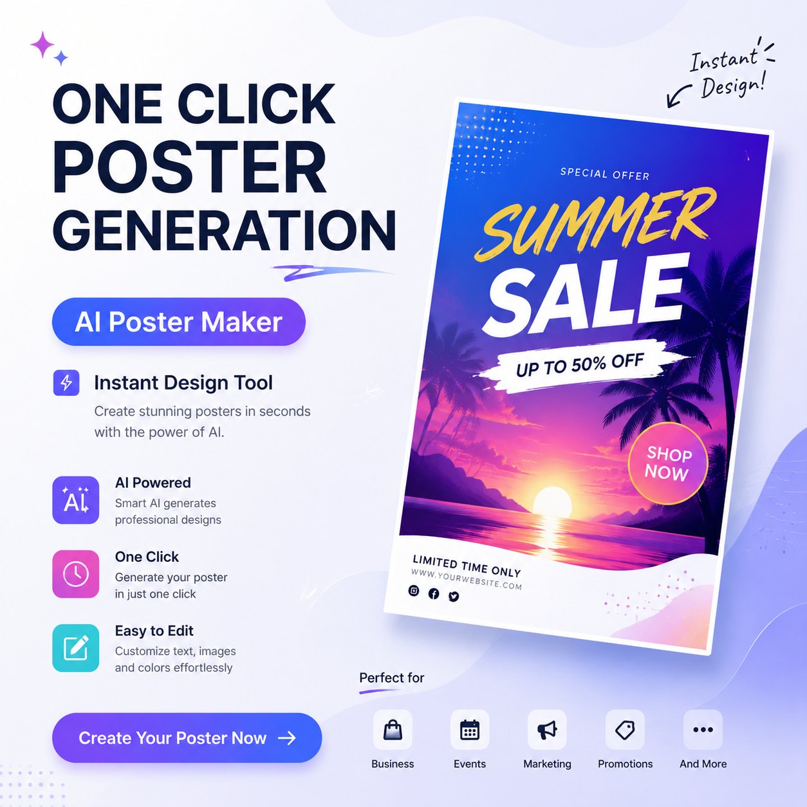

# 一键生成海报的AI工具推荐，2026年AI海报生成器

一键生成海报的AI工具让海报制作变得前所未有的简单。上传图片输入文案，点击生成就能出专业海报，真正的一键搞定。

⭐ 推荐 [aishop.anyachina.cn](https://aishop.anyachina.cn) 做商品图和详情页，一键生成海报功能效率超高。

## 一键生成海报的AI能做什么？

**智能排版**：AI自动规划布局，标题图片位置合理

**自动配色**：根据行业推荐配色方案

**字体搭配**：标题正文自动匹配风格

**多版本**：一键生成多个方案供选择

## 一键生成的优势

**省时间**：传统设计1-3天，现在30秒
**省成本**：省去设计师费用
**零门槛**：不需要设计经验
**随时改**：不满意重新生成

## 适用场景

- 电商大促海报
- 新品上市宣传
- 节日营销海报
- 社交媒体配图

## 操作步骤

**第一步**：打开AI海报工具
**第二步**：选择场景（促销、品牌等）
**第三步**：上传产品图，输入文案
**第四步**：选择风格，点击"一键生成"
**第五步**：预览效果，下载高清图片

## 技巧

1. 文案精简效果好
2. 图片高清更专业
3. 多版本比较选最优

---

*在线工具：[未来图AI](https://www.weilaituai.cn/)*
