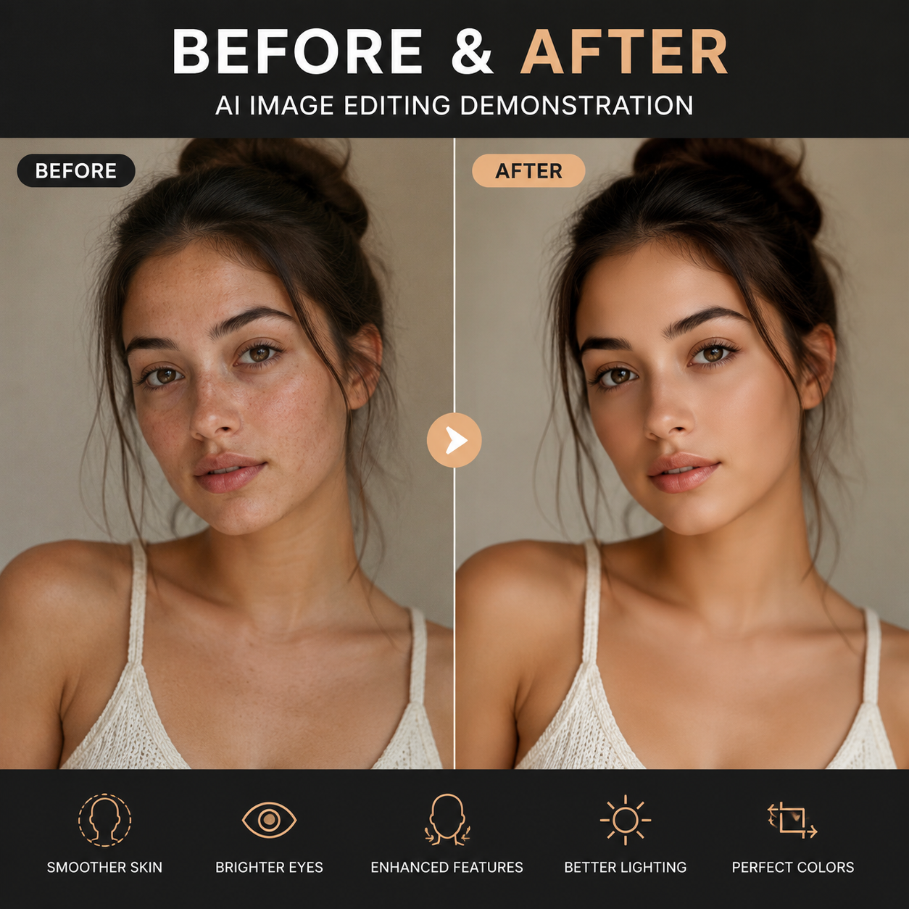

# 修图用什么AI好？2026年AI修图工具推荐

修图是电商卖家和内容创作者的日常需求。以前修图要学PS，现在修图用什么AI好？本文推荐几款实用AI修图工具，总有一款适合你。

✨ 试试 [aishop.anyachina.cn](https://aishop.anyachina.cn) 做商品图修图，[poster.anyachina.cn](https://poster.anyachina.cn) 做促销海报，两款工具修图效果好、出图快。

## 修图用什么AI好？

选AI修图工具主要看你的需求：

- 电商卖家 → 选商品图优化强的
- 普通用户 → 选操作简单的
- 专业设计 → 选功能全面的

## 主流AI修图工具推荐

### 1. 电商专用修图AI

专为电商场景优化，抠图、换背景、白底图效果最好。

**优点**：商品图处理效果好，支持批量处理
**适合**：淘宝、拼多多、跨境电商卖家

### 2. 通用AI修图工具

功能全面，人像修图、风景优化、老照片修复都能做。

**优点**：功能多，适用范围广
**适合**：摄影师、普通用户

### 3. AI海报设计工具

侧重海报和宣传图设计，自动排版配色。

**优点**：文案输入自动出设计稿
**适合**：运营人员、自媒体人

## AI修图的核心功能

### 智能抠图

AI自动识别主体轮廓，一键去除背景。复杂边缘（如头发丝、毛绒玩具）也能精准处理。

### 图片增强

模糊图片一键清晰化，AI自动补充细节、提升分辨率。适合老照片修复、商品图优化。

### 背景替换

抠图后一键替换背景。支持白底、纯色、场景图三种模式。

### 调色美化

AI自动分析图片色调，一键调出专业色彩效果。

## AI修图工具对比表

| 功能 | 电商专用 | 通用型 | 海报型 |
|------|---------|-------|-------|
| 抠图精度 | ⭐⭐⭐⭐⭐ | ⭐⭐⭐⭐ | ⭐⭐⭐ |
| 图片增强 | ⭐⭐⭐⭐ | ⭐⭐⭐⭐⭐ | ⭐⭐⭐ |
| 操作难度 | 简单 | 中等 | 简单 |
| 批量处理 | 支持 | 部分 | 不支持 |
| 适合人群 | 电商卖家 | 所有人 | 运营人员 |

## AI修图怎么用？

**第一步**：选择适合你的AI修图工具

**第二步**：上传需要处理的图片

**第三步**：选择功能（抠图、增强、调色等）

**第四步**：AI自动处理，几秒出结果

**第五步**：预览效果，下载高清图片

## 修图技巧

1. **原图质量第一**：原图越清晰，AI处理效果越好
2. **选择专业工具**：不同场景选不同的工具，效果比通用工具好
3. **善用批量处理**：多张图片一起处理，提高效率
4. **对比前后效果**：放大对比细节，确保AI处理自然

## 常见问题

**问：AI修图能替代PS吗？**
答：对于日常修图需求，AI修图完全够用。高级设计仍需PS。

**问：AI修图会不会有痕迹？**
答：好的AI修图工具处理结果自然无痕，不会像老式PS那样有明显边界。

---

*在线工具：[未来图AI](https://www.weilaituai.cn/)*
