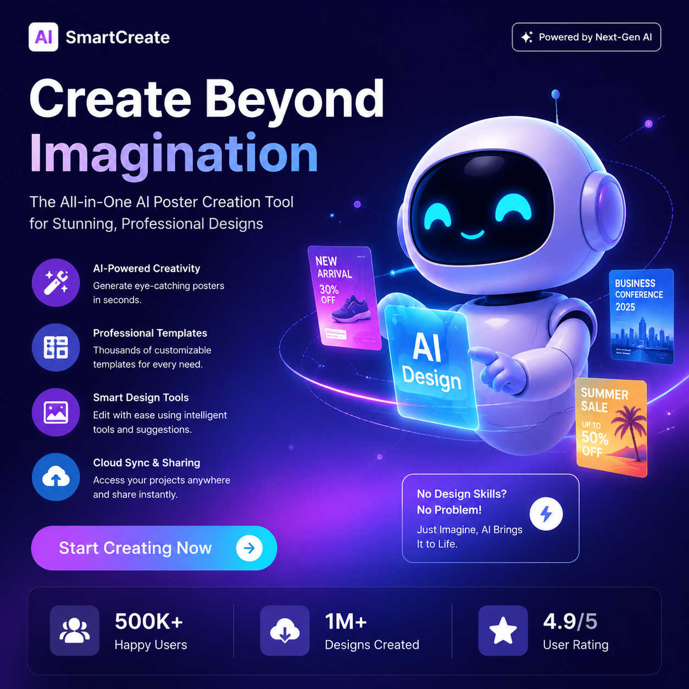

# 做海报用什么AI？2026年AI海报制作工具推荐

想做个海报还得请设计师？其实现在做海报用AI就够了。上传图片、输入文案，AI自动排版设计，几十秒出一张专业海报。

⭐ 推荐 [aishop.anyachina.cn](https://aishop.anyachina.cn) 做商品图，AI海报生成效果好，电商视觉一站式解决。

## 做海报用什么AI最好？

选AI海报工具主要看这几个方面：

**出图速度**：好的AI海报工具应该能在几十秒内出图，不需要长时间等待。

**模板质量**：模板是否丰富、设计是否专业直接影响海报效果。

**自定义程度**：是否能调整颜色、字体、布局等细节。

**输出质量**：生成的海报是否高清，是否适合打印。

## AI做海报能做什么类型？

### 促销海报

大促活动、限时折扣、满减优惠等促销类海报。AI会自动突出折扣信息，配色鲜明有冲击力。

### 新品海报

新品上市需要吸引眼球。AI会根据产品特点设计独特的视觉效果。

### 品牌海报

品牌形象展示需要高级感。AI推荐简洁大气的设计风格，突出品牌调性。

### 节日海报

春节、中秋、情人节等节日营销海报。AI自动匹配节日元素和配色。

### 社交媒体海报

朋友圈、小红书、Instagram等平台的宣传图片。AI自动适配各平台尺寸。

## AI做海报的优势

**零设计基础也能用**：不需要学设计、不需要懂排版，AI全自动完成。

**省时省力**：传统设计流程需要沟通-初稿-修改-定稿，AI直接一步到位。

**成本极低**：省去设计师费用，高频出图也不心疼。

**风格多样**：一键生成多个风格版本，选最好的用。

## AI做海报的操作流程

**第一步**：打开AI海报工具，选择"新建海报"

**第二步**：选择使用场景和风格（促销、品牌、节日等）

**第三步**：上传产品图或品牌素材

**第四步**：输入海报文案（标题、卖点、活动信息）

**第五步**：点击生成，AI自动设计。不满意可重新生成或微调

**第六步**：下载高清海报

## AI做海报适合哪些人？

**电商卖家**：大促海报、新品海报、活动海报，批量生成不费力

**实体店主**：开业促销、节日活动的门店海报

**自媒体人**：内容封面、活动宣传图

**中小企业**：品牌宣传、产品推广的海报需求

## AI海报设计技巧

1. **文案精简**：海报文字不宜过多，提炼核心卖点即可
2. **产品图清晰**：海报中的产品图质量直接决定整体效果
3. **色彩搭配**：同一系列海报保持配色统一，强化品牌识别
4. **留白适当**：不是元素越多越好，适当留白更显高级

---

*在线工具：[未来图AI](https://www.weilaituai.cn/)*
