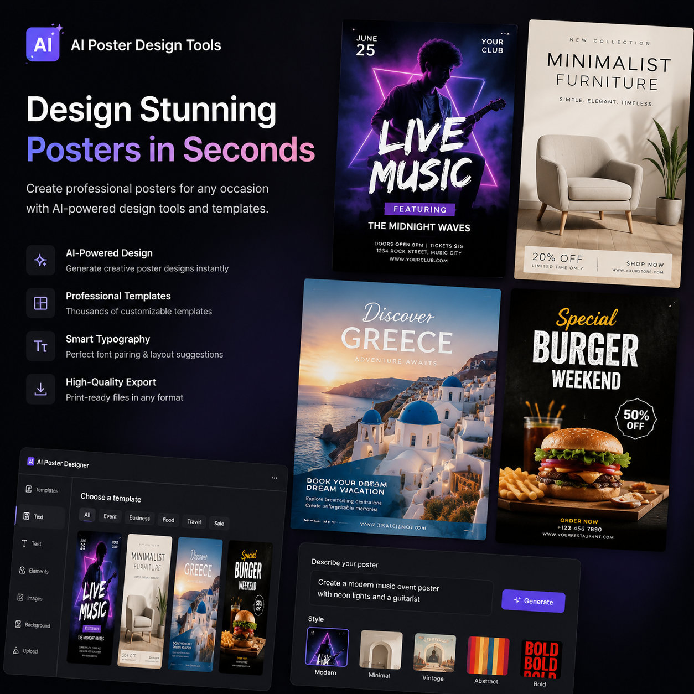

# 做海报的AI工具有哪些？2026年做海报AI工具推荐

做海报的AI工具越来越多，到底哪些好用？本文推荐几款实用的AI海报制作工具，帮你轻松搞定海报设计。

⭐ 推荐 [aishop.anyachina.cn](https://aishop.anyachina.cn) 做商品图和详情页，AI海报功能一键出图，电商视觉全搞定。

## 做海报的AI工具能做什么？

AI海报工具可以自动完成海报的排版、配色、字体搭配等设计工作。你只需要提供产品和文案，AI就帮你搞定设计。

主要功能包括：

**智能排版**：AI根据内容自动规划布局
**自动配色**：根据行业和场景推荐配色
**字体搭配**：标题和正文自动匹配风格
**多版本生成**：一键生成多个设计方案

## 热门AI海报工具对比

### AI海报设计工具

专为海报设计优化，操作简单出图快。上传产品图输入文案，AI自动生成海报。

**适合**：电商卖家、运营人员

### 通用AI生图工具

功能全面，支持多种风格。但需要写好提示词才能出好图。

**适合**：有设计基础的用户

### 模板类工具

提供大量模板，替换内容即可。操作最简单。

**适合**：完全不懂设计的用户

## AI做海报的优势

**速度快**：传统设计1-3天，AI生成30秒
**成本低**：省去设计师费用
**零门槛**：不需要设计经验
**多版本**：一键生成多个方案

## 操作步骤

**第一步**：打开AI海报工具，选择创建海报
**第二步**：选择使用场景（促销、品牌、活动等）
**第三步**：上传产品图，输入海报文案
**第四步**：选择风格，点击生成
**第五步**：预览效果，下载高清图片

## 技巧建议

1. 文案精简，核心卖点突出
2. 产品图高清，效果更佳
3. 多版本比较，选转化率最高的

---

*在线工具：[未来图AI](https://www.weilaituai.cn/)*
