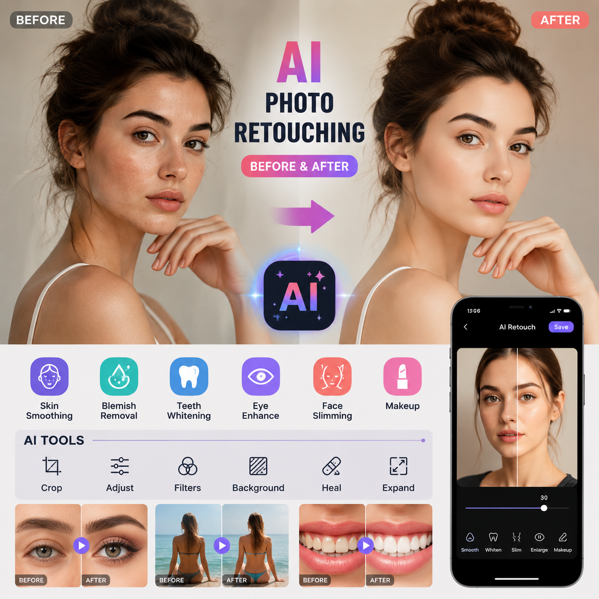

# 可以P图的AI有哪些？2026年AI修图工具推荐

P图是日常工作和生活中经常遇到的需求。以前P图要用PS，现在可以P图的AI工具越来越多，上传图片AI自动修图，省时省力。

✨ 推荐 [aishop.anyachina.cn](https://aishop.anyachina.cn) 做商品图编辑，[poster.anyachina.cn](https://poster.anyachina.cn) 做促销海报，两款AI修图工具效果专业。

## 可以P图的AI有哪些？

市面上可以P图的AI工具主要分为几类：

**在线AI修图工具**：打开网页就能用，不需要下载安装。上传图片选择功能，AI自动处理。

**AI图片增强工具**：专注图片清晰化和画质提升，适合老照片修复、模糊图片优化。

**AI设计工具**：侧重海报设计和商品图制作，自动排版配色。

## AI修图工具的核心功能

### 智能抠图

AI自动识别图片主体，一键去除背景。无论是产品图还是人像，边缘都处理得非常自然。复杂边缘如头发丝也能精准识别。

### 图片增强

模糊图片一键变清晰，AI自动补充细节。低分辨率图片放大后也不会模糊，适合老照片修复和商品图优化。

### 背景替换

抠图后可以一键替换背景。支持白底、纯色、场景图三种模式，几分钟就能制作出专业效果的商品图。

### 调色美化

AI自动分析图片色调，一键调出专业色彩。不学色彩理论也能调出好看的照片。

## 怎么选择AI修图工具？

根据你的需求选择：

**电商卖家**：选支持批量处理和商品图优化的工具
**自媒体人**：选操作简单、出图快的工具
**普通用户**：选免费基础功能够用的工具

## AI修图的优势

**操作简单**：上传图片点一下按钮就行，不需要专业技能

**速度快**：传统P图一张十几分钟，AI只需几秒

**效果好**：AI处理结果自然，不会有明显的处理痕迹

**成本低**：免费工具就能满足日常需求

## AI修图步骤

**第一步**：打开AI修图工具

**第二步**：上传需要处理的图片

**第三步**：选择功能（抠图、增强、换背景等）

**第四步**：AI自动处理，几秒出结果

**第五步**：预览效果，下载高清图片

## 常见问题

**问：AI修图能替代PS吗？**
答：日常修图需求AI完全够用。专业复杂设计仍需PS。

**问：AI修图会损害原图质量吗？**
答：不会。AI修图是在原图基础上增强，输出高清图片。

---

*在线工具：[未来图AI](https://www.weilaituai.cn/)*
